# AWS ECS and ECR

## AMAZON EC2 CONTAINER REGISTRY (AMAZON ECR) 

1. FULLY MANAGED DOCKER CONTAINER REGISTRY 
2. STORE, MANAGE, AND DEPLOY CONTAINER IMAGES 
3. INTEGRATED WITH AMAZON ECS 
4. ENCRYPTED, REDUNDANT, AND HIGHLY-AVAILABLE 
5. GRANULAR SECURITY PERMISSIONS WITH AWS iAM 

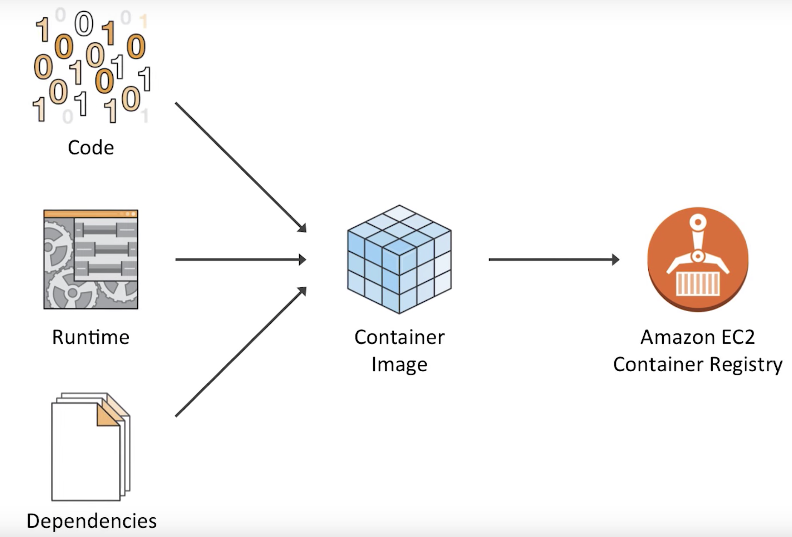

## Amazon ECS (EC2 Container Service)

* Supports Docker containers 
* Easily run applications on a managed cluster of EC2 instances 
* Launch or stop container-enabled applications 
* Query the complete state of your cluster 
* Access familiar features
  * Security groups
  * Elastic Load Balancing 
  * EBS volumes
  * IAM roles

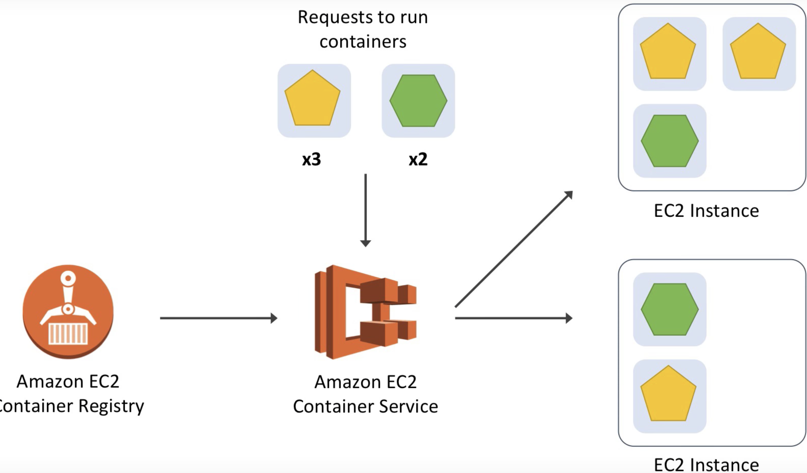

## Key Components: 

### Container Instances 

* Amazon EC2 instances 
* Docker daemon 
* Amazon ECS agent 
 

### AMAZON ECS AGENT 

* **MANAGES THE STATE OF CONTAINERS ON A SINGLE EC2 INSTANCE** 
* **HOW ECS COMMUNICATES WITH THE DOCKER DAEMON ON THE EC2 INSTANCE** 
* **MUST BE ON EVERY EC2 INSTANCE IN YOUR ECS CLUSTER** 
* INCLUDED WITH THE ECS-OPTIMIZED AMAZON MACHINE IMAGE (AMI) 

## Key Components: Clusters 

* Resource pool
* Start empty
* dynamically scalable 
* GroupinG of container instances 

### AMAZON ECS CLUSTER

* **LOGICAL GROUP OF AMAZON EC2 INSTANCES** THAT YOU CAN PLACE CONTAINERS ONTO 
* **CAN UTILIZE ON-DEMAND, SPOT, OR RESERVED EC2 INSTANCES** 
* CAN INCLUDE **DIFFERENT EC2 INSTANCE TYPES REGION-SPECIFIC** 
* **EC2 INSTANCES ARE LINKED IN A VIRTUAL PRIVATE CLOUD (VPC)** 

## Key Components: Task Definitions

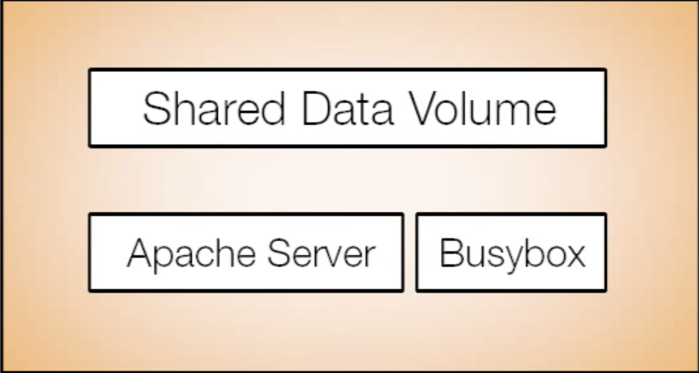

### AN AMAZON ECS TASK DEFINITION SPECIFIES

* **DOCKER IMAGE** FOR EACH CONTAINER 
* **CPU AND MEMORY REQUIREMENTS FOR EACH CONTAINER** 
* **LINKS BETWEEN CONTAINERS**
* **NETWORKING AND PORT SETTINGS**
* **DATA STORAGE VOLUMES** 
* **SECURITY IAM ROLE**

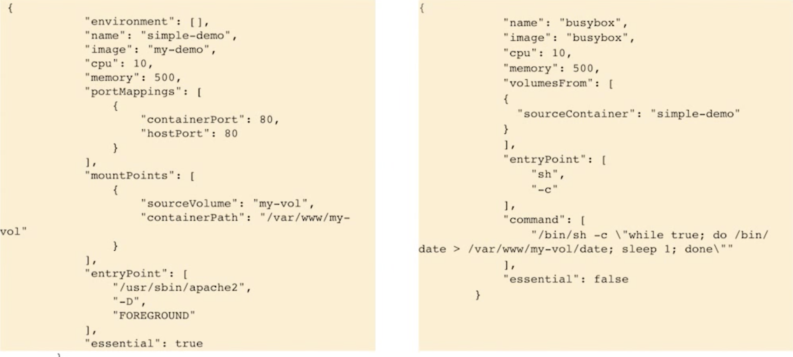

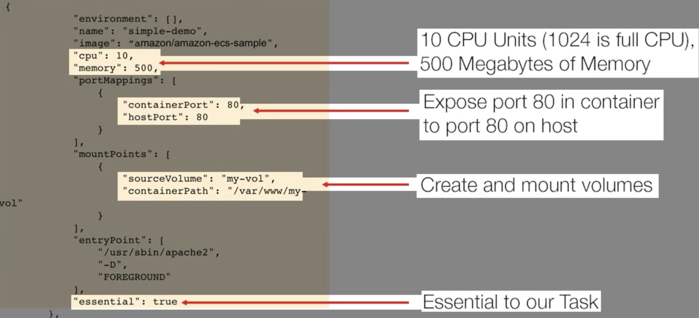

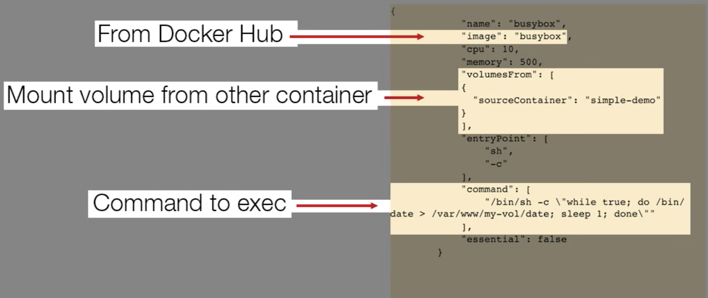

* Unit of Work 
* Grouping of relates containers 
* Run on container instances 

## RUN-TASK 

* **FINDS EC2 INSTANCES IN CLUSTER THAT MEET REQUIREMENTS IN THE TASK DEFINITION**
* **DEFINES HOW TASKS ARE DISTRIBUTED ONTO EC2 INSTANCES IN THE CLUSTER** 
* COMMUNICATES WITH ECS-AGENT AND DOCKER DAEMON TO RUN CONTAINERS ON ELIGIBLE EC2 INSTANCES IN THE CLUSTER 
* CAN BE EXECUTED VIA THE ECS CONSOLE, CLI, OR APIS 

## SERVICES

* **MANAGE LONG-RUNNING WORKLOADS** 
* **AUTOMATE THE 'RUN-TASK' PROCESS** 
* **ACTIVELY MONITOR RUNNING TASKS**
* **RESTART TASKS IF THEY FAIL**

### SERVICE UPDATES 

* AUTOMATICALLY STARTS NEW TASKS AND STOPS OLD TASKS 
* **KEEPS THE SERVICE RUNNING DURING DEPLOYMENT** 
* **HEALTH CHECKS ENSURE NEW TASKS ARE STABLE BEFORE OLD TASKS ARE STOPPED** 
* USE THE CONSOLE, CLI, OR APIS 

## TASK PLACEMENT STRATEGY 

* DEFINES HOW TASKS ARE DISTRIBUTED ONTO EC2 INSTANCES IN THE CLUSTER

### STRATEGIES INCLUDE:

* BALANCE TASKS FOR AVAILABILITY 
* PACK TASKS FOR EFFICIENCY 
* RUN ONLY ONE TASK PER EC2 INSTANCE 
* CUSTOM TASK PLACEMENTS 

## ECS LAB

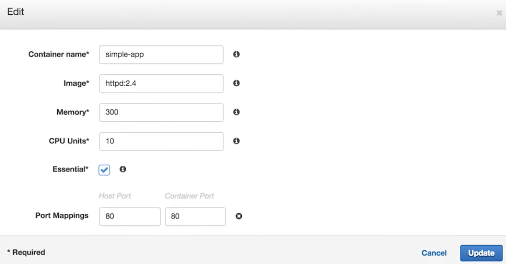

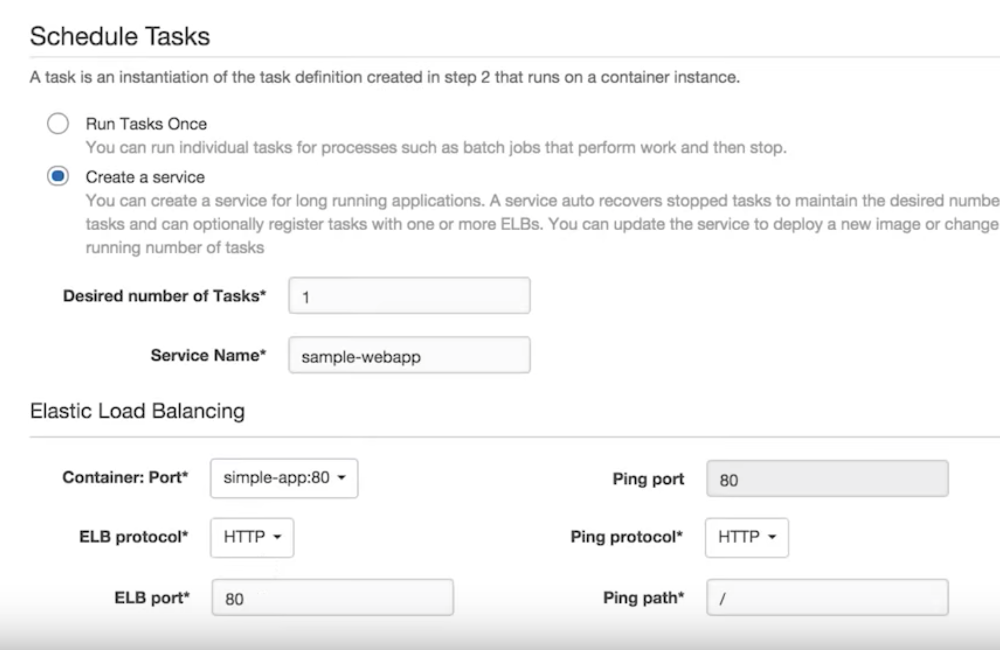

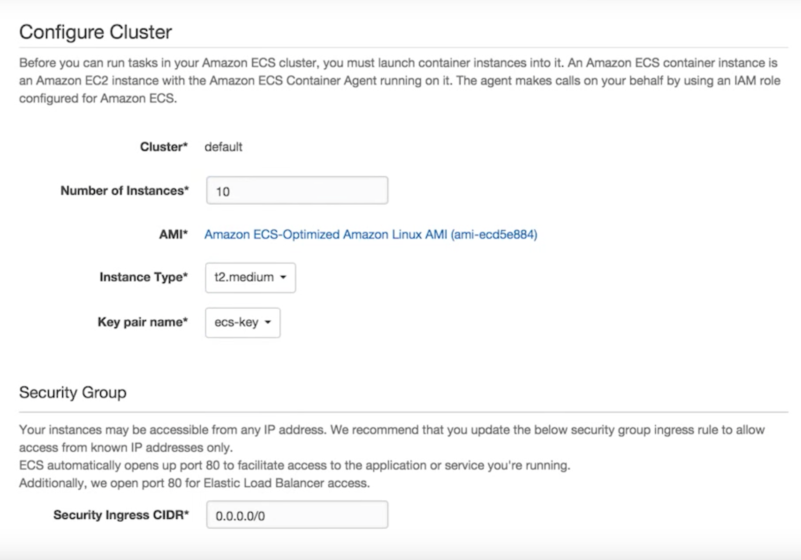

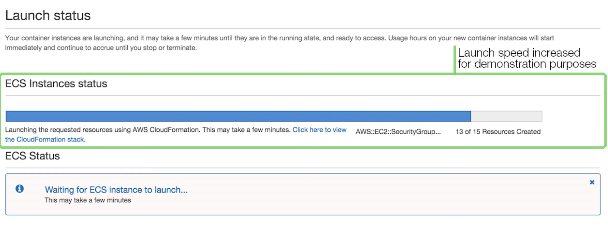

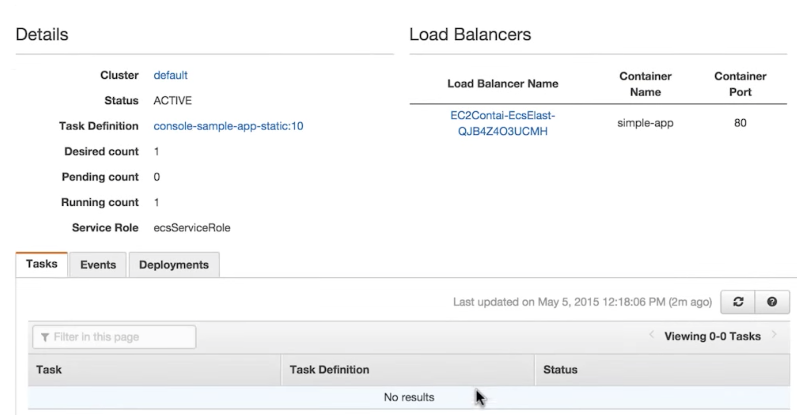

