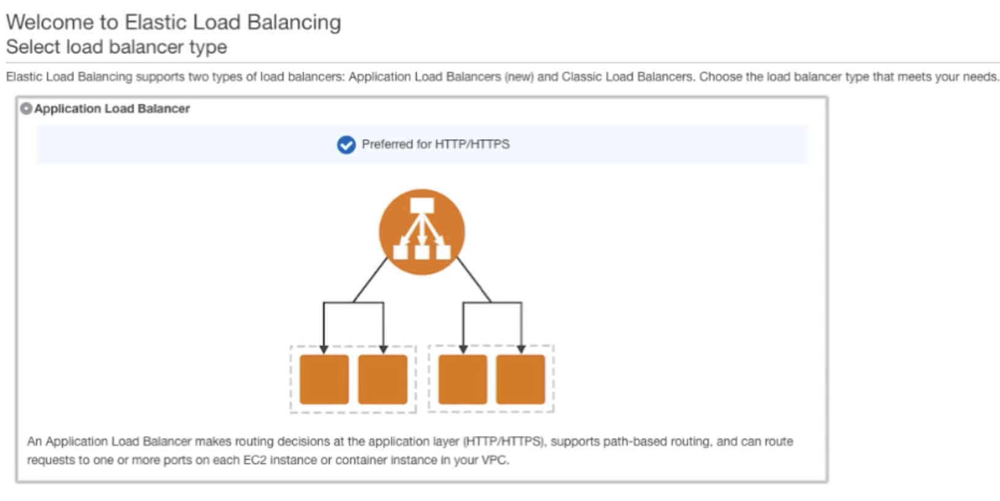

# Choosing Between an ELB and an ALB on AWS

Application Load Balancer (ALB), a new load balancer allowing developers to **direct and configure user traffic to apps in the public AWS cloud.**

## Application Load Balancing. 

### Application load balancing identifies incoming traffic and directs it to the right resource type. 

For example, 

1. **URLs tagged with /API extensions can be routed to the appropriate application resources**, 
2. **Traffic bound for /MOBILE can be directed to resources managing mobile access**.

The Application Load Balancer will process the request, 

**Not only by receiving port, but also by looking at the destination URL.**

Multiple services can share a single load balancer using path-based routing. In the example given here, the client could request any of the following URLs:

* http://www.example.com/login
* http://www.example.com/subscribe
* http://www.example.com/download

The Application Load Balancer will be aware of each of these URLs based on patterns set up when configuring the load balancer, and can route to different clusters of servers depending on application need

The **Application Load Balancer** also integrates with EC2 Container Service (ECS) using **Service Load Balancing.** 

This allows for dynamic mapping of services to ports as specified in the ECS task definition. 

**Multiple containers can be targeted on the same EC2 instance, each running different services on different ports. The ECS task scheduler will automatically add these tasks to the ALB**.

## Key ALB Concepts

**Rules** determine what action is taken when a rule matches a client request. **Up to 10 URL-based rules can be defined in the ALB.**

**The condition** is the path pattern you want the ALB to evaluate in order for it to route requests.

The **target group** is used to route requests to registered targets as part of an action for a rule. Target groups specify a protocol and target port. **Health checks can be configured per target group. An ALB can route to multiple target groups**.

**Priority** tells the ALB in which order to evaluate the rules. Rules are numerically evaluated in order from lowest to highest value. 

