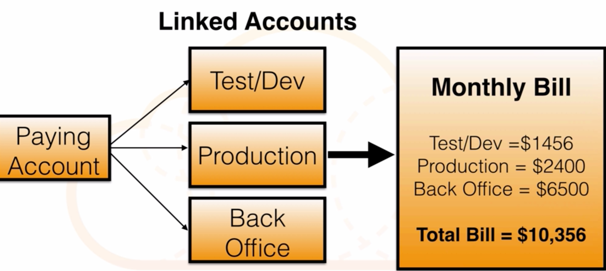

# AWS additional Exam Tips

## courses list

1. [Additional Exam Tips(Kinesis, EC2 EBS Backed vs Instance Store, OpsWork, Elastic Transcoder, SWF - Actors, EC2 public IP address)](1addExamTip1.md)
2. [Consolidated Billing](2ConsolidateBilling.md)
3. [Direct Connection](3DirectConn.md)
4. [Tags and Resource Group](4Tags_Resoucegp.md)
5. [VPC peering](5VPC_peering.md)
6. [WorkSpaces](6WorkSpaces.md)
7. [AWS Federated Authentication with Active Directory Federation Services](7AD_FS.md)
8. [Intro to DNS](../8Route53/1Dns_Intro.md)
9. [AWS ECS and ECR](8ECS_ECR.md)
10. [Choosing Between an ELB and an ALB on AWS](9ALBvsELB.md)
11. [AWS Amazon Kinesis](10Kinesis.md)

## Exam Tips

### 1. What is Kinesis

Amazon Kinesis is a fully managed service for real-time processing of streaming data at massive scale.

* Used to consume big data
* Stream large amounts of social media, news feeds logs etc in to the cloud
* **Redshift for business intelligence**
* **Elastic Map Reduce for Big Data Processing**

### 2.EC2 EBS Backed vs Instance Store

* EBS backed volumes are persistent.
* Instance Store backed volumes are not persistent (ephemeral)
* EBS Volumes can be detached and reattached to other EC2 instances. **[Only for data volume not root volume]**
* Instance store volume cannot be detached and reattached to other instances. They exist only for the life of that instance.
* EBS volumes can be stopped, data will persist.
* **Instance store volumes cannot be stopped.** **If you do this the data will be wiped.**

### 3.OpsWork

Automate Operations with Chef and Puppet

### 4.Elastic Transcoder

* Media Transcoder in the cloud
* Convert media files from theft original source format into different formats that will play on smartphones, tablets, PC's etc

### 5.SWF - Actors

* **Workflow Starters**: An application that can initiate (start) a workflow. 
* **Deciders**: Control the flow of activity tasks in a workflow execution. If something has finished in a workflow (or fails) a Decider decides what to do next.
* **Activity Workers**: Carry out the activity tasks

### 6.Consolidated Billing

* 1.**Paying account is independent**. Cannot access resources of the other accounts.
* 2.All linked accounts are independent
* 3.Currently a limit of 20 linked accounts for consolidated billing

### 7.Direct Connection

AWS Direct Connect makes it easy to establish a dedicated network connection from your premises to AWS. Using AWS Direct Connect, you can establish private connectivity between AWS and your datacenter, office, or colocation environment, 

#### How is Direct Connect different from a VPN?

##### VPN Connections

* Can be configured in minutes and are a good solution if you have an immediate need,
* Have low to modest bandwidth requirements,
* Can tolerate the inherent variability in Internet-based connectivity.

##### AWS Direct Connect

* **Does not involve the Internet;**
* Instead,**it uses dedicated, private network connections between your Intranet and Amazon VPC**.

### 7.Tags and Resource Group

#### Resource groups contain information such as: Region, Name, Health Checks

#### Specific information

* For **EC2** - **Public & Private IP Addresses**
* For **ELB** - **Port Configurations**
* For **RDS** - **Database Engine** etc

Resource Groups is great thing to track resources aren't tagged and track resource which department it belongs to

### 8.VPC peering

1. VPC Peering is simply a connection between two VPCs that enables you to route traffic between them **using private IP addresses**.
2. You can create a VPC peering connection between your own VPCs, or **with a VPC in another AWS account within different VPC regions**
3. **It is neither a gateway nor a VPN connection, and does not rely on a separate piece of physical hardware**

**With same internal address range, basically share and overlap CIDR**, instances within VPC A and B are no longer be able to peer and talk to each other

* You **cannot create a VPC peering connection between VPCs that have matching or overlapping CIDR blocks.**
* You **CAN create a VPC peering connection between VPCs in different regions**
* PC peering **does not support transitive peering relationships**

### 9.WorkSpaces

#### What is Workspaces?

1. It's basically **Virtual Desktop Infrastructure(VDI)**.
2. A WorkSpace is a **cloud-based replacement for a traditional desktop**.

#### Workspaces - Quick Facts

* By default you will be given **local administrator access**, so you can install your own appplications
* **Workspaces are persistent**.
* All data on the `D:\` is backed up every **12 hours**.
* **You do not need an AWS account to login to workspaces**

### 10.AWS Federated Authentication with Active Directory Federation Services (AD FS)

 Once the AWS identity provider configuration is complete, it is necessary to create the roles in AWS that federated users can assume via **SAML 2.0**.
 
An IAM role is an AWS identity with permission policies that determine what the identity can and cannot do in AWS

### 11.AWS ECS and ECR

#### ECR

* Fully managed **docker container registry**
* **Store, manage, and deploy container image**s
* Integrated with amazon ECS
* **Encrypted, redundant, and highly-available**
* **Granular security permissions with AWS IAM** 

#### ECS 

* Supports Docker containers
* Easily run applications on a managed cluster of EC2 instances
* Launch or stop container-enabled applications
* Query the complete state of your cluster
* Access familiar features
  * Security groups
  * Elastic Load Balancing
  * EBS volumes
  * IAM roles

#### ECS AGENT  (kubelet)

* Manages the state of containers on a single EC2 instance
* **How ECS communicates with the docker daemon on the EC2 instance**
* **Must be on every EC2 instance in your ECS cluster**
* Included with the ecs-optimized amazon machine image (AMI) 

#### ECS CLUSTER (EC2 cluster)

* **Logical group of amazon EC2 instances that you can place containers onto**
* Can utilize **on-demand, spot, or reserved EC2 instances**
* Can include different EC2 instance types region-specific
* **EC2 instances are linked in a virtual private cloud (VPC)**

#### ECS TASK (k8s YAML spec)

* Docker image for each container
* CPU and memory requirements for each container
* **Links between containers**
* Networking and port settings
* Data storage volumes
* **Security IAM role**

#### ECS Service (deployment)

* Manage long-running workloads
* Automate the 'run-task' process
* Actively monitor running tasks
* Restart tasks if they fail

#### ECS TASK PLACEMENT STRATEGY

* Balance tasks for availability
* Pack tasks for efficiency
* Run **only one task per ec2 instance**
* Custom task placements

### 12.ALB vs ELB

#### The Application Load Balancer will process the request

* Not only by receiving port, but also by looking at the destination URL.
* The **Application Load Balancer** also integrates with **EC2 Container Service (ECS)** using **Service Load Balancing**.
* Dynamic mapping of services to ports as specified in the ECS task.
* **Multiple containers can be targeted on the same EC2 instance**, each running different services on different ports. T**he ECS task scheduler will automatically add these tasks to the ALB.**

#### Tips:

* **The condition** is the **path pattern** you want the ALB to evaluate in order for it to route requests.
* **The target group** is used to **route requests to registered targets as part of an action for a rule**. 
* **Priority** tells the ALB in which order to evaluate the rules.

