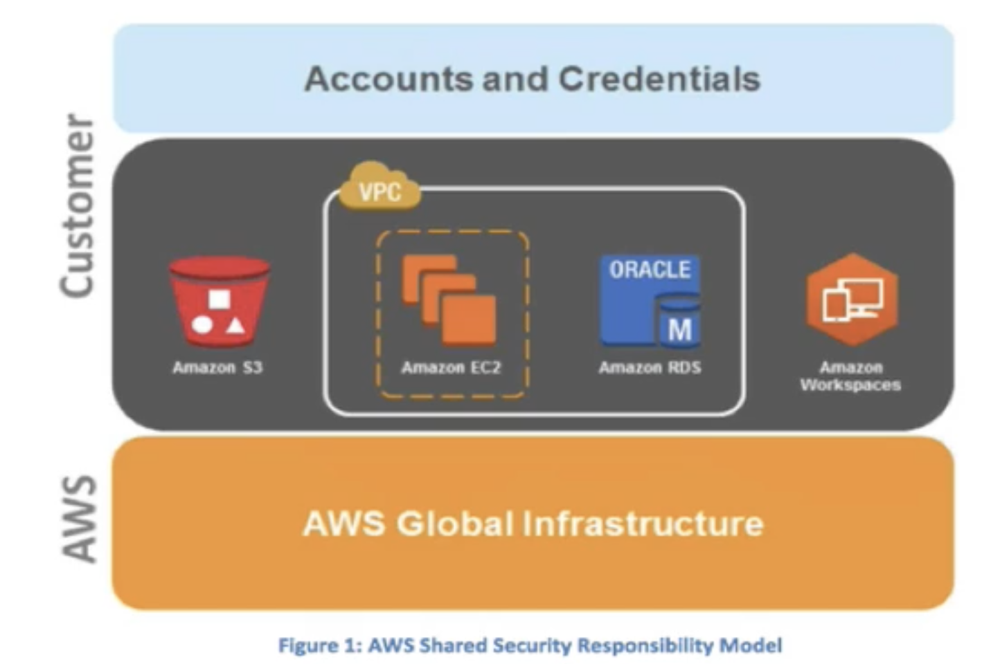
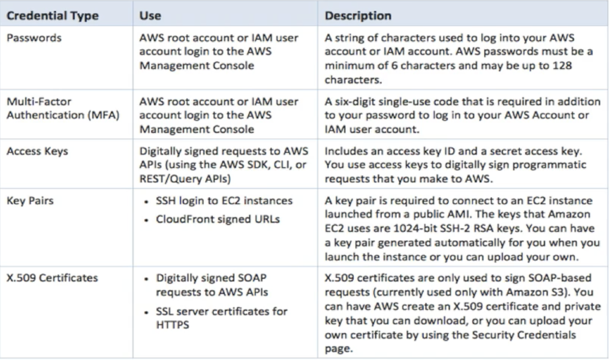
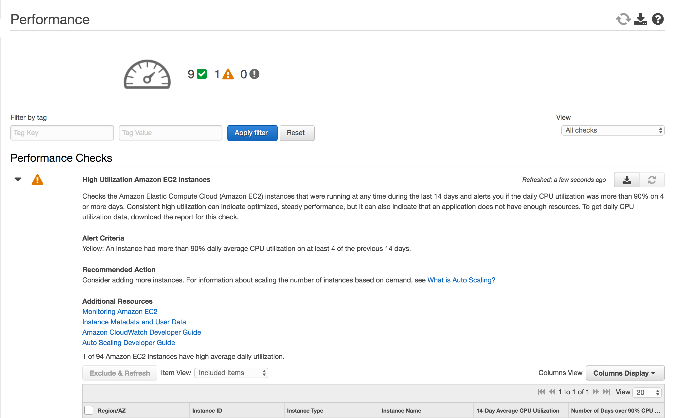
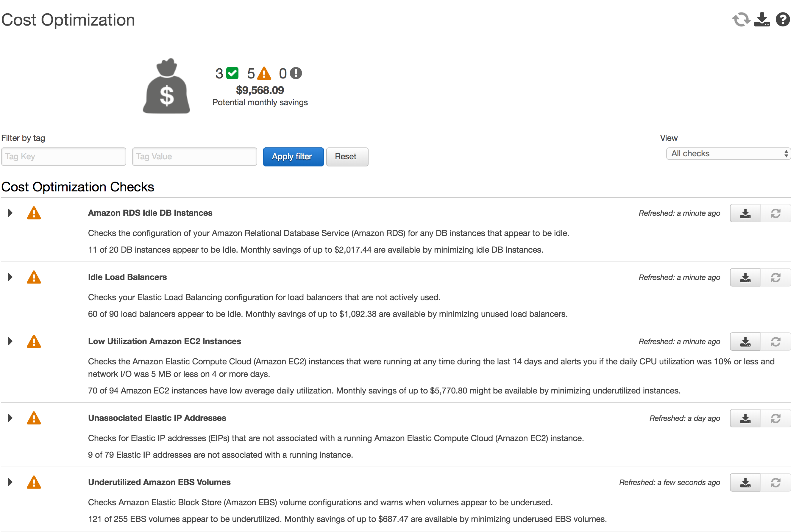

# Overview of Security Process two

## Shared Security Model

AWS is responsible for securing the underlying infrastructure that supports the cloud, and you're responsible for anything you put on the cloud or connect to the cloud. 

 

## AWS Security Responsibilities

Amazon Web Services is responsible for protecting the global infrastructure that runs all of the services offered in the AWS cloud. This infrastructure is comprised of the hardware, software, networking, and facilities that run AWS services. 

AWS is responsible for the security configuration of its products that are considered managed services. Examples of these types of services include Amazon DynamoDB, Amazon RDS, Amazon Redshift, Amazon Elastic MapReduce, Amazon WorkSpaces  

## Customer Security Responsibilities

**IAAS - such as Amazon EC2, Amazon VPC, and Amazon S3 are completely under your control and require you to perform all of the necessary security configuration and management tasks.** 

Managed Services, AWS is responsible for patching, antivirus etc, **however you are responsible for account management and user access.**
 
### Its recommended that 

* MFA be implemented 

* Communicate to these services using SSL/ TLS 
 
* API/user activity logging be setup with CloudTrail 

## Storage Decommissioning
 
When a storage device has reached the end of its useful life, AWS procedures include a decommissioning process that is designed to prevent customer data from being exposed to unauthorized individuals. AWS uses the techniques detailed in DoD 5220.22-M ("National Industrial Security Program Operating Manual ") or NIST 800-88 ("Guidelines for Media Sanitization") to destroy data as part of the decommissioning process. A**ll decommissioned magnetic storage devices are degaussed and physically destroyed in accordance with industry-standard practices.** 

## Network Security

Transmission Protection - You can connect to an AWS access point via HTTP or HTTPS using Secure Sockets Layer (SSL), a cryptographic protocol that is designed to protect against eavesdropping, tampering, and message forgery. 

For customers who require additional layers of network security, AWS offers the Amazon Virtual Private Cloud (VPC), which provides a private subnet within the AWS cloud, **and the ability to use an IPsec Virtual Private Network (VPN) device to provide an encrypted tunnel between the Amazon VPC and your data center.**

## Network Security 

### Amazon Corporate Segregation 

Logically, the AWS Production network is segregated from the Amazon Corporate network by means of a complex set of network security / segregation devices.

## Network Monitoring & Protection 

* DDoS
* Man in the middle attacks (MITM)
* Ip Spoofing 
* Port Scanning 
* Packet Sniffing by other tenants 

### Ip Spoofing

The AWS-controlled, host-based firewall infrastructure will not permit an instance to send traffic with a source IP or MAC address other than its own. 

### Port Scanning 

**Unauthorized port scans by Amazon EC2 customers are a violation of the AWS Acceptable Use Policy.** 

**You may request permission to conduct vulnerability scans as required to meet your specific compliance requirements**. These scans must be limited to your own instances and must not violate the AWS Acceptable Use Policy. 

#### You must request a vulnerability scan in advance. 

## AWS Credentials

 

## AWS Trusted Advisor 

### `Trusted Advisor` inspects your AWS environment and makes recommendations when opportunities may exist to save money, improve system performance, or close security gaps. 

It provides alerts on several of the most common security misconfigurations that can occur, including leaving certain ports open that make you vulnerable to hacking and unauthorized access, neglecting to create IAM accounts for your internal users, allowing public access to Amazon S3 buckets, not turning on user activity logging (AWS CloudTrail), or not using MFA on your root AWS Account. 

 

 