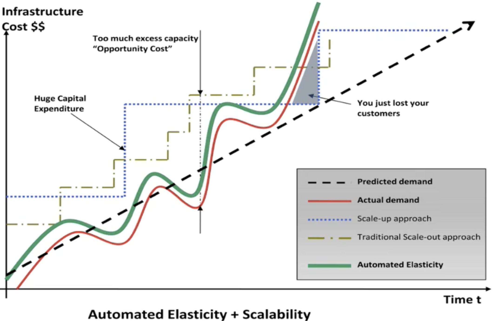
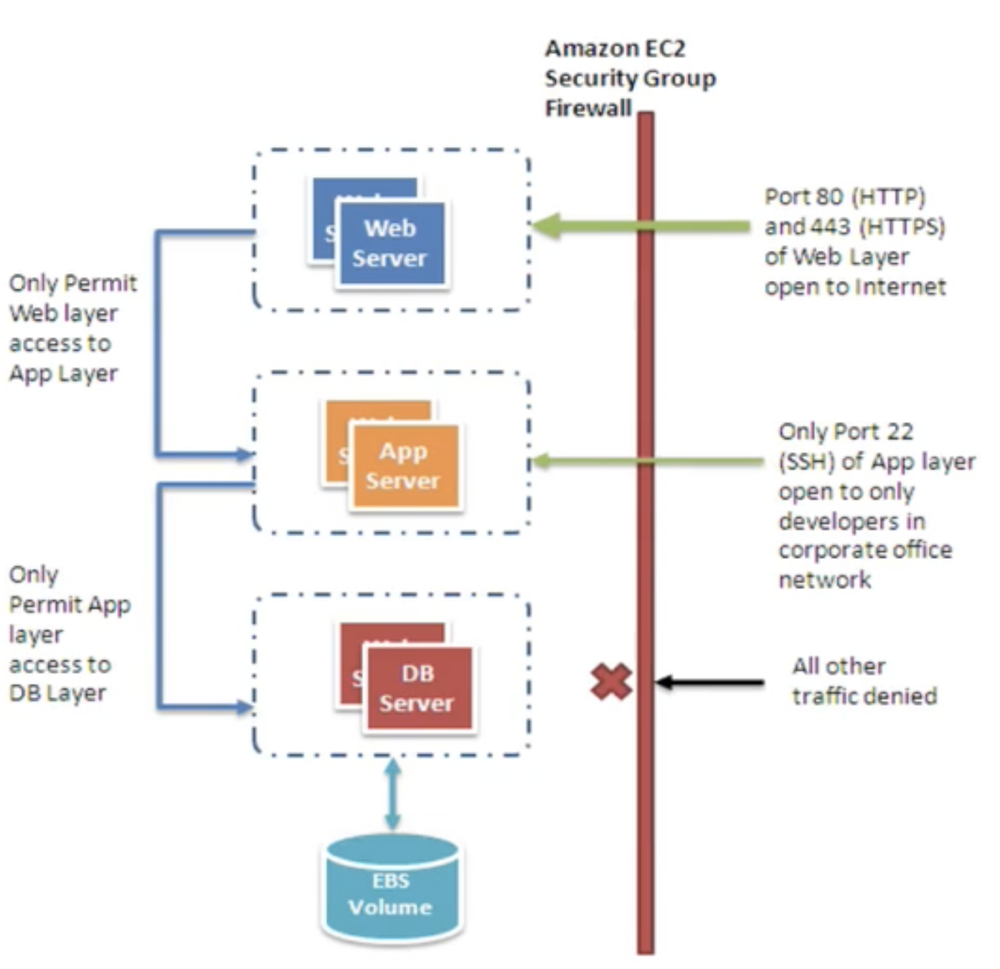

# Architecting for the Cloud White Paper

## Business Benefits of Cloud

* Almost zero upfront infrastructure investment
* Just-in-time Infrastructure 
* More efficient resource utilization 
* Usage-based costing 
* Reduced time to market 

## Understanding Elasticity

## Design for Failure 

### Rule of thumb: 

Be a pessimist when designing architectures in the cloud; assume things will fail. In other words, always design, implement and deploy for automated recovery from failure. 

In particular, assume that your hardware will fail. Assume that outages will occur. Assume that some disaster will strike your application. Assume that you will be slammed with more than the expected number of requests per second 
some day. Assume that with time your application software will fail too. By being a pessimist, you end up thinking about recovery strategies during design time, which helps in designing an overall system better. 

## Decouple your components 

The key is to build components that do not have tight dependencies on each other, so that if one component were to `die (fail)`, `sleep (not respond)` or `remain busy (slow to respond)` for some reason, the other components in the system are built so as to continue to work as if no failure is happening. In essence, loose coupling isolates the various layers and components of your application so that each component interacts asynchronously with the others and treats them as a "black box". 

For example, in the case of web application architecture, you can isolate the app server from the web server and from the database. The app server does not know about your web server and vice versa, this gives decoupling between these layers and there are no dependencies code-wise or functional perspectives. In the case of batch- processing architecture, you can create asynchronous components that are independent of each other. 

## Implement Elasticity

The cloud brings a new concept of elasticity in your applications. Elasticity can be implemented in three ways: 

1. **Proactive Cyclic Scaling**: **Periodic scaling that occurs at fixed interval** (daily, weekly, monthly, quarterly) 
2. **Proactive Event-based Scaling:** Scaling just when you are expecting a big surge of traffic requests due to a **scheduled business event (new product launch, marketing campaigns)** 
3. **Auto-scaling based on demand.** **By using a monitoring service**, your system can send triggers to take appropriate actions so that it scales up or down based on metrics (**utilization of the servers or network i/o, for instance**) 

## Secure your Application

 

