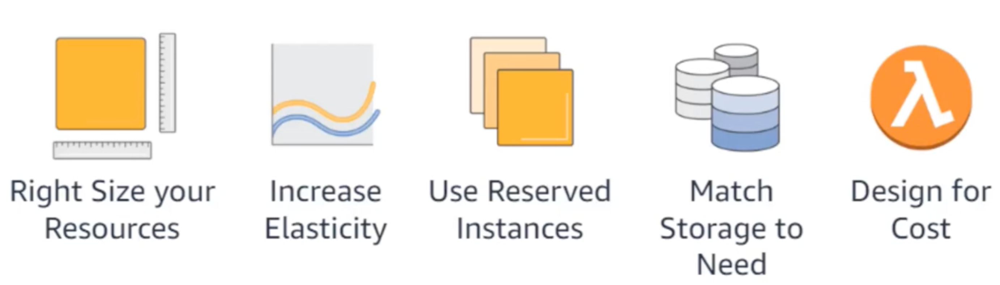
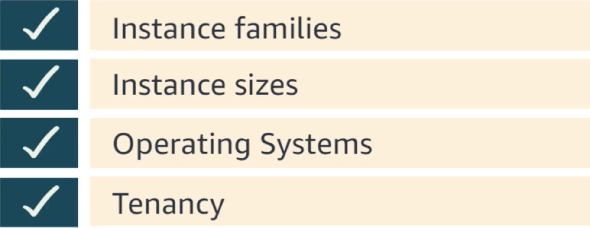
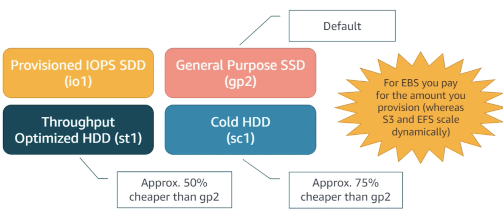

# Optimize Cost and Efficiency on AWS (Tips and Tools)

## Optimization lever drive down costs over time

## Cost Optimization Levers and Tools

### The Pillars of cost optimization

* Right Size you Resource
* Increase Elasticity
* Use Reserved Instances
* Match storage to Need
* Design for Cost

### The Pillar 1: Right Size your Resources

#### Right Sizing 

* Selecting the **cheapest instance** (e.g. size, family) **while meeting performance needs** 
* Most commonly based on CPU, RAM, storage, and network needs 
* **Doing this before/during migration via discovery tools reduces overall effort** 

#### Right Sizing example

#### Right Sizing Tool

##### 1. EC2 Right Sizing (EC2 Right Sizing) solution

##### 2. AWS Trusted Advisor

* **AWS Trusted Advisor => AWS COST Explorer**

* **AWS COST Explorer => Reserved Instance (RI) recommendation**

* **AWS Budget**

### The Pillar 2: Increase Elasticity

* **AWS Auto Scaling helps you match resources to demand**

* **AWS Instance Scheduler**

### The Pillar 3: Use Reserved Instances (RIs)

#### What are Reserved Instances (RIs)?

* RIs are a **commitment in exchange for discount** 
* They **behave like discount coupon booklets** 
* Each hourly coupon is matched to a running instance and used or expires at the end of each hour 
* RIs are a **financial construct/layer on top of your AWS infrastructure** 

#### RIs are best used for always-on instances

#### EC2 RIs cater to a range a range of customer needs

#### Convertible Reserved Instances

With a Convertible Reserved Instance, you can modify your existing reservation across: 

### The Pillar 4: Match Storage to Need

* ST1 => OPTIMIZATION
* SC1 => Cold

#### Storage Classes on Simple Storage Services (S3)

### The Pillar 5: Designing for Cost - There are many methods

## Exam tips

### 1.Right Size you Resource tool

* EC2 Right Sizing (EC2 Right Sizing) solution
* AWS Trusted Advisor
  * AWS COST Explorer
  * Reserved Instance (RI) recommendation
  * AWS Budget

### 2.Increase Elasticity

* AWS Auto Scaling
* AWS Instance Scheduler

### 3.Use Reserved Instances (RIs)

* RIs are best used for always-on instances
* Convertible Reserved Instances
  * With a Convertible Reserved Instance, you can modify your existing reservation

### 4.Match storage to Need

#### EBS

* provisioned IOPS SSD => io1
* general purpose => gp2 (default)
* Throughput optimized HDD (st1)
* Cold HDD (sc1)

#### S3

* standard
* IA
* IA one region
* glacier

### 5. Design for Cost

