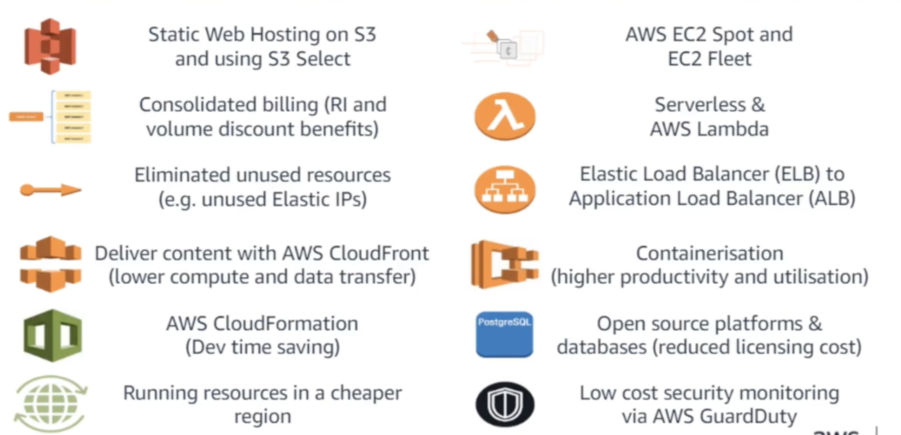

# Cost Optimization 

## Course List

1. [Optimize Cost and Efficiency on AWS (Tips and Tools)](1CostOpt.md)

## Exam tips

### 1.Right Size you Resource tool

* EC2 Right Sizing (EC2 Right Sizing) solution
* AWS Trusted Advisor
  * AWS COST Explorer
  * Reserved Instance (RI) recommendation
  * AWS Budget

### 2.Increase Elasticity

* AWS Auto Scaling
* AWS Instance Scheduler

### 3.Use Reserved Instances (RIs)

* RIs are best used for always-on instances
* Convertible Reserved Instances
  * With a Convertible Reserved Instance, you can modify your existing reservation

### 4.Match storage to Need

#### EBS

* provisioned IOPS SSD => io1
* general purpose => gp2 (default)
* Throughput optimized HDD (st1)
* Cold HDD (sc1)

#### S3

* standard
* IA
* IA one region
* glacier

### 5. Design for Cost

