# AWS Platform Introduction

## 1.Platform

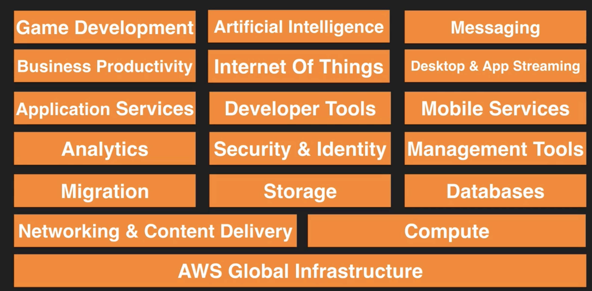

## What do you need to know to pass SAA exam

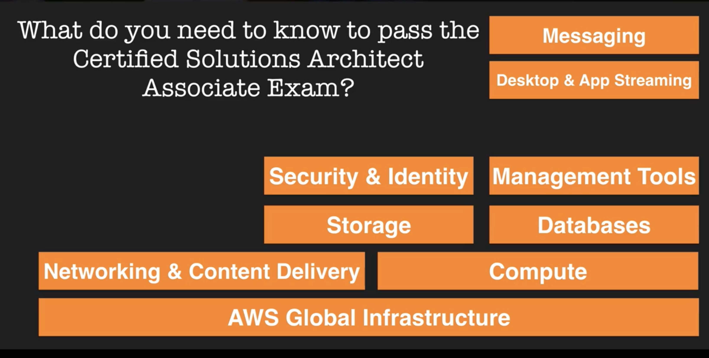

## 2.AWS Global Infrastructure

The AWS Cloud spans **55 Availability Zones** within **18 geographic Regions** and 1 Local Region around the world, with announced plans for 12 more Availability Zones and four more Regions in Bahrain, Hong Kong SAR, Sweden, and a second AWS GovCloud Region in the US.

## 3.AWS Region

**AWS Regions** provide multiple, physically separated and isolated Availability Zones which are connected with **low latency, high throughput, and highly redundant networking.**

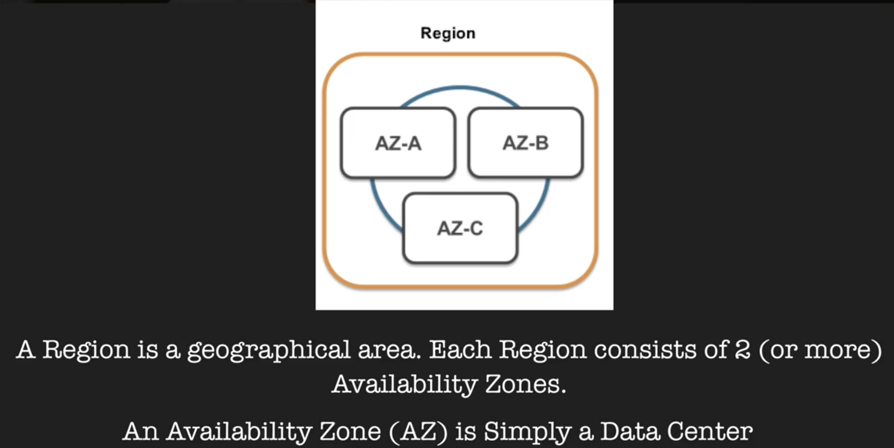

## 4. AWS Edge Network Locations / content deliver network (CDN)

### Edge location are CDN end points for CloudFront

To deliver content to end users with lower latency, Amazon CloudFront uses a global network of 138 Points of Presence

## Networking and Content Delivery

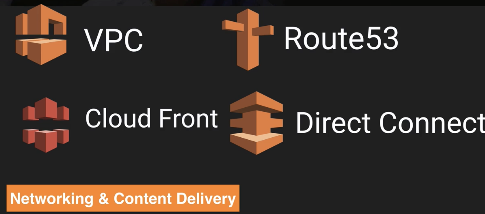

* **Amazon Virtual Private Cloud (Amazon VPC)** lets you provision a logically isolated section of the AWS Cloud where you can launch AWS resources in a virtual network that you define. 
* **Amazon Route 53** is a highly available and scalable cloud **Domain Name System** (DNS) web service. 
* **Amazon CloudFront** is a fast **content delivery network (CDN)** service that securely delivers data, videos, applications, and APIs to customers globally with low latency, high transfer speeds, all within a developer-friendly environment. **CloudFront is integrated with AWS – both physical locations that are directly connected to the AWS global infrastructure, as well as other AWS services.**
* **AWS Direct Connect** is a cloud service solution that makes it easy to establish a **dedicated network connection from your premises to AWS**. Using AWS Direct Connect, you can establish **private connectivity between AWS and your datacenter, office, or colocation environment**, which in many cases can reduce your network costs, increase bandwidth throughput, and provide a more consistent network experience than Internet-based connections.

## Compute

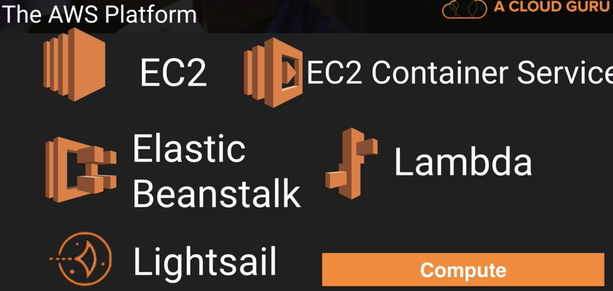

* **Amazon Elastic Compute Cloud (Amazon EC2)** is a web service that provides secure, resizable compute capacity in the cloud. It is designed to make web-scale cloud computing easier for developers. Launch applications when needed without upfront commitments.
* **Amazon Elastic Container Service (Amazon ECS)** is a highly scalable, high-performance **container orchestration service** that **supports Docker containers** and allows you to easily run and scale containerized applications on AWS. Amazon ECS eliminates the need for you to install and operate your own container orchestration software, manage and scale a cluster of virtual machines, or schedule containers on those virtual machines. **With simple API calls, you can launch and stop Docker-enabled applications, query the complete state of your application, and access many familiar features such as IAM roles, security groups, load balancers, Amazon CloudWatch Events, AWS CloudFormation templates, and AWS CloudTrail logs**.
* **AWS Elastic Beanstalk is an easy-to-use service for deploying and scaling web applications** and services developed with Java, .NET, PHP, Node.js, Python, Ruby, Go, and Docker on familiar servers such as Apache, Nginx, Passenger, and IIS.
* **AWS Lambda** lets you run code without provisioning or managing servers. You pay only for the compute time you consume - there is no charge when your code is not running.
* **Lightsail** is a virtual server that's cost-effective, fast, & reliable with an **easy-to-use interface.**

## Storage

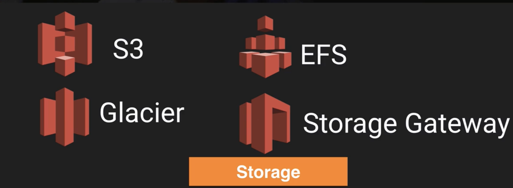

* **Amazon Simple Storage Service(Amazon S3)** is a scalable, high-speed, low-cost, web-based cloud storage service designed for online **backup and archiving of data and application programs**.
* **Amazon Elastic File System (Amazon EFS)** provides simple, scalable, elastic **file storage **for use with AWS Cloud services and on-premises resources.
* **Amazon Glacier is an extremely low-cost storage service** that provides secure and durable storage for data archiving and backup. In order to keep costs low, Amazon Glacier is optimized for data that is **infrequently accessed and for which retrieval times of several hours are suitable**.
* **AWS Storage Gateway is a hybrid storage service that enables your on-premises applications to seamlessly use AWS cloud storage**. You can use the service for backup and archiving, disaster recovery, cloud data processing, storage tiering, and migration. Your applications connect to the service through a **virtual machine or hardware gateway** appliance **using standard storage protocols, such as NFS, SMB and iSCSI**.

## Databases

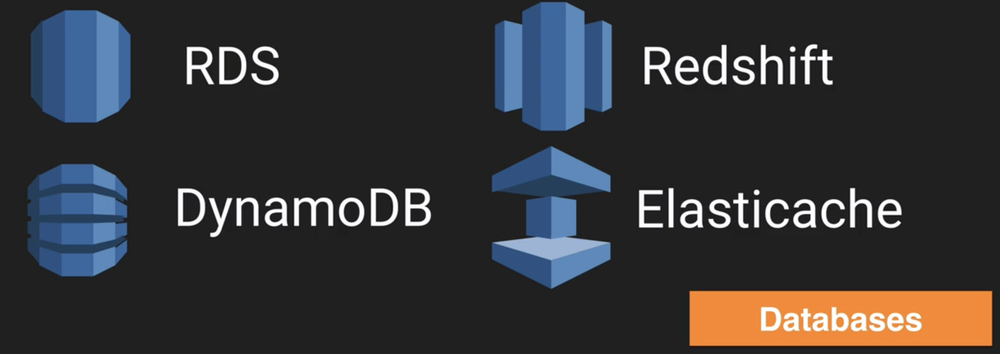

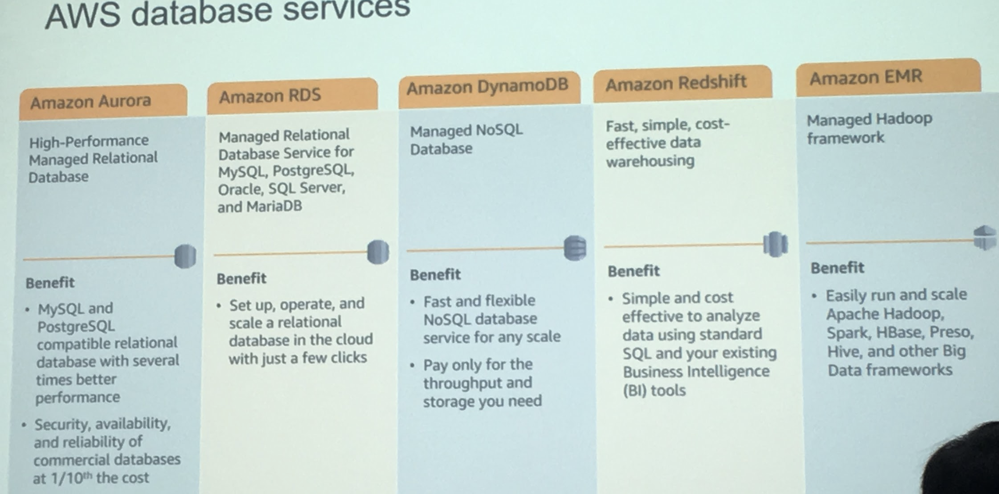

## Migration

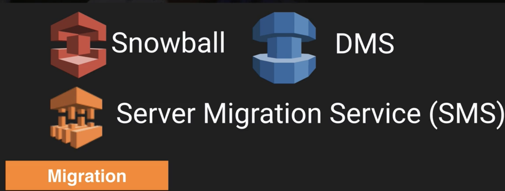

* **Snowball** is a petabyte-scale data transport solution that uses devices designed to be secure to transfer large amounts of data into and out of the AWS Cloud.

* **AWS Database Migration Service (DMS)** helps you migrate databases to AWS quickly and securely. The source database remains fully operational during the migration, minimizing downtime to applications that rely on the database. The AWS Database Migration Service can migrate your data to and from most widely used commercial and open-source databases.
* **AWS Server Migration Service (SMS)** an agentless service which makes it easier and faster for you to **migrate thousands of on-premises workloads to AWS**. AWS SMS allows you to **automate, schedule, and track incremental replications of live server volumes, making it easier for you to coordinate large-scale server migrations**.

## Analytics

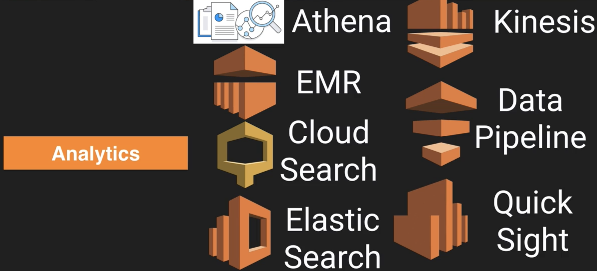

* **Amazon Athena** is an **interactive query service** that makes it easy to **analyze data in Amazon S3 using standard SQL**. **Athena is serverless**, so there is no infrastructure to manage, and you pay only for the queries that you run.
* **Amazon EMR** provides a **managed Hadoop framework** that makes it easy, fast, and cost-effective to **process vast amounts of data across dynamically scalable Amazon EC2** instances. You can also run other popular distributed frameworks such as Apache Spark, HBase, Presto, and Flink in Amazon EMR, and interact with data in other A**WS data stores such as Amazon S3 and Amazon DynamoDB**.
* **Amazon CloudSearch** is a scalable cloud-based search service that forms part of Amazon Web Services (AWS). **CloudSearch is typically used to integrate customized search capabilities into other applications**
* **Amazon Elasticsearch Service**, is a fully managed service that makes it easy for you to deploy, secure, operate, and scale Elasticsearch to search, analyze, and visualize data in real-time
* **Amazon Kinesis** makes it easy to **collect, process, and analyze real-time, streaming data so you can get timely insights and react quickly to new information**. Amazon Kinesis offers key capabilities to cost-effectively process streaming data at any scale, along with the flexibility to choose the tools that best suit the requirements of your application.
* **AWS Data Pipeline**, you can regularly access your data where it’s stored, transform and process it at scale, and efficiently transfer the results to AWS services such as Amazon S3, Amazon RDS, Amazon DynamoDB, and Amazon EMR.
* **Amazon QuickSight** is a fast, cloud-powered BI service that makes it easy to **build
visualizations, perform ad-hoc analysis, and quickly get business insights from your
data**. 

## Artificial Intelligence 

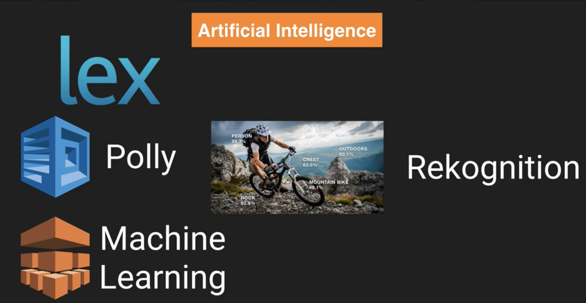

## Messaging

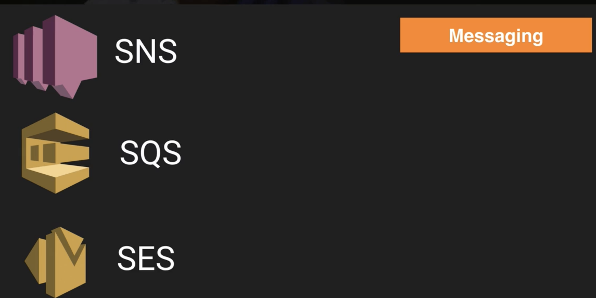 

* **Amazon Simple Notification Service (SNS)**
* **Amazon Simple Queue Service (SQS)**
* **Amazon Simple Email Service (Amazon SES)** is a **cloud-based email** sending service designed to help digital marketers and application developers send marketing, notification, and transactional emails.

