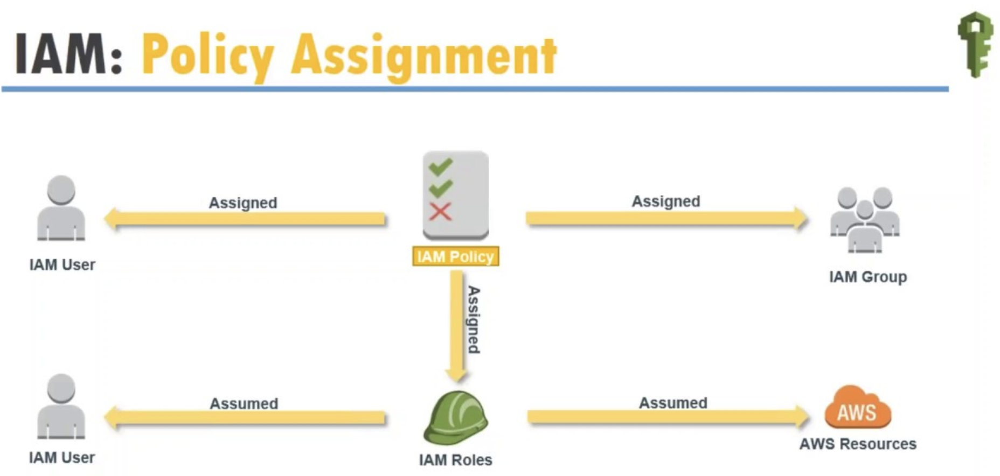

# IAM Intro

## What is IAM?

Essentially, **IAM allows you to manage users and their level of access to the AWS Console**, 

It is important to understand IAM and how it works, both for the exam and for administrating a companies AWS account in real life.

## What does IAM give you?

### 1. Centralised control of your AWS account
### 2. Shared Access to your AWS account
### 3. Granular permissions
### 4. Identity Federation (including Active Directory, Facebook, LinkedIn etc)
### 5. Multifactor Authentication
### 6. Provide temporary access for users/devices and services where necessary
### 7. Allows you to set up your own password rotation policy
### 8. Integrates with many different AWS services
### 9. Supports PCI DSS Compliance

 
## Critical Terms

* **Users** - End Users (think people)
* **Groups** - A collection of users under one set of permissions
* **Roles** - You create roles and then assign them to resource
* **Polices** - A document that defines one (or more permissions)

