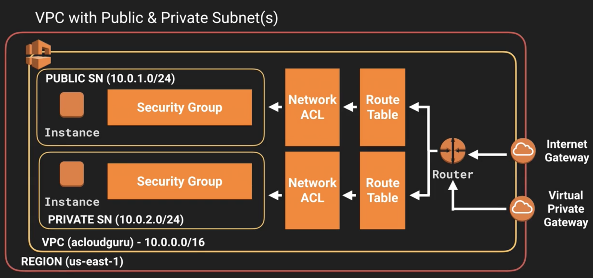
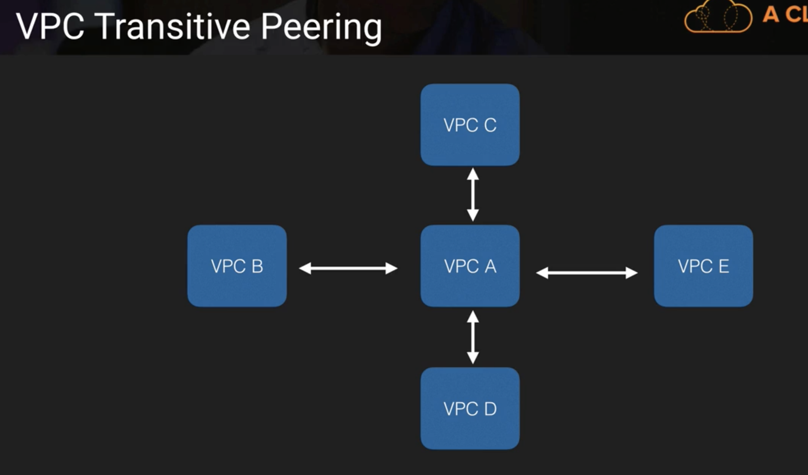
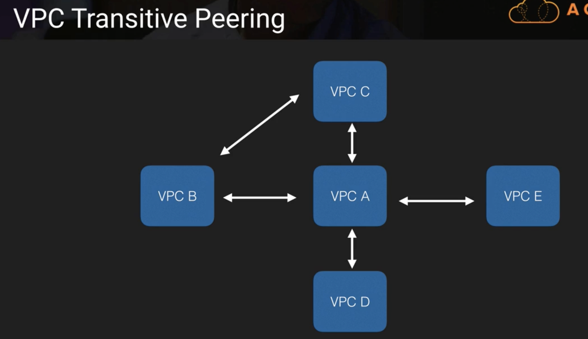

# The Overview of AWS VPC

## What is VPC

### Think of a VPC as logical datacenter.

**Amazon Virtual Private Cloud (Amazon VPC)** lets you provision a logically **isolated section of the Amazon Web Services (AWS) Cloud** where you can launch AWS resource in a virtual network that you define. You have complete control over your virtual networking environment, including selection of your own 

* IP address range, 
* creation of subnets, 
* configuration of route tables 
* network gateways.


You can easily customize the network configuration for your Amazon Virtual Private Cloud. For example, **you can create a public-facing subnet for your webservers that has access to the internet, and place your backend systems such as databases or application servers in a private-facing subnet with no Internet access**. You can leverage multiple layers of security, including security groups and network access control lists, to help control access to Amazon EC2 instances in each subnet


Additionally, you can create a **Hardware Virtual Private Network (VPN) connection** between *your corporate datacenter and your VPC and leverage the AWS cloud as an extension of your corporate datacenter*.


## VPC Diagram



1. Internet Gateway  &&  Virtual Private Gateway
2. Router
3. Route Table
4. Network ACL
5. Public Subnet && Private Subnet
6. Security Group
7. Instance


## What can you do with a VPC

### 1.Launch instances into a subnet of your choosing
### 2.Assign custom IP address range in each subnet
### 3.Configure route tables between subnets
### 4.Create internet gateway and attach it to our VPC
### 5.Much better security control over your AWS resources
### 6.Instances security groups
### 7.Instance security access control lists(ACLS)


## Default VPC vs Custom VPC

* Default VPC is user friendly, allowing you to immediately deploy instance
* All Subnets in default VPC have route out to the internet
* Each EC2 instance has both a public and private IP address
* If you delete the default VPC the only way to get get it back is to contact AWS.


## VPC Peering

* Allow you to connect one VPC with another via a **direct network route using private IP addresses**.
* **Instance behave as if they were on the same private network**
* You can peer VPC's with other AWS accounts as well as other VPCs in the same account.
* **Peering is in a star configuration**, ie 1 central VPC peers with 4 others. 

### NO TRANSITIVE PEERING

## VPC Peering in Right Way (TRANSITIVE PEERING)






## Exam Tips

### 1. Think of a VPC as logical data center in AWS
### 2. Consists of IGW's (Or `virtual Private Gateways`), `Route Tables`, `Networks access Control Lists`, `Subnets`, `Security Groups`
### 3. 1 Subnet = 1 Availability Zone

One AZ can have many subnets,  so this means that the equation is,

```
1 Subnet => 1 Availability Zone (not <=>)
```

### 4. Security Group are `stateful`, Network Access Control Lists are `Stateless`
### 5. NO TRANSITIVE PEERING
