# Hands on VPC

## First of first

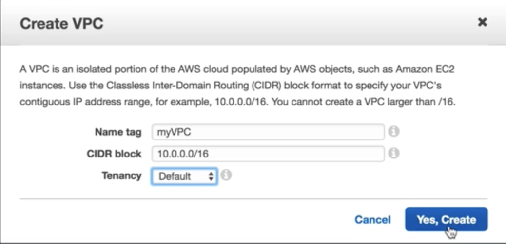

* **NameTag**: myVPC
* **CIDR block**: 10.0.0.0/16
* **Tenancy**: Default

## What's Next (step two)

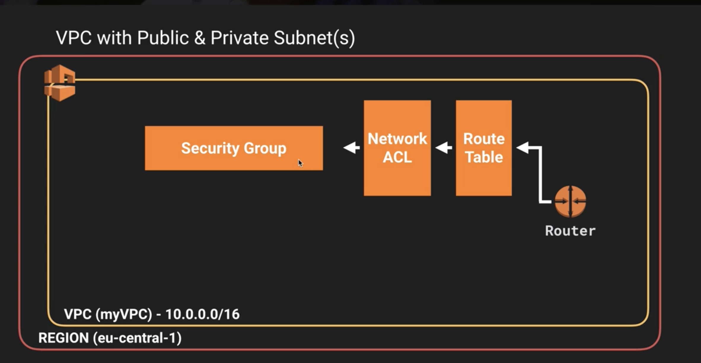


### Create Subnet  

**subnet one:**

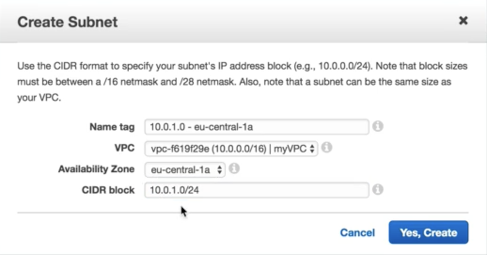

* **Name Tag**: 10.0.1.0-eu-central-1a
* **VPC**: myVPC
* **Availability Zone**: eu-central-1a
* **CIDR block:** 10.0.1.0/24


The first four IP addresses and the last IP address in each subnet CIDR block are not available for you to use, and cannot be assigned to an instance. For example, in a subnet with CIDR block `10.0.0.0/24`, the following five IP addresses are reserved:

```
10.0.0.0: Network address.

10.0.0.1: Reserved by AWS for the VPC router.

10.0.0.2: Reserved by AWS. The IP address of the DNS server is always the base of the VPC network range plus two; however, we also reserve the base of each subnet range plus two. For VPCs with multiple CIDR blocks, the IP address of the DNS server is located in the primary CIDR. For more information, see Amazon DNS Server.

10.0.0.3: Reserved by AWS for future use.

10.0.0.255: Network broadcast address. We do not support broadcast in a VPC, therefore we reserve this address.
```

**subnet two:**

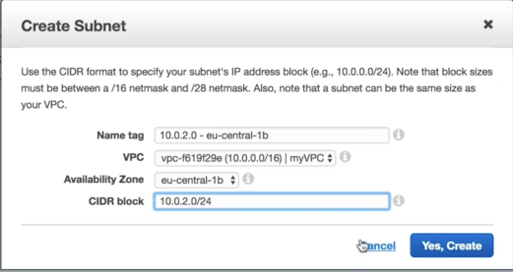

* **Name Tag**: 10.0.1.0-eu-central-1b
* **VPC**: myVPC
* **Availability Zone**: eu-central-1b
* **CIDR block:** 10.0.2.0/24

## step three `create internet gateway`

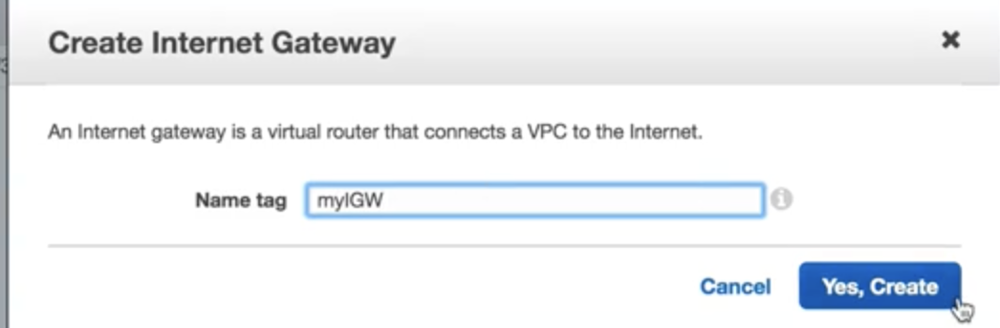

* **Name Tag**: myIGW


We need attach `myIGW` to the `myVPC`

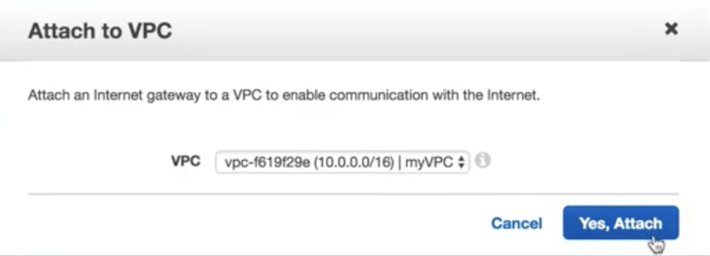


## step four `create route table & Edit it`

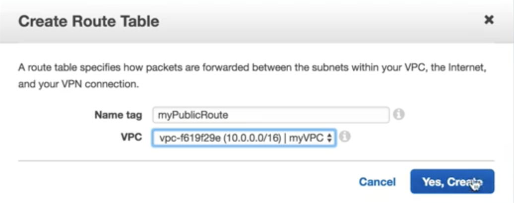

* **Name Tag**: myPublicRoute


**Edit `myPublicRoute` and add `myIGW` to it**

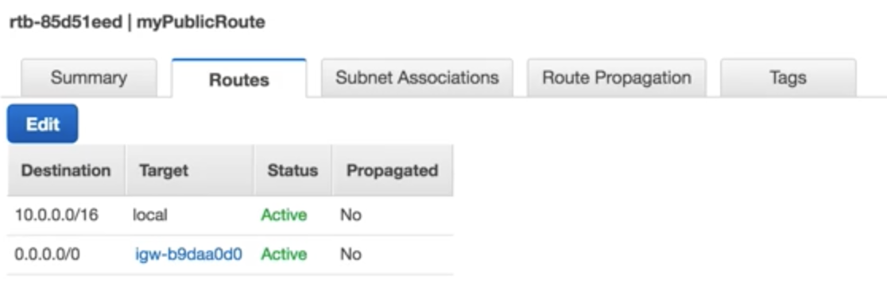

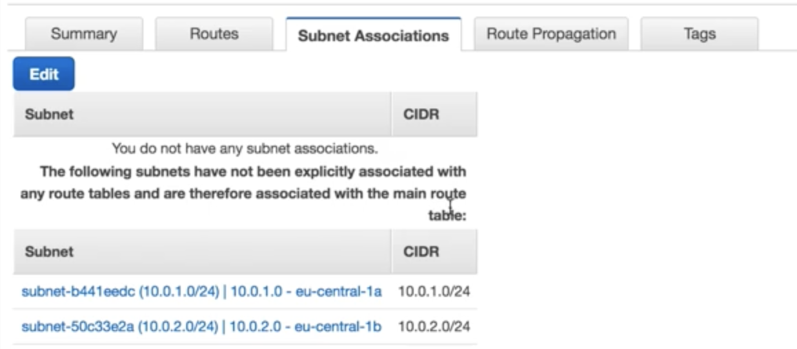

### This route table is `public route table`, so only associate `one subnet` to this `route table`. So this subnet is `public open subnet`

Associate `subnet 10.0.1.0-eu-central-1a` to `myPublicRoute`


Now the subnet `10.0.1.0-eu-central-1a` is public open

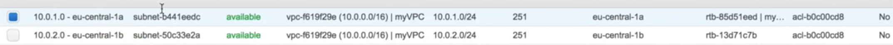


### Enable auto-assign IP for this public open subnet


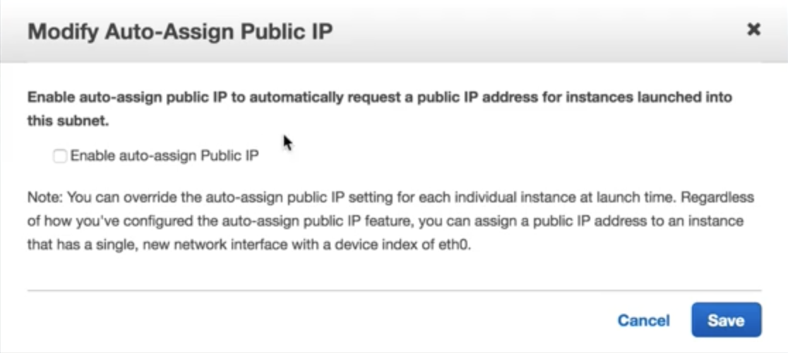

**This function will auto assign public IP to the EC2 inside this public-open subnet, so this can be also set in EC2 setup**

## step five `create EC2 inside public subnet`

**This EC2 will auto-assin one public ip address**

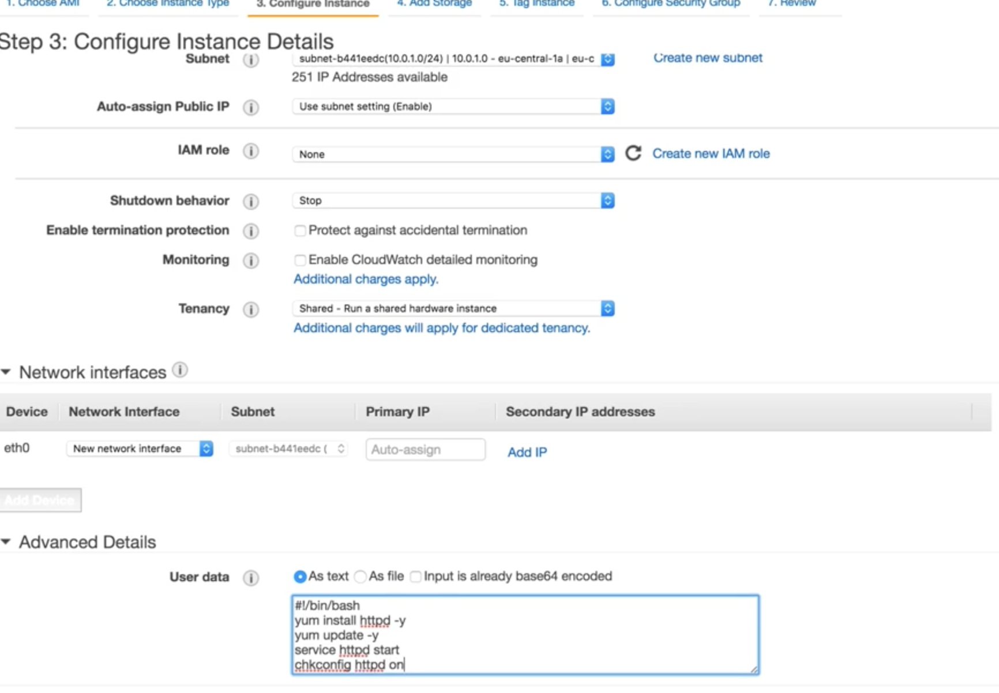


### Advanced user data

```
#/bin/bash
yum install httpd -y
yum update -y
service httpd start
chkconfig httpd on
echo "<html><h1>Hello Jacob is God</h1></html>" > /var/www/html/index.html
```

### configure security group for the EC2 `WebDMZ`

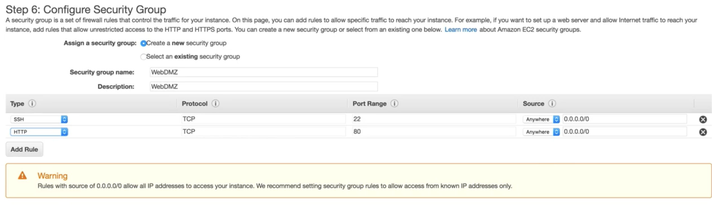


**add `SSH` and `http` **


## What we have done now

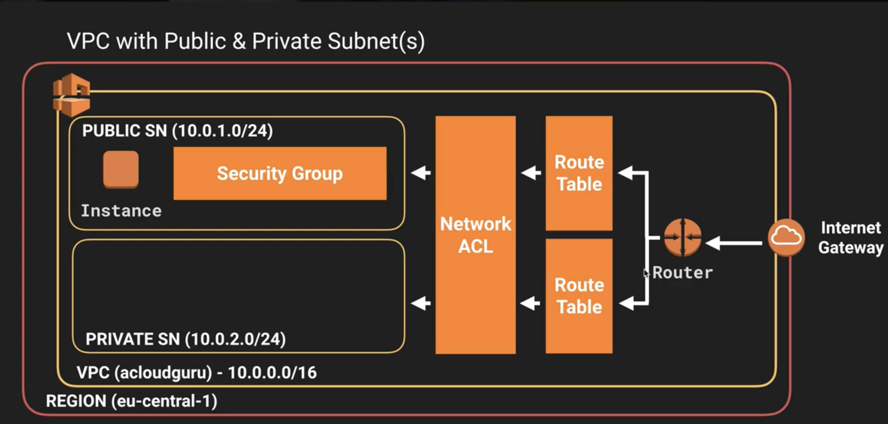


## step six `create EC2 inside private subnet`

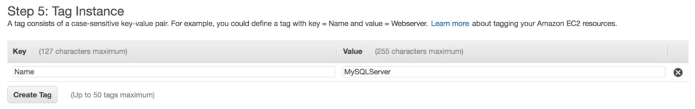

**EC2 NAME:**  MySQLServer


## Add new SG (`MyRDSSG`)

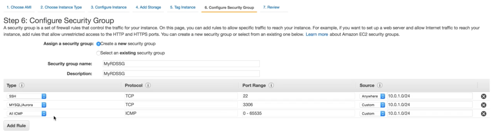

**1.SSH: TCP 22 10.0.1.0/24**  

**2.MYSQLAurora: TCP 3306 10.0.1.0/24** 

**3.ALL ICMP: ICMP 0-65535 10.0.1.0/24** 

### ICMP is for `ping`

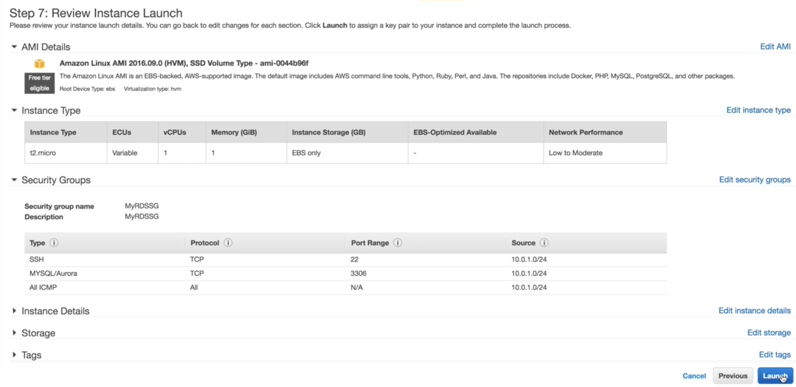
 

## step seven `ssh public EC2 instance from local machine`

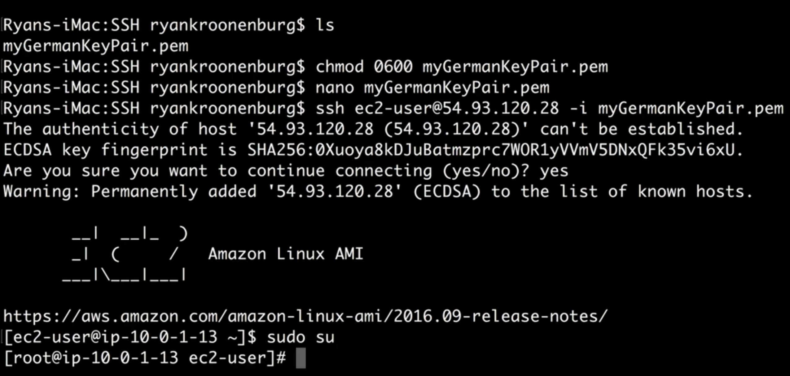

**public ec2 instance**

1. public ip: 54.93.120.28
2. private ip: 10.0.1.13

**On my local machine**

```
$ chmod 0600 key.pem
$ ssh ec2-user@54.93.120.28 -i key.pem
$ sudo su
```

**On public instance `myWebserver` to ping private instance `myDBserver`**

**private ec2 instance**

1. private ip: 10.0.2.156

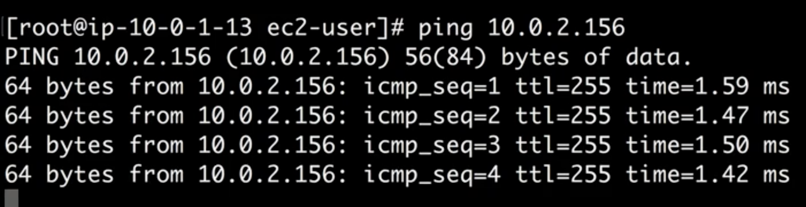


### It's pingable


### But If we delete ICMP rule for `MyRDSSG`


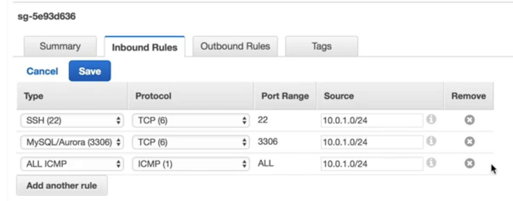

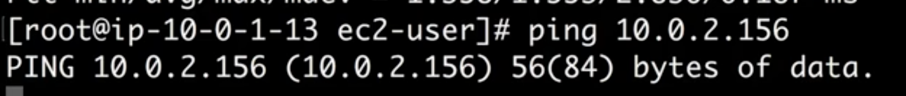

**Ping failed**


## step seven `ssh private EC2 instance from my public EC2 instance`

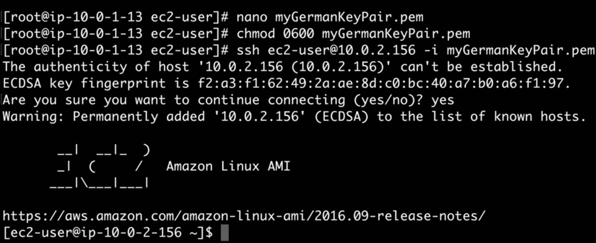


### But this private instance cannot connect to outside internet

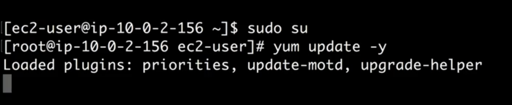


 