# Network Access Control List vs Security Group

## Comparison of Security Groups and Network ACLs

Security Group  | Network ACL
------------- | -------------
Operates at the instance level  | Operates at the subnet level
Supports allow rules only       | Supports allow rules and deny rules
Is stateful: Return traffic is automatically allowed, regardless of any rules  | Is stateless: Return traffic must be explicitly allowed by rules
We evaluate all rules before deciding whether to allow traffic  | We process rules in number order when deciding whether to allow traffic
Applies to an instance only if someone specifies the security group when launching the instance, or associates the security group with the instance later on  | Automatically applies to all instances in the subnets it's associated with (therefore, you don't have to rely on users to specify the security group)

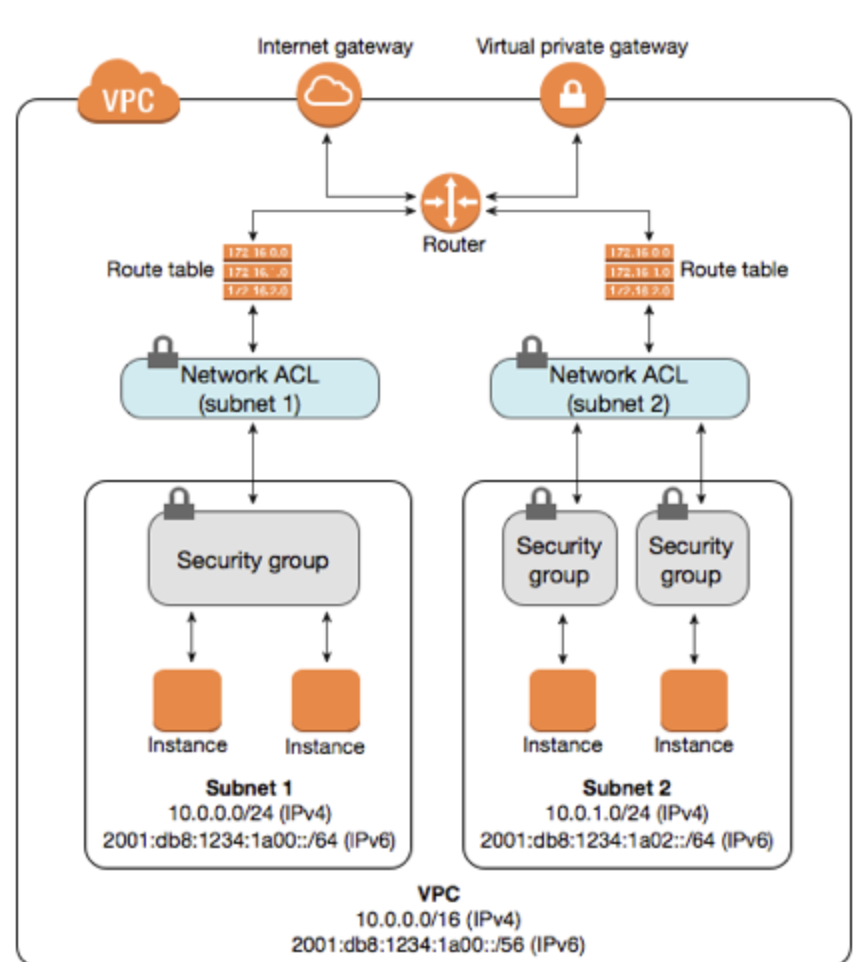

## Create custom ACL and enable it

#### We already have `default ACL`, its `inbound` & `outbound` are both allowed `all traffic`

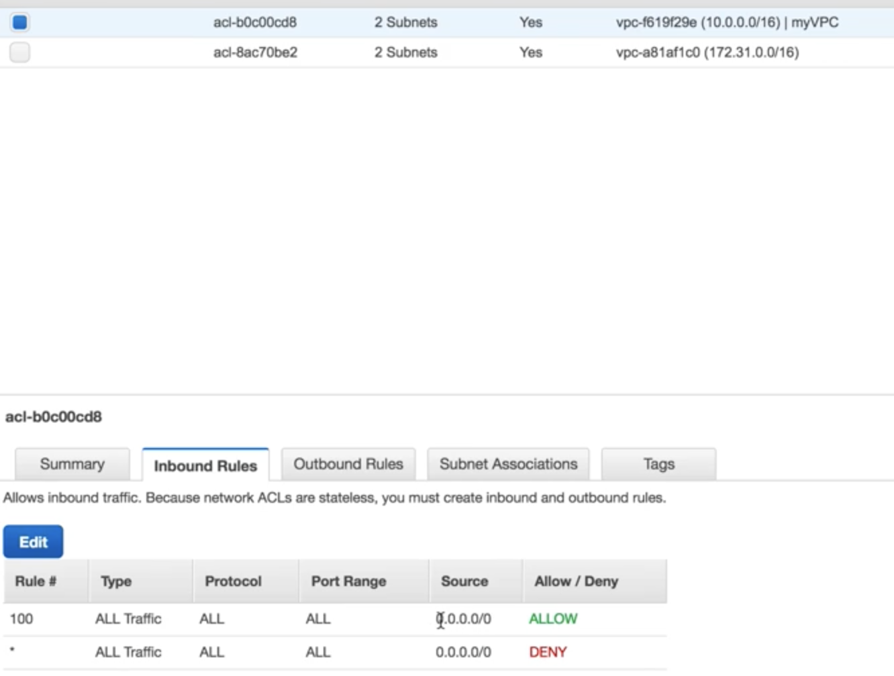

#### create our own Net ACL `MyWebNetworkACL` Inside `MyVPC`

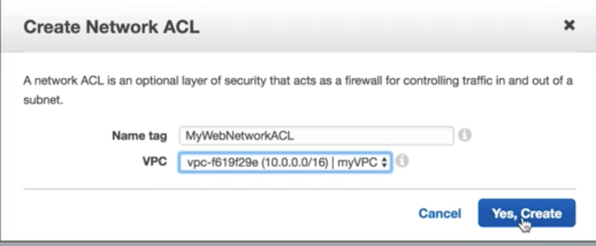

#### Associate our own Net ACL `MyWebNetworkACL` to `public subnet`

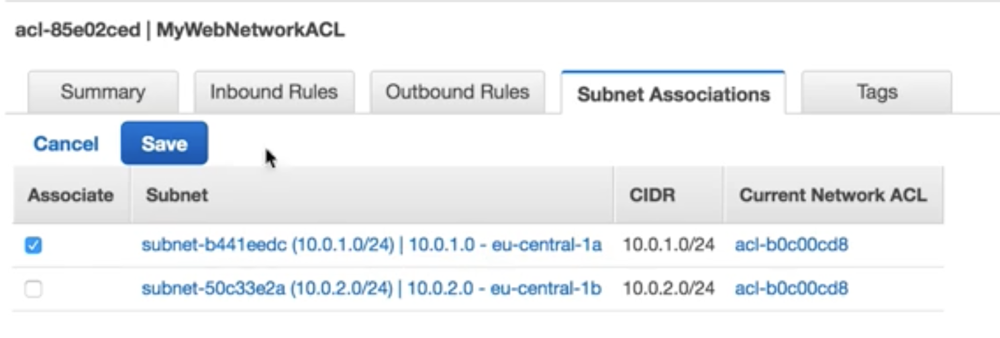

#### The subnet is automatically removed from `default ACL`

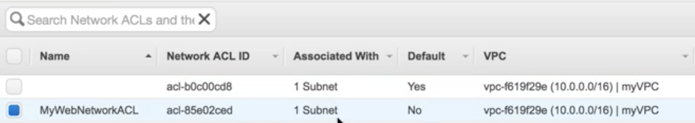

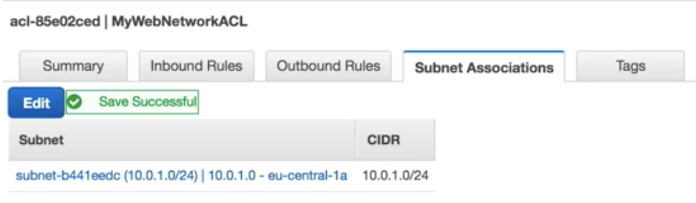

### Add `inbound rules` and `outbound rules` to the ACL, these two must be same

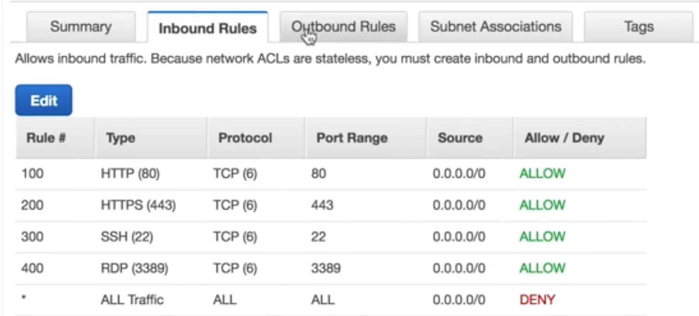

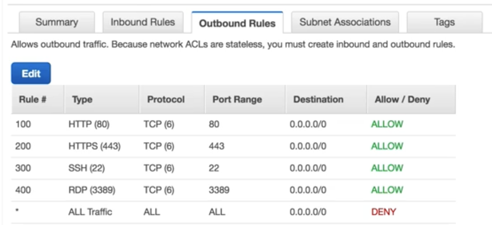

### However, the web sever still doesn't work

#### Add `Ephemeral Ports` to the `inbound rules` and `outbound rules` rule of the ACL

In practice, to cover the different types of clients that might initiate traffic to public-facing instances in your VPC, you can open ephemeral ports **1024-65535**. However, you can also add rules to the ACL to deny traffic on any malicious ports within that range. **Ensure that you place the DENY rules earlier in the table than the ALLOW rules that open the wide range of ephemeral ports.**

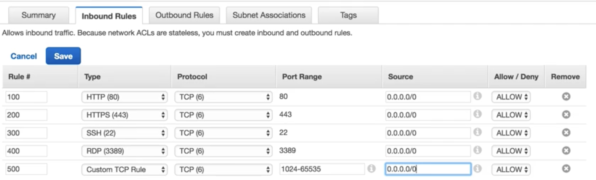

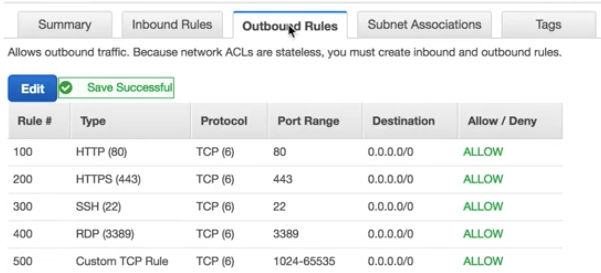

#### Now it works

## Block special IP address in ACL

#### 1. `Block HTTP Rule number` bigger than `original HTTP Rule number`

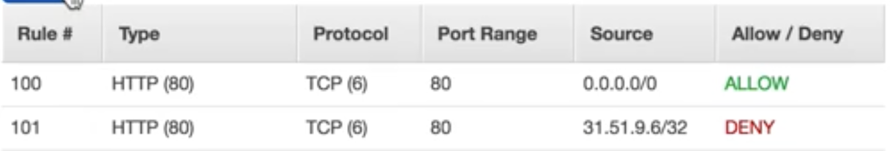

#### `Block Action` doesn't work, which means `We process rules in number order when deciding whether to allow traffic`

#### 2. `Block HTTP Rule number` smaller than `original HTTP Rule number`

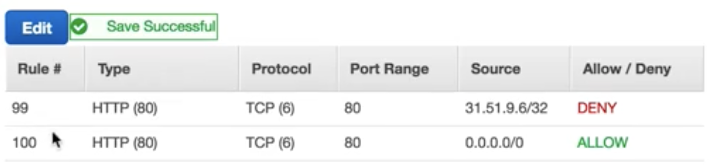

#### `Block Action` works

## Exam Tips - Network ACL'S

#### 1.Your VPC automatically comes a default network ACL and by default it allows `all outbound and inbound traffic`

#### 2.You can create a custom network ACL. By default, each custom network ACL `denies all inbound and outbound traffic` until you add rules

#### 3. Each subnet in your VPC must be associated with a network ACL. If you don't explicitly associate a subnet with a network ACL, `the subnet is automatically associated with the default network ACL`.

#### 4. You can associate a network ACL with multiple subnets; however, `a subnet can be associated with only one network ACL at a time`. When you associate network ACL with a subnet, the previous association is removed

#### 5. A network ACL contains a numbered list of rules that is evaluated in order, `staring with the lowest numbered rule`.

#### 6. A network ACL has separate inbound and outbound rules, and each rule can either allow or deny traffic

#### 7. Network ACLs are stateless; responses to allowed inbound traffic are subject to the rules for outbound traffic (and vice versa)

#### 8. Block IP address using network ACL's not security group