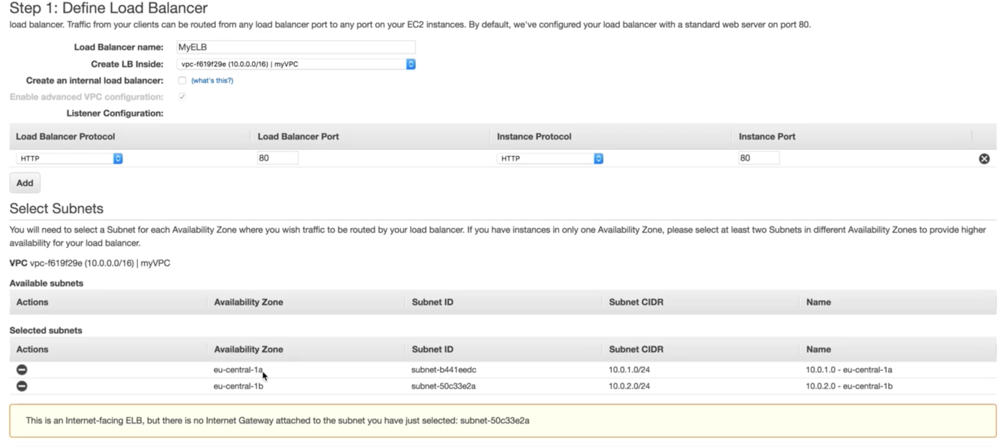
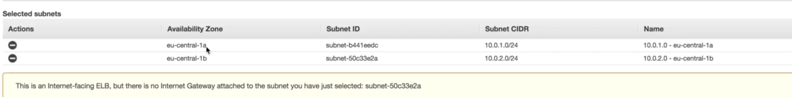

# Custom VPC's and ELBs







When you choose the private subnet to ELBs, it will show that 

```
This is an internet-facing ELB, but there is no internet Gateway attached to the subnet you 
have just select ....
```


Which means once the `one public subnet` down, the whole service will down


### So you need more than two `public subnet` to connect `ELB` to provides higher availability for the load balancer


## Exam Tips

1. If you want **resiliency**, always have **2 public subnets and 2 private subnets**. Make sure **each subnet is in different availability zones.**
2. With ELB's make sure **they are in 2 public subnets in 2 different availability zones**
