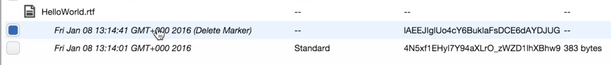
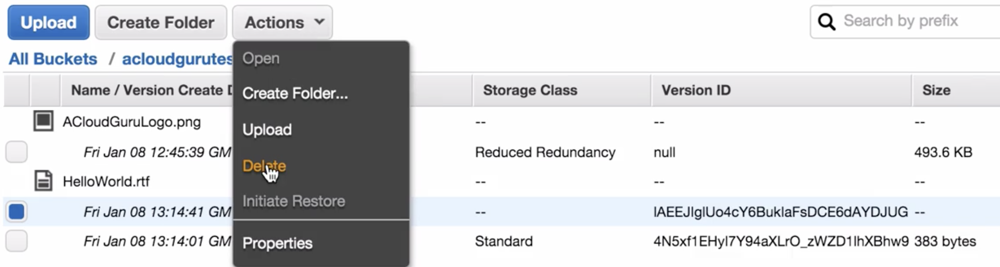
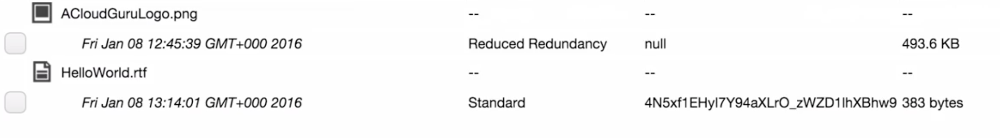
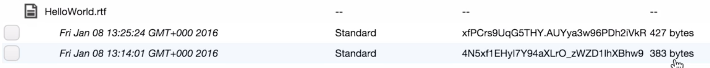
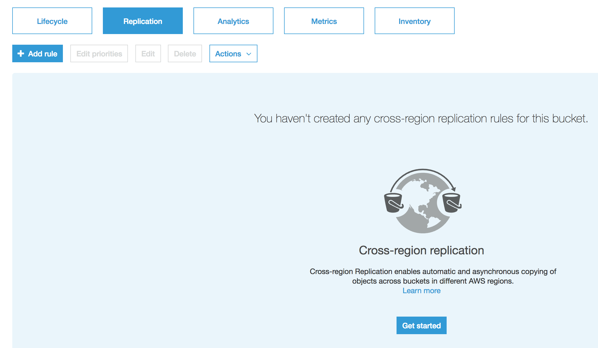
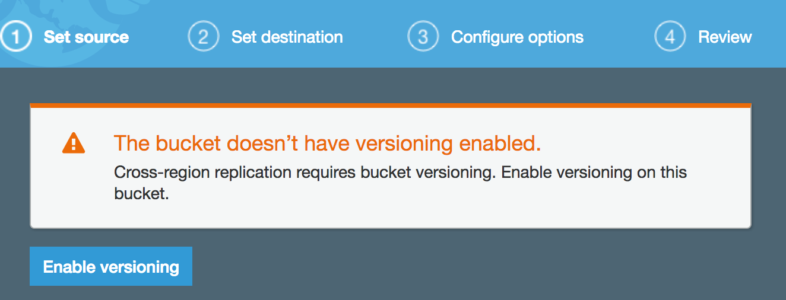
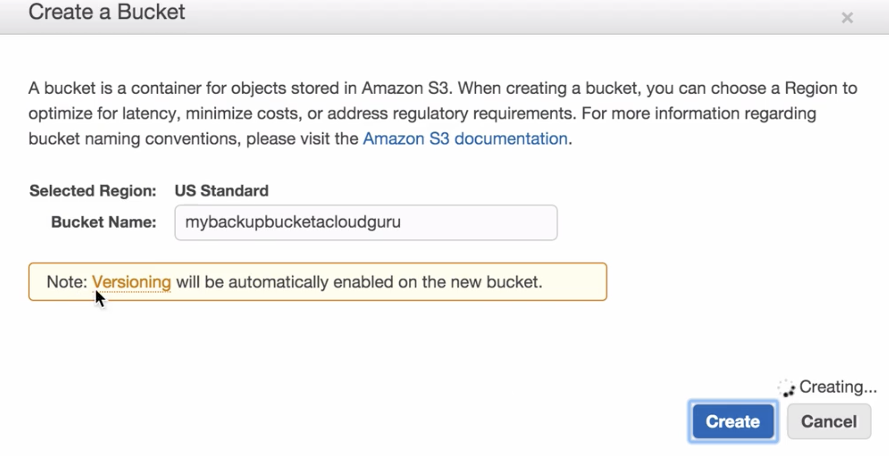
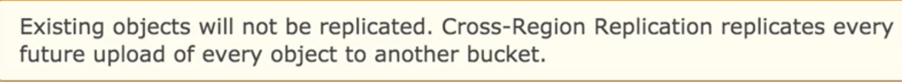

# S3 - Versioning Lab

#### Once you created bucket with versioning turned on, you cannot turn it off. you can `suspend` it or `enable` versioning again. Only way is to delete bucket and recreate it with turned off versioning 

### If you already enabled `Versioning` in S3

If you delete an object `without specifying an object version ID`, Amazon S3 adds a `delete marker `

### How to restore delete object  `without specifying an object version ID`

Click show tab to show versioning

Delete object one versioning with `deleted mark`, this object will be restored

####  Turning on the versioning will increase storage, every versioning has one version id  

## S3 Cross Region Replication

**Cross-region replication (CRR) enables automatic, asynchronous copying of objects across buckets in different AWS Regions.** 

**Buckets configured for cross-region replication can be owned by the same AWS account or by different accounts.**

Cross-region replication is enabled with **a bucket-level configuration**. You add the replication configuration to your source bucket. In the minimum configuration, you provide the following:

* The destination bucket, where you want Amazon S3 to replicate objects
* An AWS IAM role that Amazon S3 can assume to replicate objects on your behalf

### Requirements for CRR

#### Cross-region replication requires the following:

* Both source and destination buckets must have versioning enabled.

* The source and destination buckets must be in **different AWS Regions**.

* Amazon S3 must have permissions to replicate objects from the source bucket to the destination bucket on your behalf.
 
* If the owner of the source bucket doesn't own the object in the bucket, the object owner must grant the bucket owner READ and READ_ACP permissions with the object ACL.

### How Delete Operations Affect CRR

* If you make a DELETE request without specifying an object version ID, Amazon S3 adds a delete marker. Amazon S3 deals with the delete marker as follows:

  * **If using latest version of the replication configuration**, that is you specify the `Filter element` in a replication configuration rule, **Amazon S3 does not replicate the delete marker.**

  * If don't specify the `Filter element`, Amazon S3 assumes replication configuration is a prior version V1. In the earlier version, Amazon S3 handled replication of delete markers differently.

* If you **specify an object version ID** to delete in a `DELETE` request, **Amazon S3 deletes that object version in the source bucket, but it doesn't replicate the deletion in the destination bucket**. 

**In other words, it doesn't delete the same object version from the destination bucket. This protects data from malicious deletions.**

## Exam Tips:

1. Stores all versions of an object (including all writes and even if you delete an object)
2. Great backup tool
3. **Once enabled, Versioning cannot be disabled , only suspended**
4. Integrates with Lifecycle rule
5. **Versioning's MFA Delete capability, which users multi-factor authentication, can be used to provide an additional layer of security**
6. **Cross Religion Replication, requires versioning enabled on source bucket**

