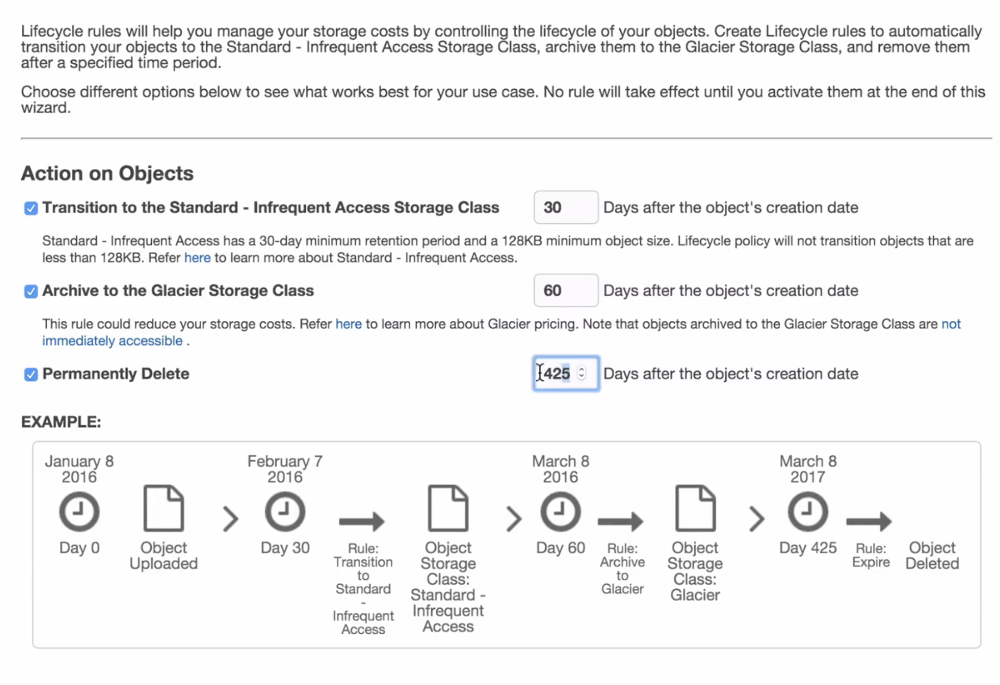
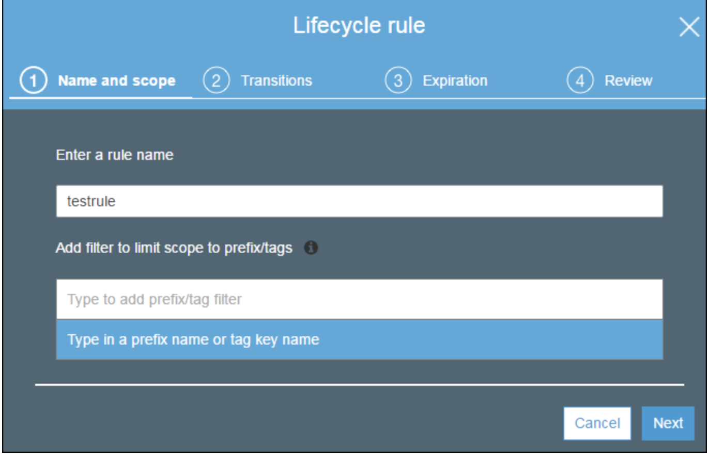
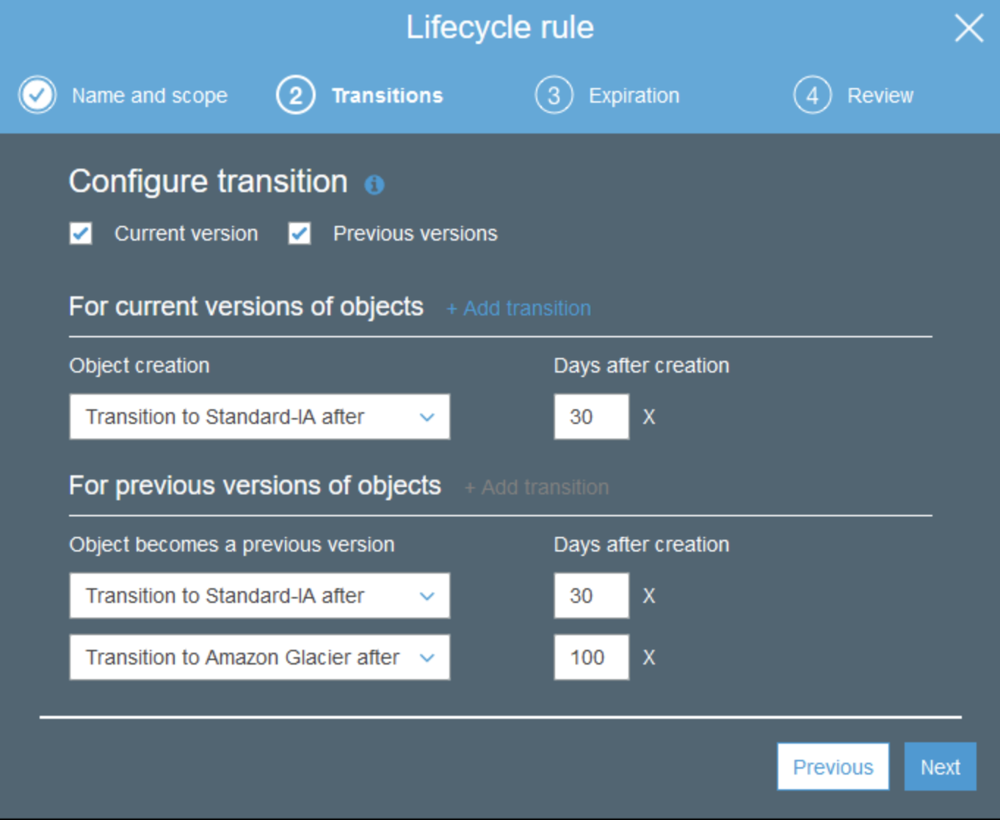
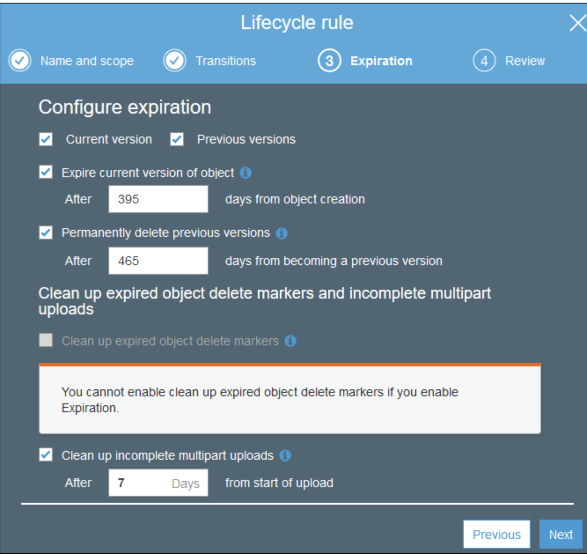

# LifeCycle Management, IA S3 & Glacier Lab

## 1.Versioning disabled / suspended

### Action of Object: 

Transition 

* [the Standard  =>  IA storage(Infrequent Access)]:  **30 days**
* [Archive => Glacier]:  **60 days**
* Object Deleted: **425 days**

### Latter rule's session must be longer than the pervious rule
 

## 2.Versioning enabled 

### Action on current and pervious version

#### In the Lifecycle rule dialog box, type a name for your rule to help identify the rule later. The name must be unique within the bucket. Configure the rule as follows:

* To apply this lifecycle rule to all objects with a specified name prefix (that is, objects with names that begin with a common string):
* To apply this lifecycle rule to all objects with one or more object tags.
* To apply this lifecycle rule to all objects in the bucket

### Choose `Add transitions` and specify one of the following transitions:

* Choose Transition to Standard-IA after, and then type the number of days after the creation of an object that you want the transition to be applied (for example, 30 days).

* Choose Transition to One Zone-IA after, and then type the number of days after the creation of an object that you want the transition to be applied (for example, 30 days).

* Choose Transition to Amazon Glacier after, and then type the number of days after the creation of an object that you want the transition to be applied (for example, 100 days).

#### If you select this expire option, you cannot select the option to clean up expired delete markers

Select **Permanently delete previous versions**, and then enter the number of days **after an object becomes a previous version to permanently delete the object** (for example, 465 days).

It is a recommended best practice to always select **Clean up incomplete multipart uploads**. For example, type 7 for the number of days after the multipart upload initiation date that you want to end and clean up any multipart uploads that have not completed.

