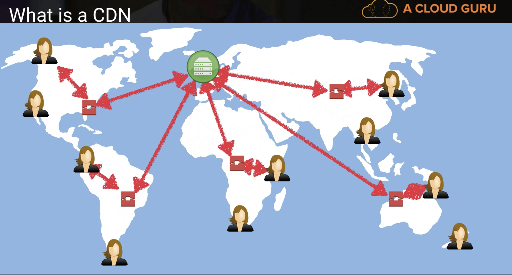
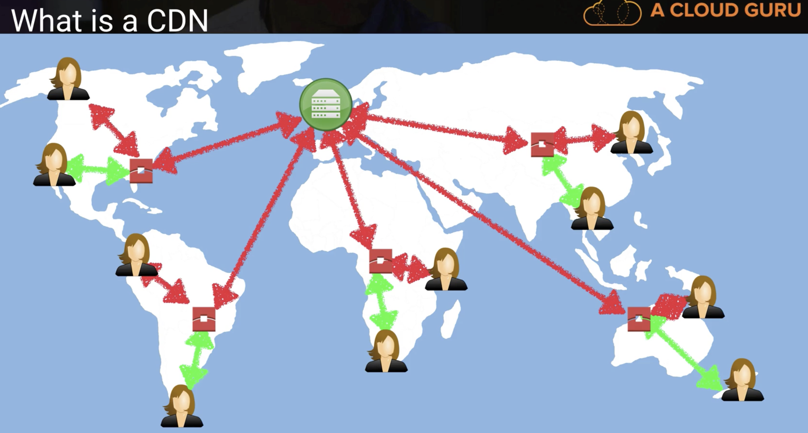

# Introduction to CloudFront

## What is a CDN

### A `content delivery network (CDN)` is a `system of distributed servers (network)` that deliver webpages and other web content to a user based on the `geographic locations` of the user, the origin of the webpage and a content delivery server.

## CloudFront - Key Terminology 

### 1. Edge Location - This is the location where `content will be cached`. `This is separate to an AWS Region/AZ`

### 2. Origin - This is the origin of all the files that the CDN will distribute. This can be either an `S3 bucket`, an `EC2 instance`, an `Elastic Load Balancer` or `Route53`

### 3.Distribution - This is the name given the CDN which consists pf a collection of Edge Locations

### Users

 
 
### Edge Location

 

### First Visiting

 

#### 1.Multiple users suited in multiple countries
#### 2.Users make request to get content and these request will be routed firstly to the local edge locations
#### 3.Edge locations will check objects whether or not cached in this edge location
#### 4.If not, edge location pulls down object from S3 and cache in it and live with the special `time to live (TTL)`
#### 5.First batch respond may be not that quick.

### Following Visiting

 

#### Following Visiting will be speed up

## What is CloudFront

Amazon Cloudfront can be used to deliver your entire website, including dynamic, static, streaming, and interactive content using global network of edge locations.

### Requests for your content are automatically routed to the nearest edge location, so content is delivered with the best possible performance.

Amazon Cloudfront is optimized to work with other Amazon Web Services, like Amazon Simple Storage Service(S3), Amazon Elastic Load Balancing, Amazon Elastic Compute Cloud(Amazon EC2), and Amazon Route 53. 

### Amazon Cloudfront also works seamlessly with any non-AWS origin server, which stores the original, definitive versions of your files.

## CloudFront - key Terminology 

* Web Distribution - Typically used for Websites

* RTMP - Used for Media Streaming

## Exam Tips:

### 1.Edge Location - This is the location where `content will be cached`. `This is separate to an AWS Region/AZ`
### 2.Origin - This is the origin of all the files that the CDN will distribute. This can be either an `S3 bucket`, an `EC2 instance`, an `Elastic Load Balancer` or `Route53`
### 3.Distribution - This is the name given the CDN which consists pf a collection of Edge Locations

* Web Distribution - Typically used for Websites
* RTMP - Used for Media Streaming

### 4.Edge locations are not just READ only, you can write them too (ie. put object in to them)
#### 5.Objects are cached for the life of the TTL(Time to Live)
#### 6.You can clear the cached objects, but you will be charged

