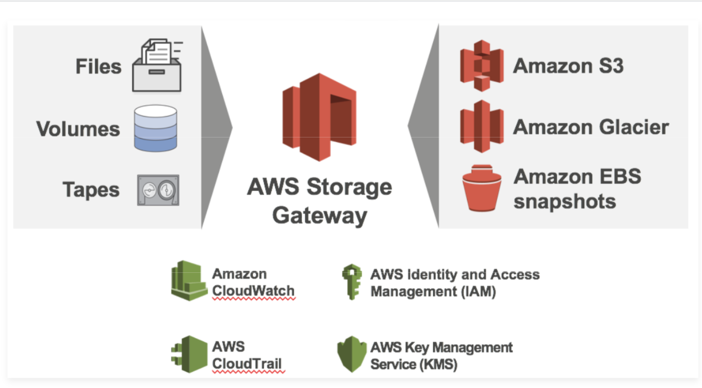
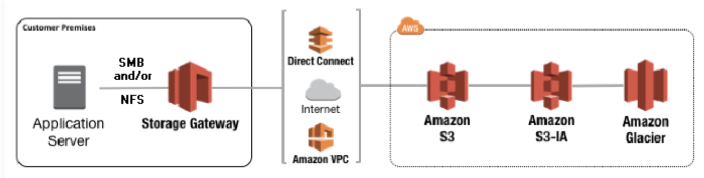

# Storage Gateway

#### `AWS Storage Gateway` is a service that connects an on-premises software appliance with cloud-based storage to provide seamless and secure integration between an organization's on-premises IT environment and AWS's storage infrastructure. 

The service enables you to securely store data to the AWS cloud for scalable and cost-effective storage

### `AWS Storage Gateway's` software appliance is available for download as a virtual machine (VM)image that you install on a host in your datacenter.

Storage Gateway supports either VMware ESXI or Microsoft Hyper-V. Once you've installed your gateway and associated it with your AWS account through the activation process, you can use the AWS Management Console to create the storage gateway option that is right for you.

## Three Types of Storage Gateways:

### 1. Gateway Stored Volumes
### 2. Gateway Cached Volumes
### 3. Gateway Virtual Tape Library (VTL)

## Gateway Stored Volumes

You keep your entire data set on site. Storage Gateway then backs this data up asynchronously to Amazon S3. **Gateway-Stored volumes provide durable and inexpensive off-site that backups that you can recover locally or from Amazon EC2.**

## Gateway Cached Volumes

### Only your most frequently accessed data is stored locally.

Your entire data set is stored in S3. You don't have to go out and buy large SAN arrays for your office/data center, so you can get significant cost savings. **If you lose internet connectivity, however, you will not be able to access all of your data.**

## Gateway Virtual Tape Library (VTL)

### You can have a limitless collection of virtual tapes.

### Each `virtual tape` can be stored in `Virtual Tape Library` backed by `Amazon S3` or a `Virtual Tape Shelf` backed by `Amazon Glacier`. 

The Virtual Tape Library exposes an industry standard iSCSI interface which provides your backup application with on-line access to the virtual tapes. Supported by NetBackup, Backup Exec, Veam etc.

## Exam Tips

### Gateway Stored Volumes

**Entire Dataset is stored on site and is asynchronously backed up to S3**

### Gateway Cached Volumes

**Entire Dataset is stored on S3 and the most frequently accessed data is cached on site**

### Gateway Virtual Tape Library (VTL)

**Used for backup and uses popular backup applications like by NetBackup, Backup Exec, Veam etc.**

