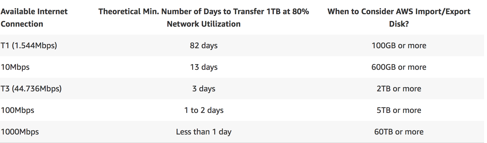
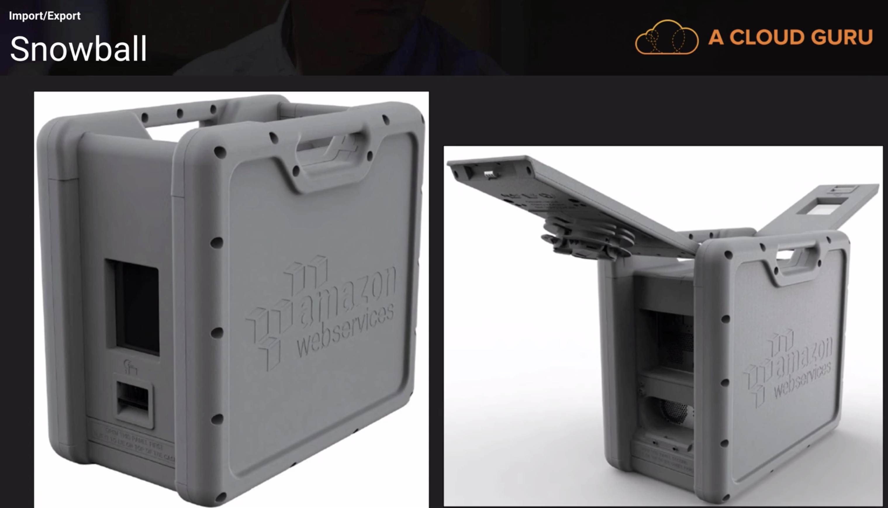
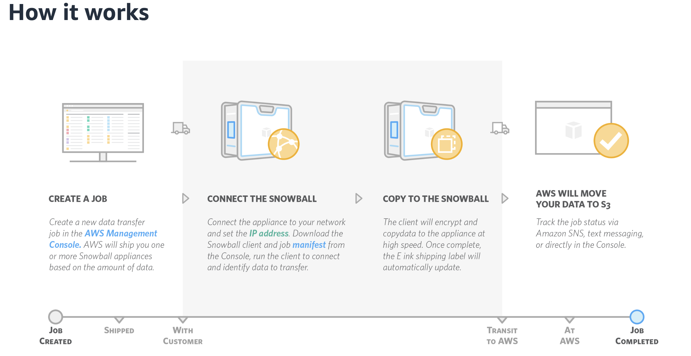

# S3 Import and Export

## Two Types of Import and Export

* Import/Export Disk
* Import/Export Snowball

## Import/Export Disk

**AWS Import/Export Disk accelerates moving large amounts of data and out of the AWS cloud using portable devices for transport**. AWS import/Export Disk transfer your data directly onto and off storage devices using Amazon's high-speed internal network and bypassing the internet.

## AWS Snowball

### Snowball is a petabyte-scale data transport solution that uses devices designed to be secure to transfer large amounts of data into and out of the AWS Cloud. 

Using Snowball addresses common challenges with large-scale data transfers including high network costs, long transfer times, and security concerns. Customers today use Snowball to migrate analytics data, genomics data, video libraries, image repositories, backups, and to archive part of data center shutdowns, tape replacement or application migration projects. 

**Transferring data with Snowball is simple, fast, more secure, and can be as little as one-fifth the cost of transferring data via high-speed Internet.**

## Exam Tips

### Import/Export Disk

* Import to EBS
* Import to S3
* Import to Glacier
* Export from S3

### Import/Export Snowball

* Import to S3
* Export to S3
