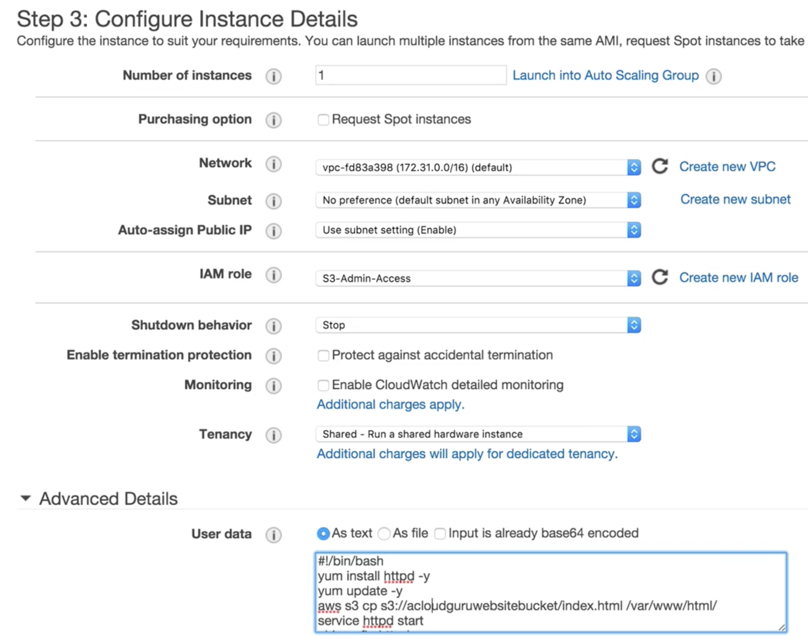

# Bash Scripting Lab

#### Upload index.html into S3  =>  `This S3 must in the same region with your EC2 instance`


### Create an EC2 instance with bash script

```
#/bin/bash
yum install httpd -y
yum update -y
aws s3 cp s://s3kucketname/index.html /var/www/html/
service httpd start
chkconfig httpd on
```

```
aws s3 cp s://s3kucketname/index.html /var/www/html/
```

### Configure instance details

