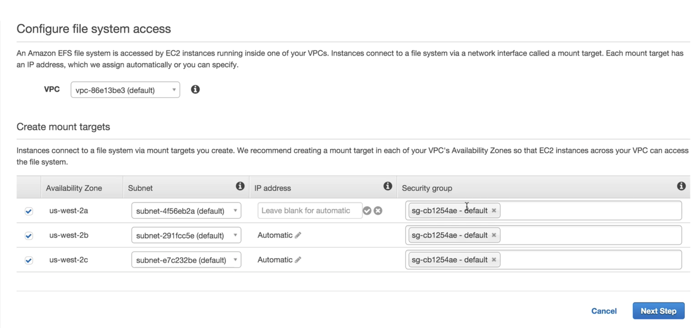
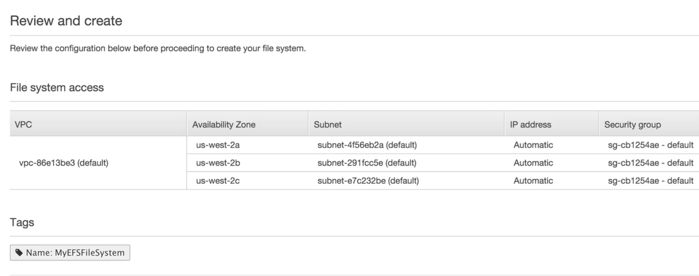
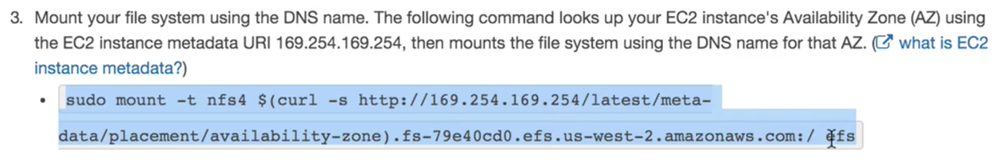
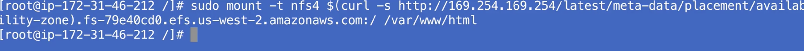

# EFS

## What is EFS

**Amazon Elastic File System** (Amazon EFS) is a **file storage service** for Amazon Elastic Compute Cloud (Amazon EC2) instances. Amazon EFS is easy to use and provides a simple interface that allows you to create and configure file systems quickly and easily. With Amazon EFS, **storage capacity is elastic, growing and shrinking automatically as you add and remove files, so your applications have the storage they need, when they need it**.


### EFS is `block based storag`e rather than `object based storage`

## EFS Feature

* Supports the network file system version 4 (NFSv4) protocol
* You only pay for the storage you use ( no pre-provisioning required)
* Can scale up to the petabytes
* **Can support thousands concurrent NFS connections**
* **Data is stored multiple AZ's within a region**
* Read after write consistency


## Lab

### Configure EFS, `different Subnets` and `default Security Group`






### create two EC2 instances with `default SG` and in `different Subnets` 

#### ssh to all instances



#### run same command in all ec2 instances



```
sudo mount -t efs fs-12345678:/ /var/www/html
```
### Once you add one file in one instance `/var/www/html`, this file will be automatically distributed to all instances' `/var/www/html` folder


## Exam Tips

**Code all in one file system, all in one container, then mount to multiple instance**
