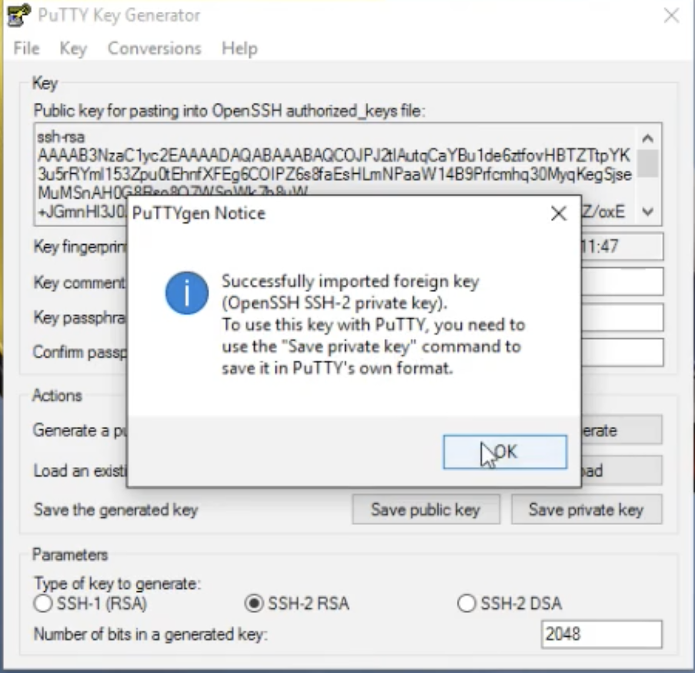
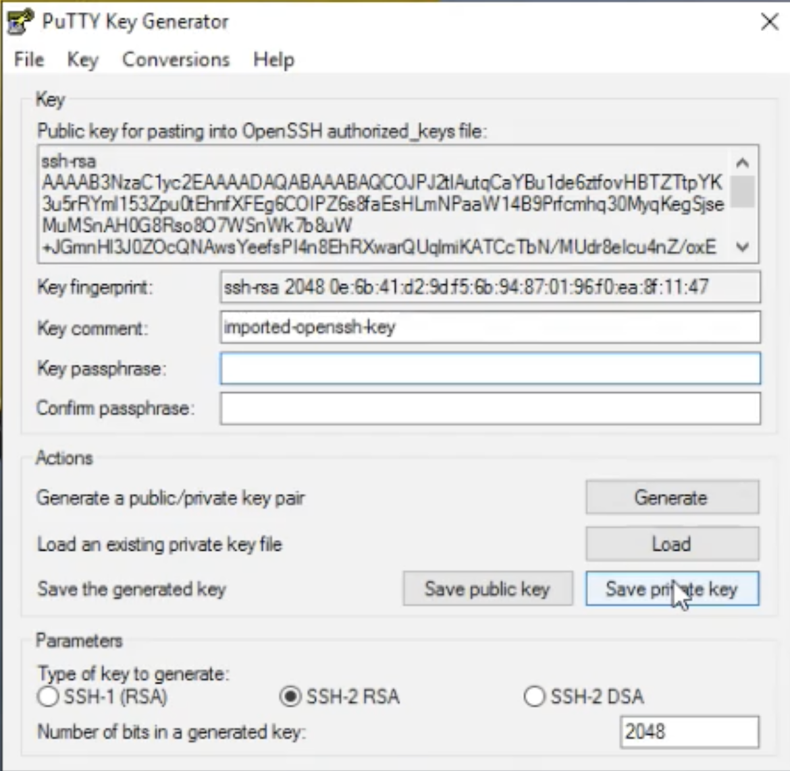
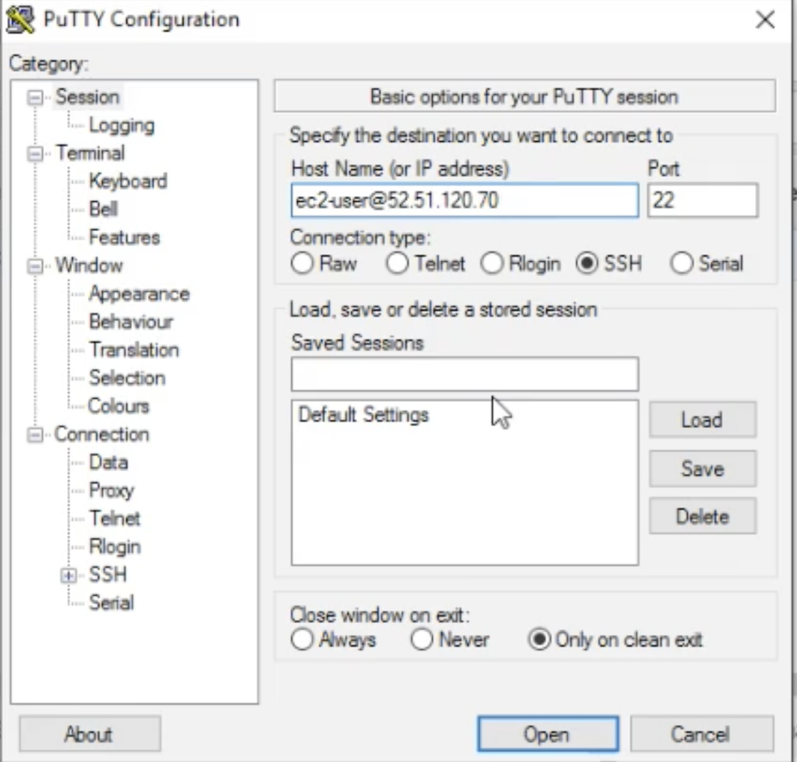
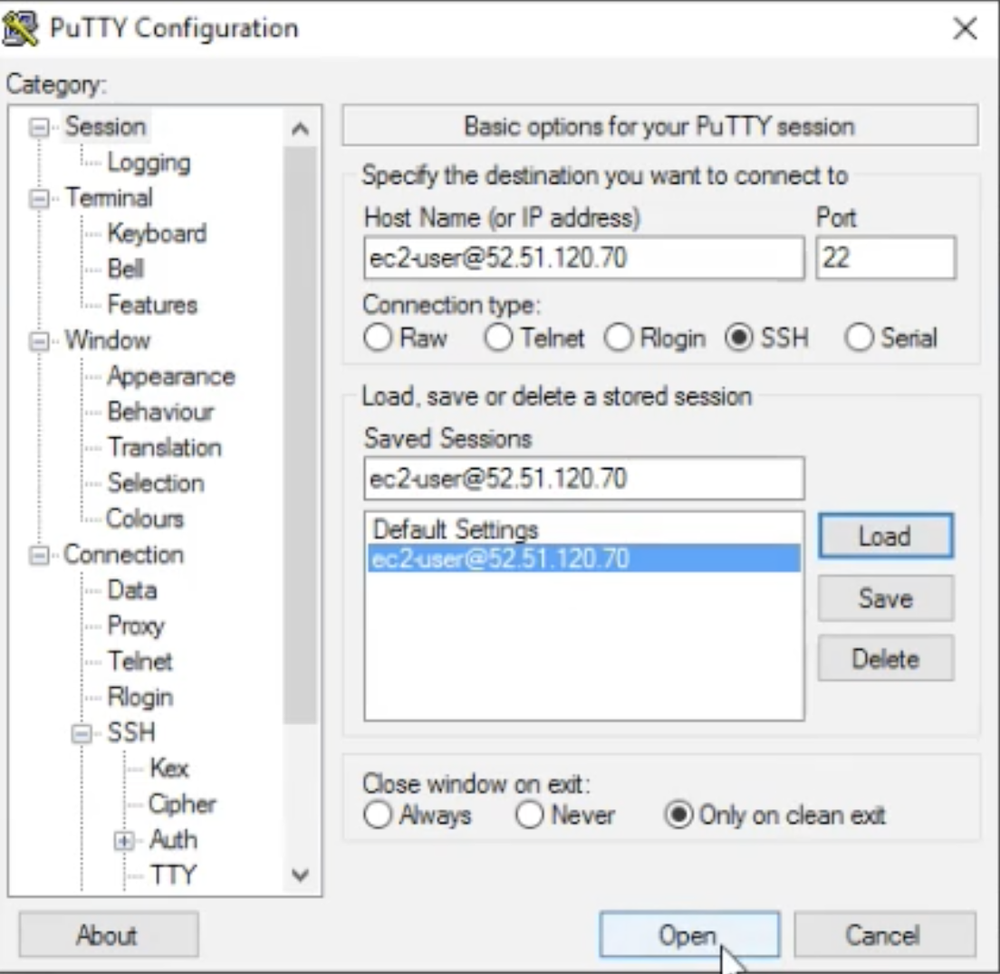

# How to Use Putty & PuttyKeyGen

### create new EC2 and download key pairs from it

### Load new key pairs to `PuttyGen`

### And save this private keys

### Use `Putty` add hostname and public ip addr

### load it and open ssh terminal 

