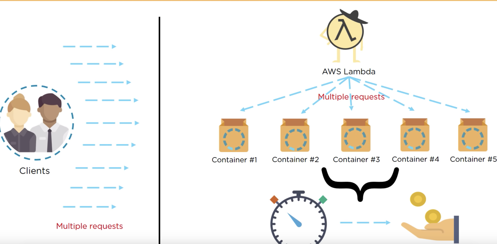
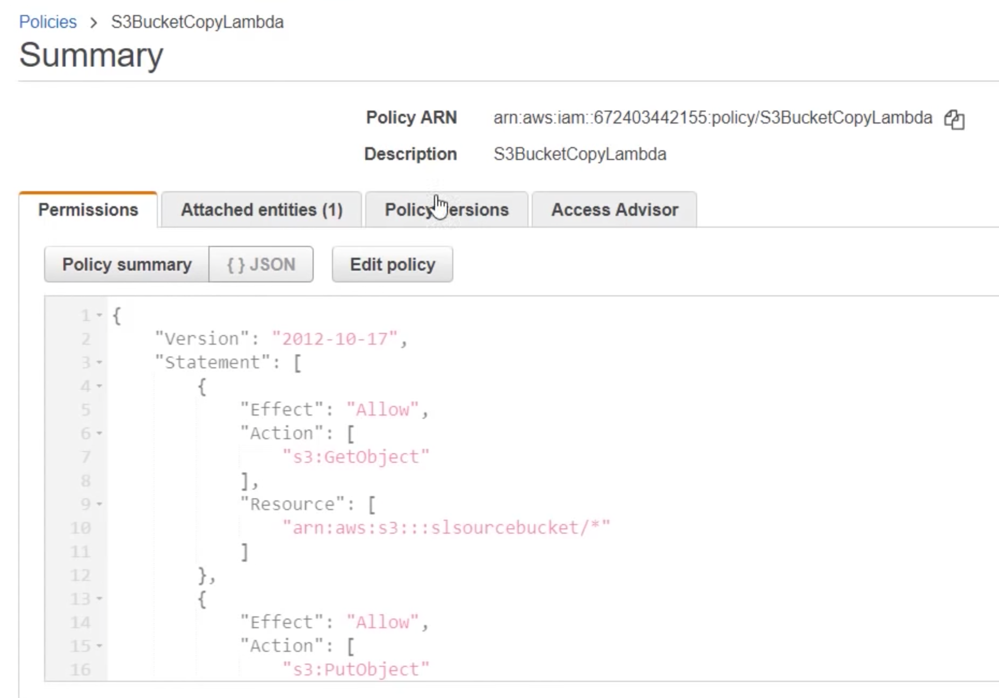
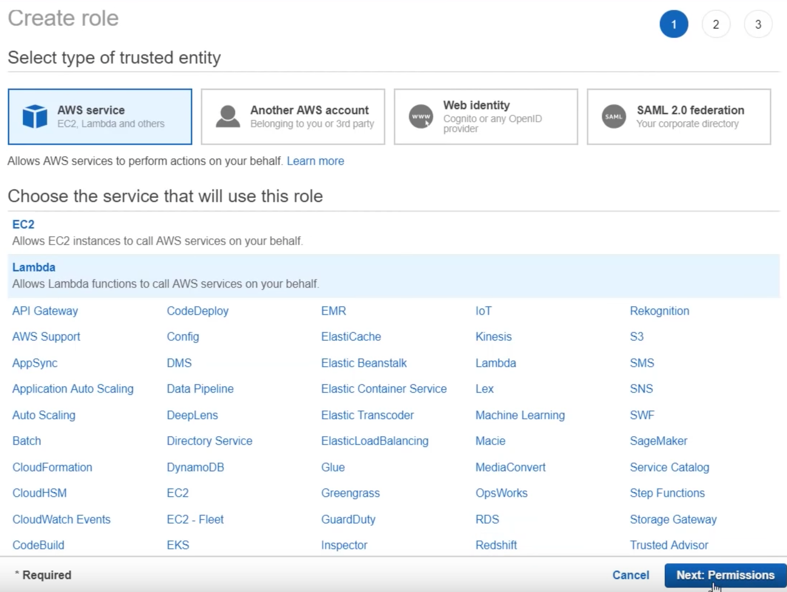
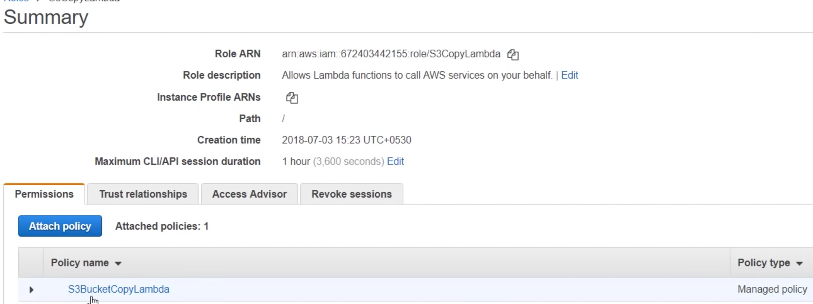
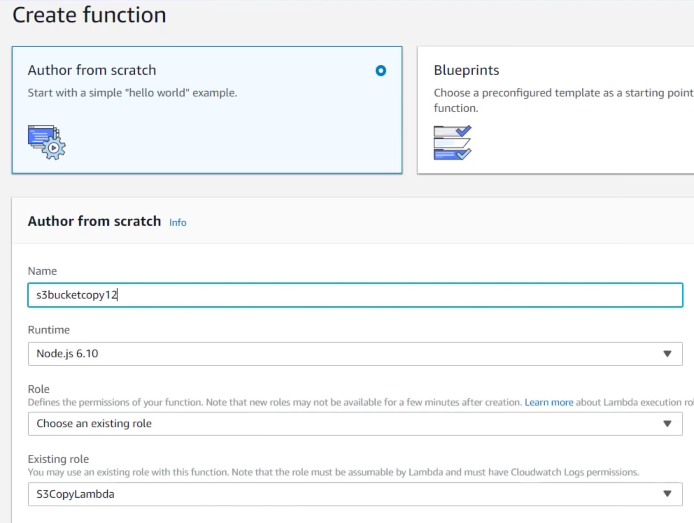
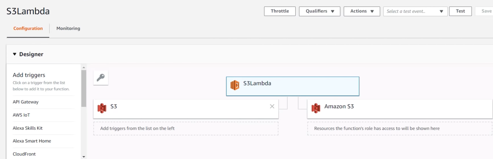

# AWS Lambda LAB - S3 copy

## Lambda Features

### No worries about the Server

You don't require servers. All you need to do is write the code and upload it to Lambda 

### Automatic Scaling 

Scaling is done automatically based on the size of the workload 

### Metering on the second 

You only pay for the amount of time that your code is running 


## How does Lambda work



## S3 Lambda Copy - LAB

### 1.Creating two S3 bucket

### 2.Create IAM roles and policies

#### create s3 copy policy

```
{
    "Version": "2012-10-17", 
    "Statement": [ 
     { 
       "Effect": "Allow", 
       "Action": [ 
          "s3:GetObject" 
        ], 
       "Resource": [ 
         "arn:aws:s3:::sourcebucket/*" 
     ] 
   },
   {
    "Effect": "Allow",
    "Action": [ 
     "s3:PutObject"  
    ]，
    "Resource": [ 
    "arn:aws:s3:::destinationbucket/*" 
    ]
  }
 ] 
} 
```




#### create lambda role







### 3.Lambda function to copy between buckets with our created role



####  Paste node.js s3 copy code

```
var AWS = require(aws-sdk"); 

exports.handler = (event, context, callback) => { 
   var s3 = new AWS.S3(); 
   var sourceBucket = "sourcebucket" 
   var destinationBucket = "destinationbucket"; 
   var objectKey = event.Records[0].s3.object.key; 
   var copySource = encodeURI(sourceBucket + "/" + objectKey); 
   var copyParams = { Bucket: destinationBucket, CopySource: copySource, Key: objectKey };         
   s3.copyObject(copyParams, function(err, data) {
     if (err) {
      console.log(err, err.stack);
     } else {
       console.log("S3 object copy successful."); 
      }
    }); 
}; 
```
s


### 4.Testing it outs