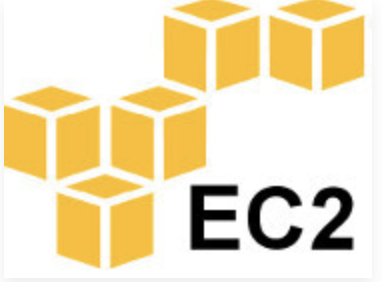
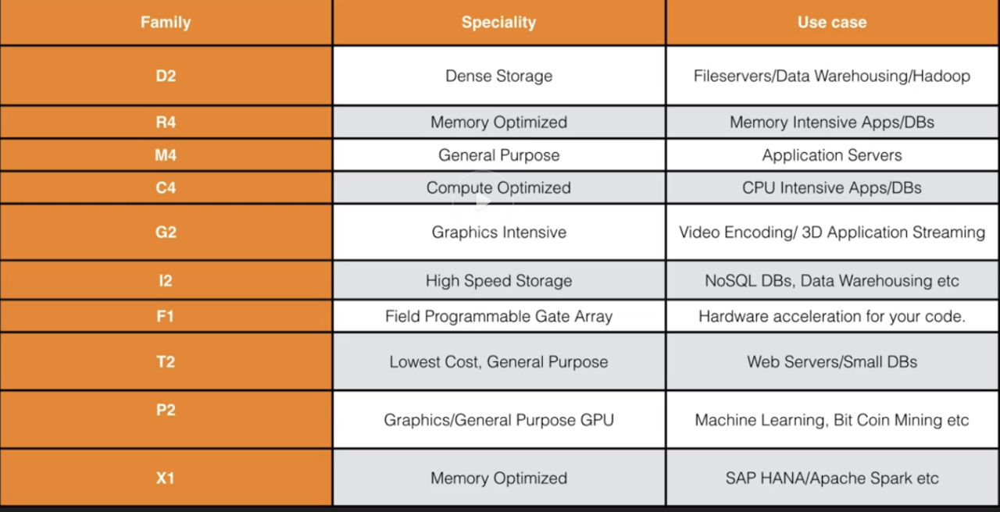
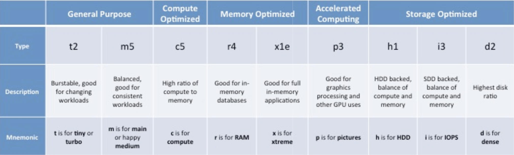

# AWS EC2 Overview

## What's EC2

### Amazon Elastic Compute Cloud (Amazon EC2) is a web service that provides resizable compute capacity in the cloud. 

Amazon EC2 reduces the time required to obtain and boot new server instances to minutes, allowing you to quickly scale capacity, both up and down, as your computing requirements change.

## EC2 Options

### On Demand

Allow you to pay a fixed rate by the hour with no commitment

### Reserved

Provide you with a capacity reservation, and offer a significant discount on the hourly charge for an instance. **1 year or 3 year terms**

### Spot

Enable you to bid whatever price you want for instance capacity, **providing for even greater saving for even greater savings if your applications have flexible start and end times**

## On Demand

* Users that want the low cost and flexibility of Amazon EC2 without any up-front payment or long-term commitment
* Applications with short term, spiky, or unpredictable workloads that cannot be interrupted
* Applications begin developed or tested on Amazon EC2 for the first time

## Reserved

* Applications with steady state or predictable usage
* Applications that require reserved capacity
* Users able to make upfront payments to reduce their total computing costs even further

## Spot

* Applications that have flexible start and end times
* Applications that are only feasible at very low compute prices
* User with urgent computing needs for large amounts of additional capcacity

### Spot price

**If the spot instance is terminated by Amazon EC2, you will not be charged for a partial hour of usage. However, if you terminate the instance yourself, you will be charged for any hour in which the instance ran.**

## EC2 Instance types

### The M5 instances are designed for highly demanding workloads and will deliver 14% better price/performance than the M4 instances on a per-core basis. 

## What is EBS?

### Amazon EBS allows you to create storage volumes and attach them to Amazon EC2 instances.

Once attached, you can create a file system on top of these volumes, run a database, or use them in any other way you would use a block device. 

**Amazon EBS volumes are placed in a specific Availability Zone, where they are automatically replicated to protect you from the failure of a single component.**

## EBS Volume Types

### Solid-State Drives (SSD)

#### General Purpose SSD (gp2)

**Description**: General purpose SSD volume that balances price and performance for a wide variety of workloads

**Use cases**:  

* Recommended for most workloads
* System boot volumes
* Virtual desktops
* Low-latency interactive apps
* Development and test environments

#### Provisioned IOPS SSD (io1)

**Description**: Highest-performance SSD volume for mission-critical low-latency or high-throughput workloads

**Use cases**:  

* Critical business applications that require sustained IOPS performance, or more than 10,000 IOPS or 160 MiB/s of throughput per volume

* Large database workloads, such as:
  
  *   MongoDB
  *   Cassandra
  *   Microsoft SQL Server
  *   MySQL
  *   PostgreSQL
  *   Oracle

### Hard disk Drives (HDD)

#### Throughput Optimized HDD (st1)

**Description**: Low cost HDD volume designed for frequently accessed, throughput-intensive workloads

**Use Cases**:

* Streaming workloads requiring consistent, fast throughput at a low price
* Big data
* Data warehouses
* Log processing
* Cannot be a boot volume

#### Cold HDD (sc1)

**Description**: Lowest cost HDD volume designed for less frequently accessed workloads

**Use Cases**:

* Throughput-oriented storage for large volumes of data that is infrequently accessed
* Scenarios where the lowest storage cost is important
* Cannot be a boot volume

### Previous Generation Volumes

#### EBS Magnetic

**Description**: Previous generation HDD
**Use Cases**: Workloads where data is infrequently accessed

## What we'll cover

* Lauch an EC2 Instance
* Security Group Basics
* Volumes and Snapshots
* Create an AMI
* Load Balancers & Health Checks
* Cloud Watch
* AWS Command Line
* IAM Roles with EC2
* Bootstrap Scripts
* Launch Configuration Groups
* Autoscaling
* EFS
* Lambda
* HPC (High performance compute) & Placement Groups

## Exam Tips EC2

### Know the differences between;

* On Demand
* Spot
* Reserved

### Remember with spot instances;

* if you terminate the instance, you pay for the hour
* If AWS terminate the spot instance, you get the hour it was terminated in for free.

## Exam Tips EBS

### EBS consists of:

### Solid-State Drives (SSD)

* General Purpose SSD (gp2)
* Provisioned IOPS SSD (io1)

### Hard disk Drives (HDD)

* Throughput Optimized HDD (st1)
* Cold HDD (sc1)
* EBS Magnetic. (cheap, infrequently accessed storage)

### You cannot mount 1 EBS volume to multiple EC2 instances, instead use EFS.

## EC2 Instance types

