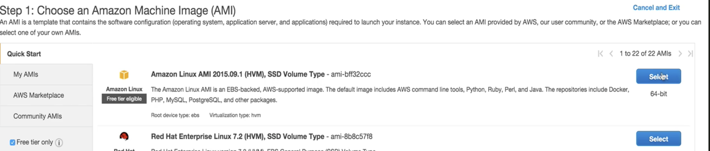

# Launch our first EC2 instance

## Check `free tier only` to use free EC2 AMI



### AMI Types:

1. HVM: Hardware Virtual Machine (HVM).
2. PV:  Paravirtual (PV)


## Request Spot Instance

 

## Tag Instance

 


## Add Storage

### 1. IOPS = SIZE * 3   (3 * 8G = 24)
### 2. Root storage => setting for operating system is not encrypted by default


## Create New Security Group

### Security Group is like a virtual fire wall

 

Like `SSH`, `HTTP`

## Create New Key Pair for New EC2

 


## New EC2 Created with Public IP

 


### SSH to EC2 Instance with key

```
$ chmod 600 MyEC2Key.pem
$ ssh ec2-user@public-ip -i MyEC2Key.pem
```

 


## How to terminate an Instance with `Termination Protection Open`

 

### Disable it firstly

 


## Exam Tips

1. Termination Protection is turned off by default, you must turn it on
2. On an EBS-backed instance, the default action is for the root EBS volume to be deleted when instance is terminated
3. **Root Volumes cannot be encrypted by default, you need a third party tool (such as bit locker etc) to encrypt the root volume**
4. **Additional volumes can be encrypted.**


