# Volume vs Snapshot Lab

## Volume vs Snapshot

### Volumes exist on EBS: `Virtual Hard Disk`
### Snapshot exits on S3
### You can take a snapshot of a volume, this will `store that volume on S3`
### Snapshots are point in time copies of Volumes
### Snapshots are `incremental`, this means that only the blocks that have changed since your `last snapshot are move to S3`
### If this is your first snapshot, it may take some time to create


## Create Magnetic Volume (10G)

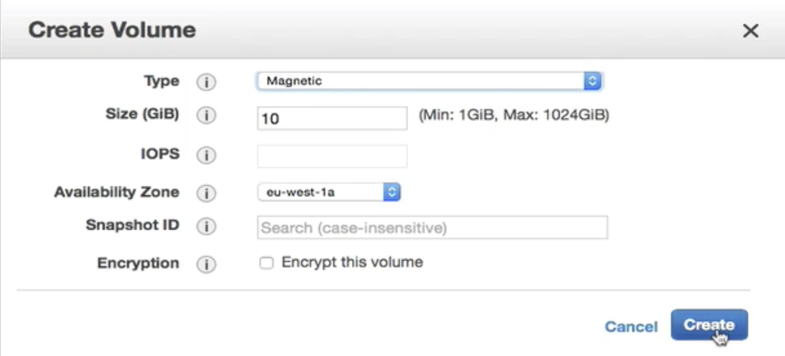


### attach it to an running instance

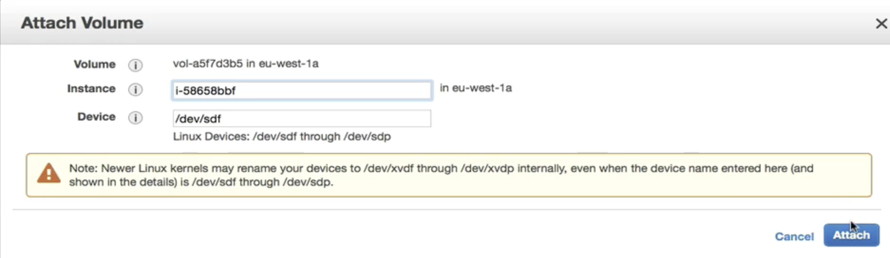

### ssh to instance and lists information about all available or the specified block devices.

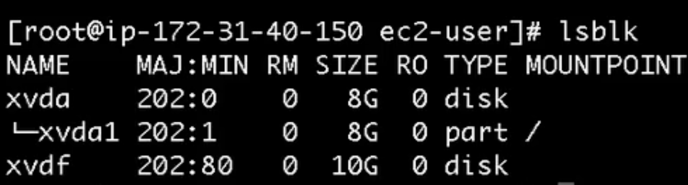

#### `xvdf` already attach to instance, but no `mount point` currently

### check this vol is file system or not 

```
$ sudo su
$ file -s /dev/xvd
/dev/xvdf: data        #  It's not file system
```

### Transfer this block device to file system


```
$ mkfs -t ext4 /dev/xvdf
# mkfs: make file system
# -t type
# /dev/xvdf : mount location
```
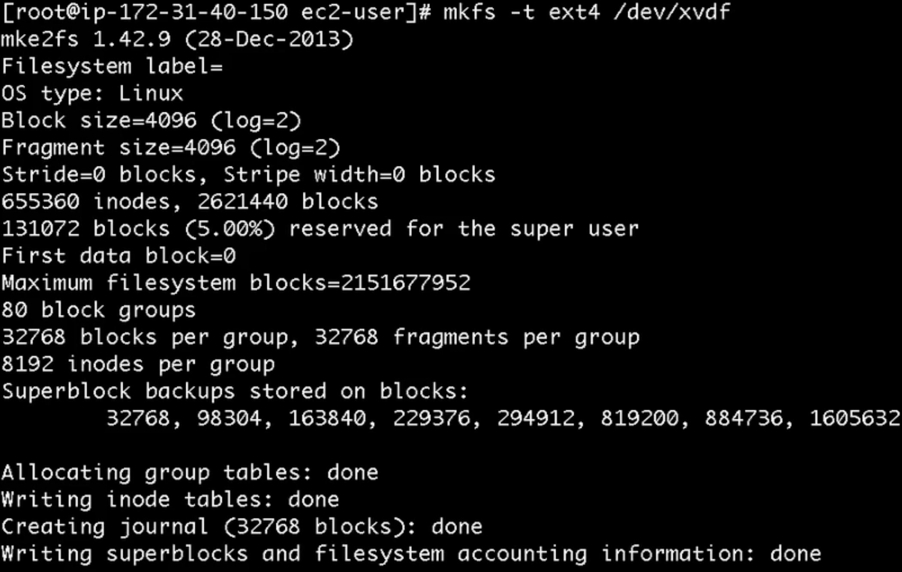

### mount `/dev/xvdf` to `/fileserver`

```
$ mkdir /fileserver
$ mount /dev/xvdf /fileserver
```

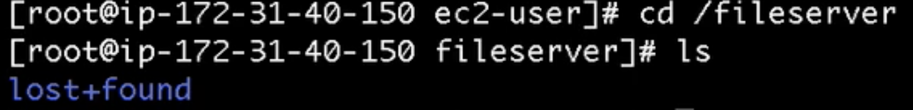

#### add tmp files inside `/fileserver`


### unmount `/dev/xvdf` from `/fileserver`

```
$ umount /dev/xvdf
$ cd /fileserver
$ ls
$ 
```
### create Snapshot of this volume

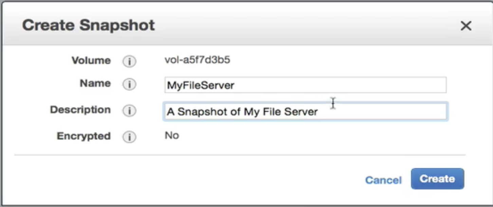

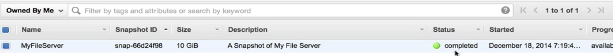

### Detach and delete this volume 


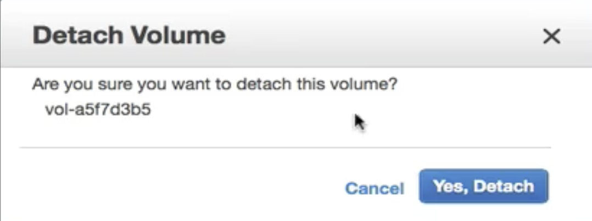

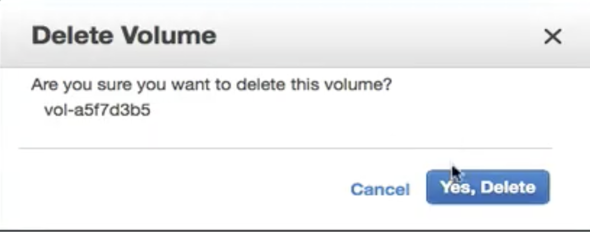


## Create new Volume (gp2 ssd)

### You can change type of volume from snapshot

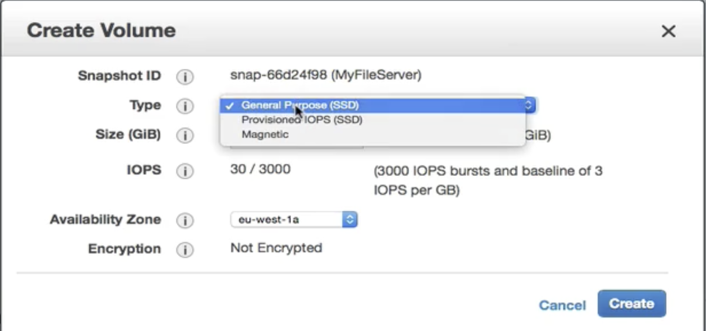


### After it reattached to instance

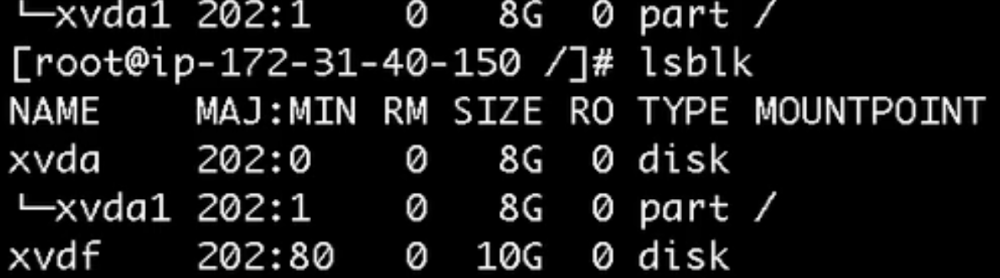

```
$ sudo su
$ file -s /dev/xvd
```

#### It's file system, so you don't have to transfer file system again

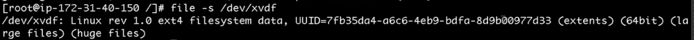


### mount again and files exist

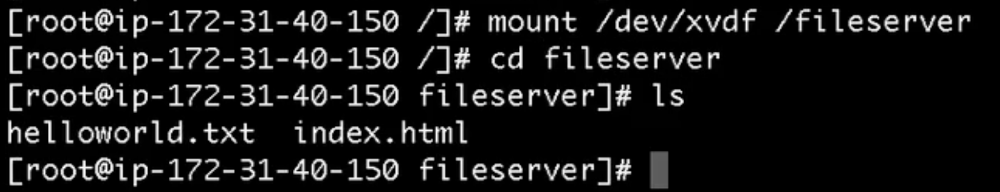


## Volumes vs Snapshots - Security

* **Snapshots of encrypted volumes are encrypted automatically**
* Volumes restored from encrypted snapshots are encrypted automatically
* You can share snapshots, but only if they are unencrypted

#### These snapshots can be shared with other AWS account or made public


## Snapshots of Root Device Volumes

**To create a snapshot for Amazon EBS volumes that servers as root devices, you should stop the instance before taking the snapshot**

