# Raid, Volume and Snapshots

## RAID = Redundant Array of Independent Disks

### RAID 0 - Striped, No Redundancy, Good Performance
### RAID 1 - Mirrored, Redundancy
### RAID 5 - Good for reads, bad for writes, AWS does not recommend ever putting RAID 5's on EBS
### raid 10 - Striped & Mirrored, Good Redundancy, Good Performance

## Create Windows Instance

### 1.change exist SG inbound and add `RDP` rule

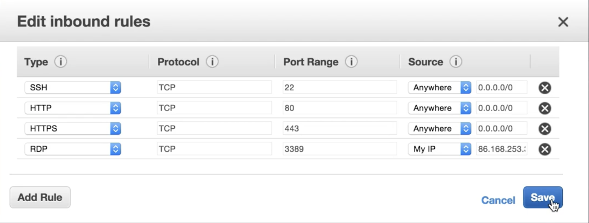

### 2.create windows 2012 server

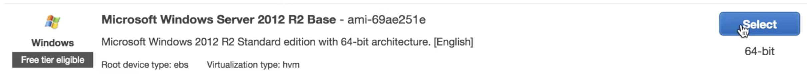

#### Add new 4 storages

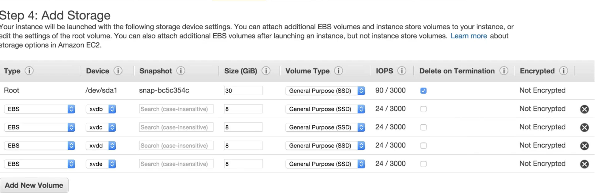

#### Attach SG to it

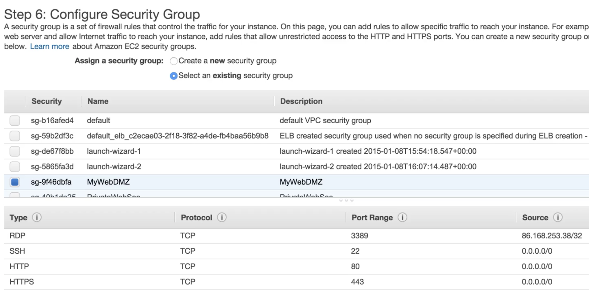

#### Download key for windows server password 

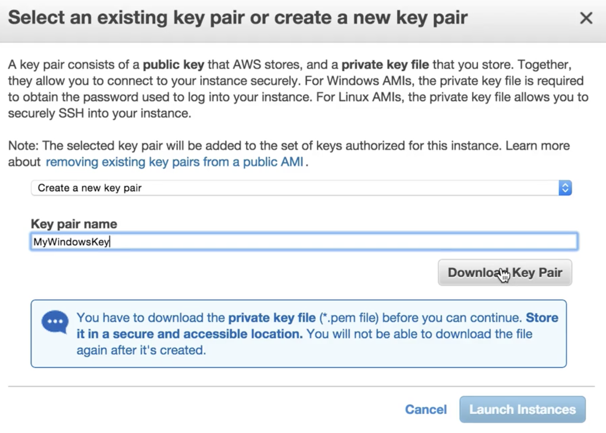

#### Get windows password and retrieve windows password for admin

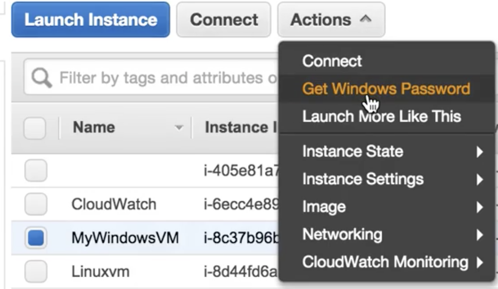

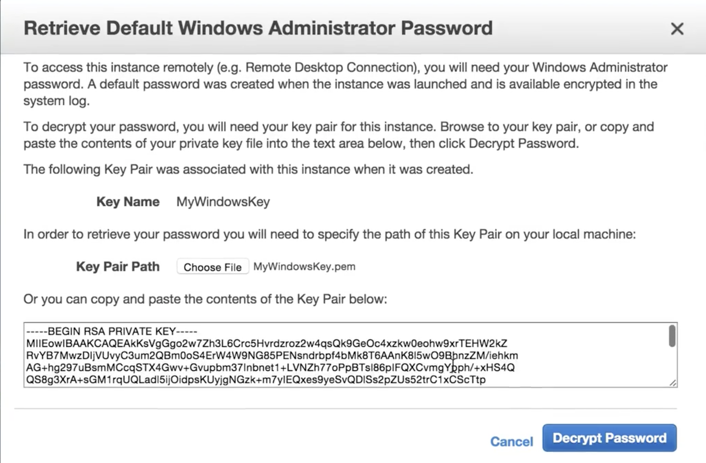

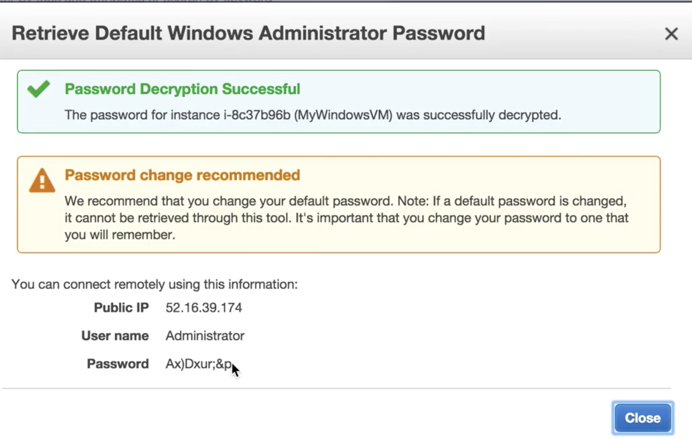

## Login into Windows Instance and change 4 new volumes to striped volume

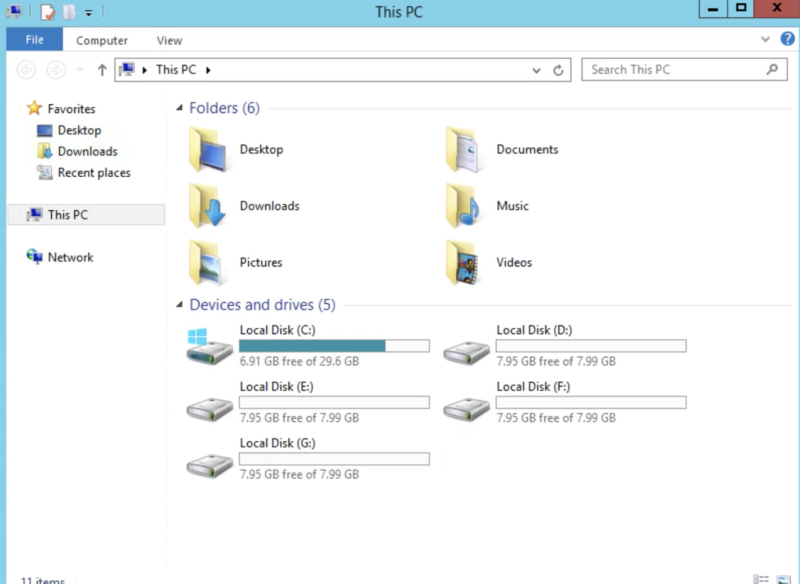

#### Delete these 4 volumes

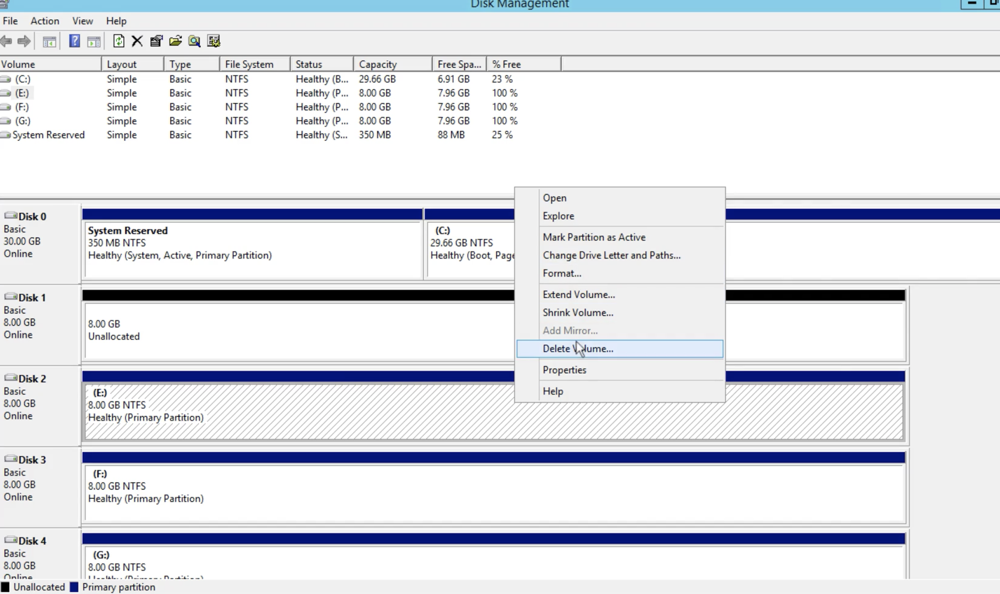

#### Change these 4 volumes to new striped volume

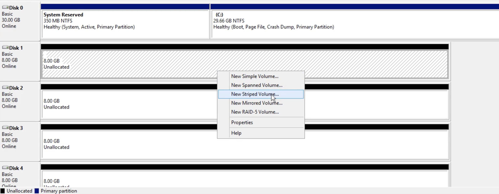

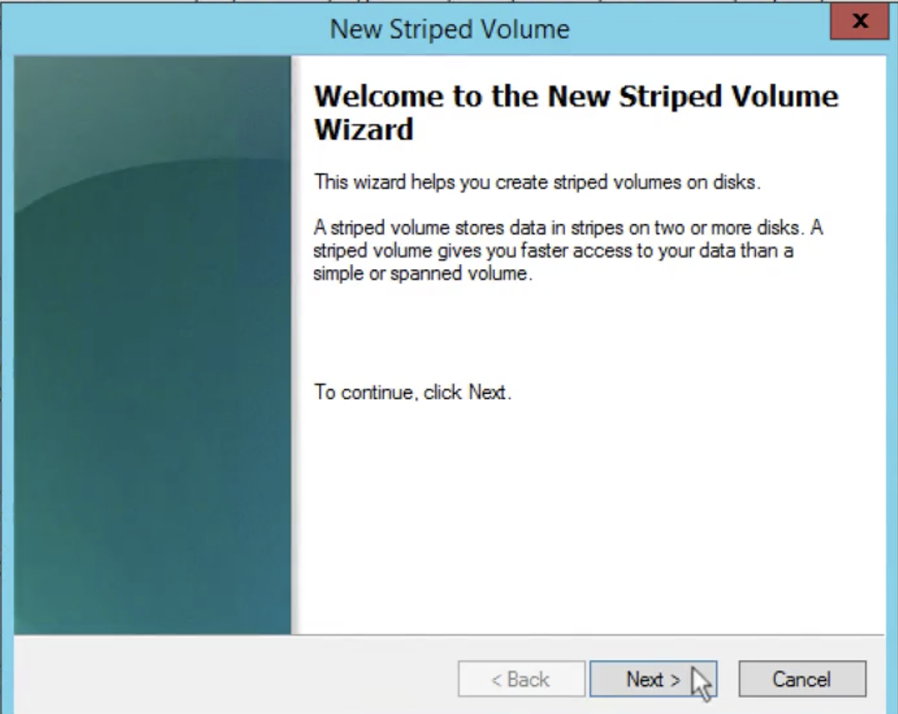

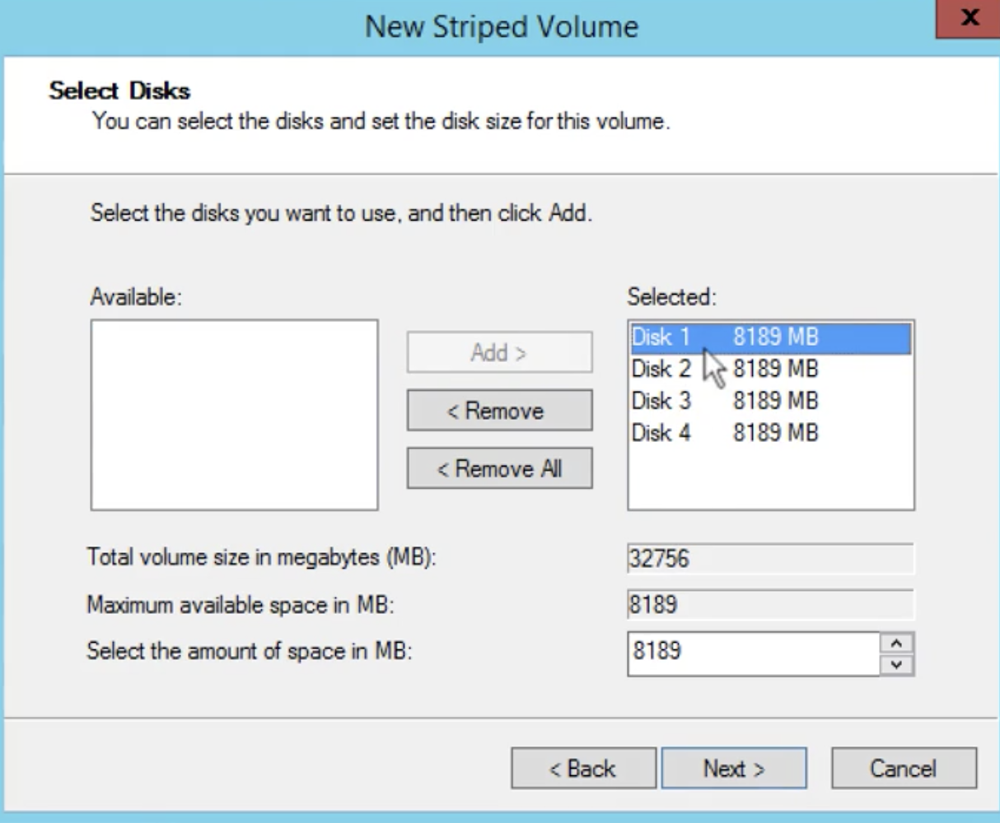

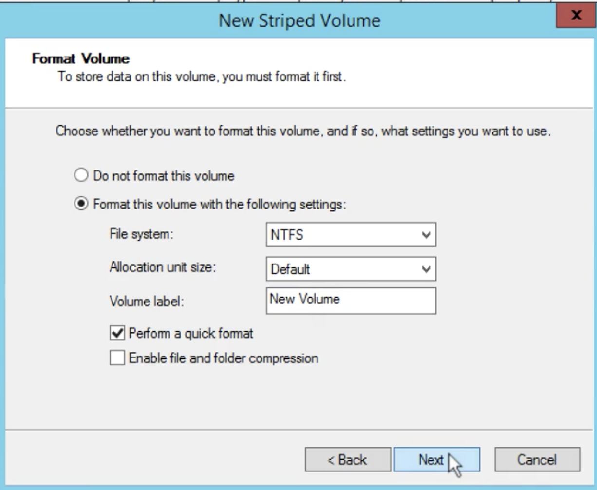

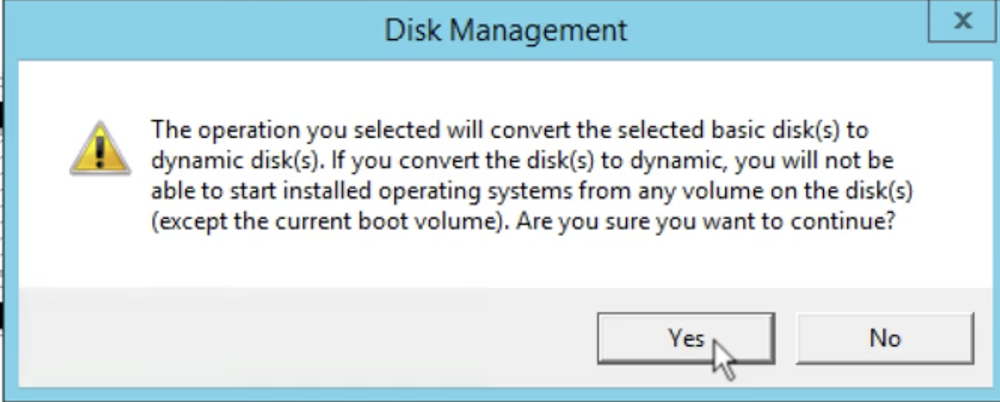

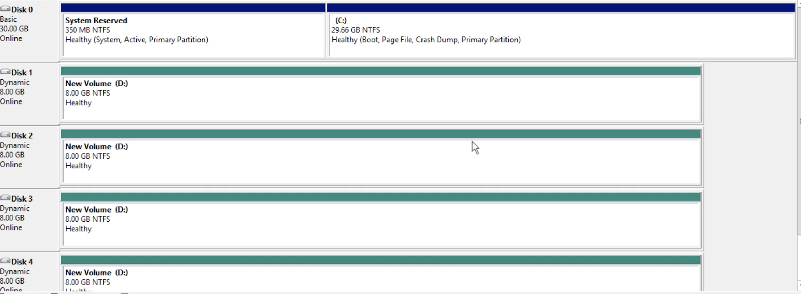

## How can I take a Snapshot of a RAID Array?

**Problem** - Take a snapshot, the snapshot `excludes data held in the cache` by applications and the OS. 

This tends not to matter on a single volume, however using multiple volumes in a RAID array, this can be a problem due to interdependencies of the array. 

###  Solution - Take an application consistent snapshot. 

## How can I take a Snapshot of a RAID Array? 

* Stop the application from writing to disk. 
* Flush all caches to the disk. 

### How can we do this? 

* Freeze the file system 
* Unmount the RAID Array 
* Shutting down the associated EC2 instance. 
