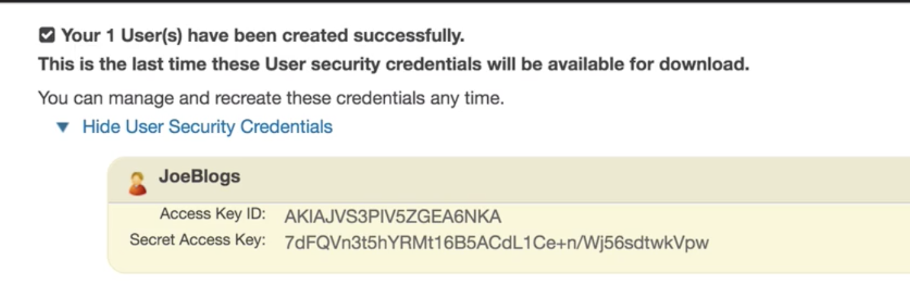
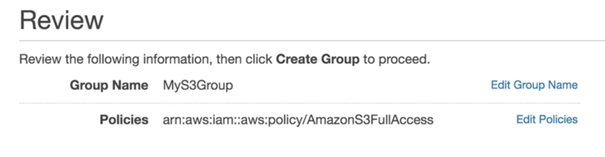
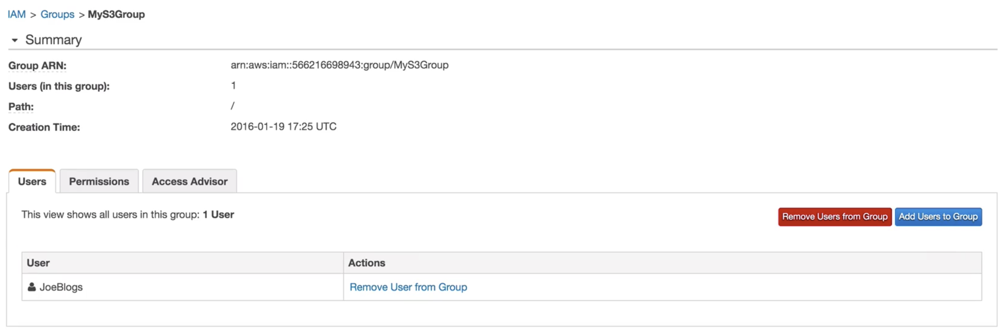
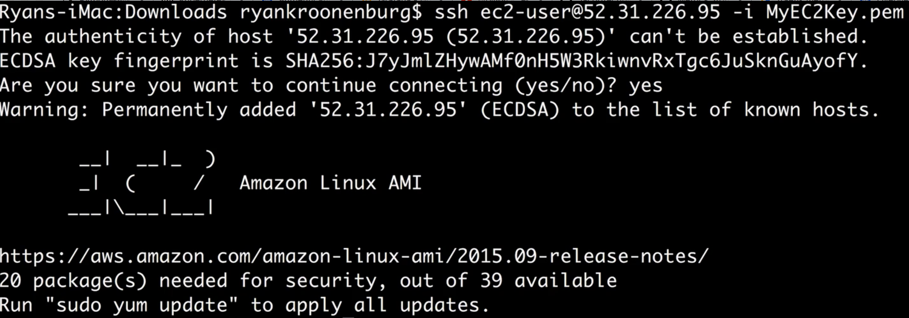
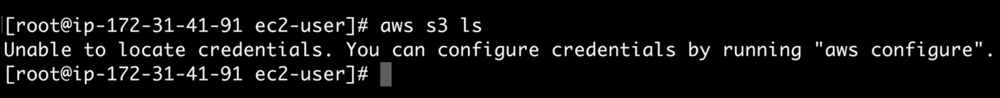
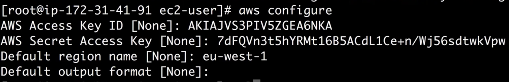
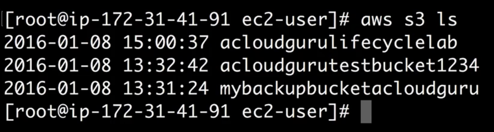

# AWS Command Line Lab

#### Creating an new instance without IAM role attached to it


## Creating an new user and group




#### download credentials


### create new group with policy



### attach the user to group




## Use AWS CLI with credentials




#### aws s3 ls  => error




#### aws configure  <= downloaded credential




#### aws s3 ls  => success




```
$ cd .aws/
$ ls
config		credentials
```


## Exam Tips:

#### 1. You can only assign an IAM role to an instance when you creating a new ec2 instance. You cannot assign latter, after you already created it
#### 2. For protection: use role rather than credentials

