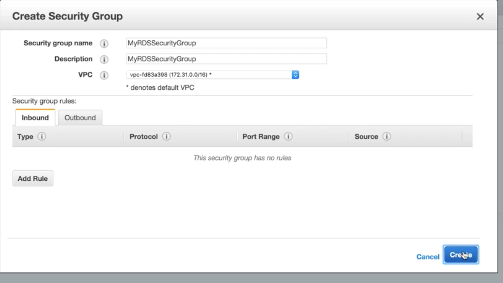
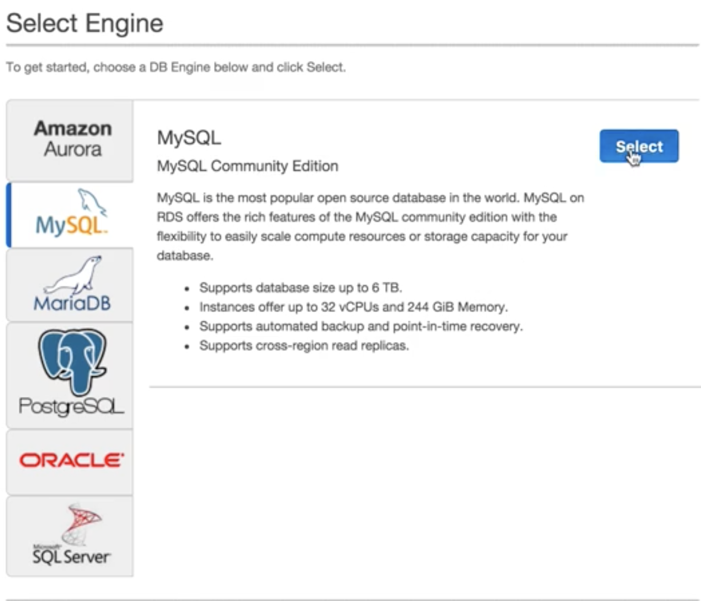
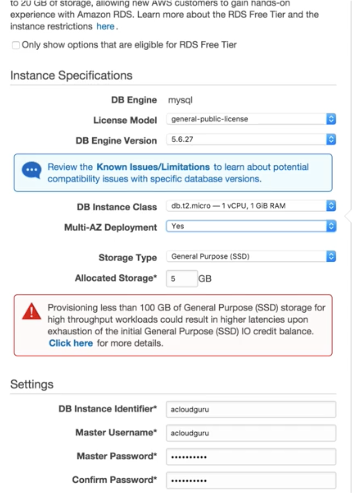
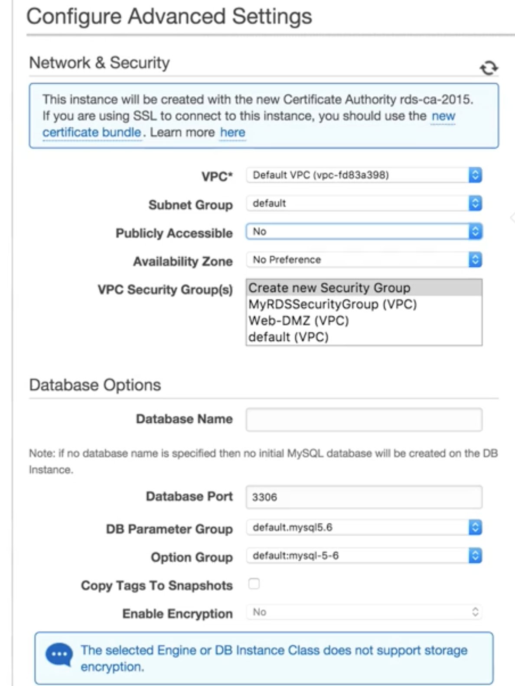
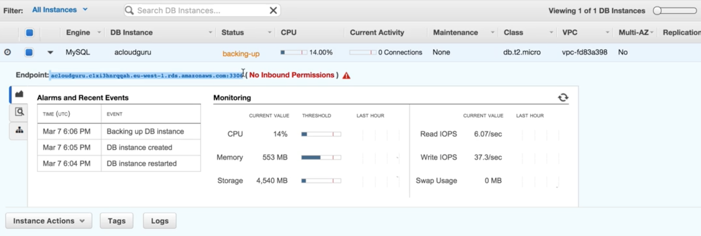
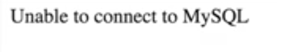
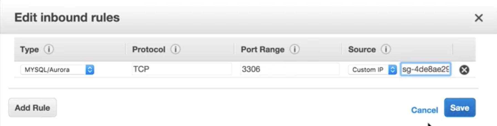
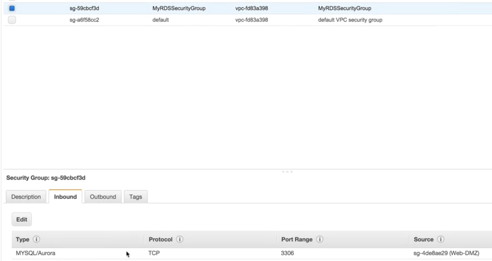
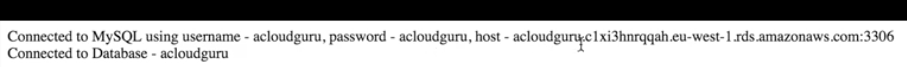

# RDS Instance - LAB

### Create web server ec2 instance 

#### advance with bash script install `php` and `php-mysql`

```
#!/bin/bash
yum install httpd php php-mysql -y
yum update -y
chkconfig httpd on
service httpd start
echo "<? php phpinfo();?>"  > /var/www/html/index.php
cd /var/www/html
wget httpds://s3-eu-west-1.amazonaws.com/bucketname/connect.php
```

#### `connect.php`


```
<?php

$ username = "xx";
$ password = "xx";
$ hostname = "";
$ $dbname = "xx";

//connection to the database 

$dbhandle = mysql_connect($hostname, $username, $password) or die ("Unable to connect to Mysql");

echo "Connected to Mysql using username - $username, password - $password, host - $hostname<br>";

$selected = mysql_select_db("$dbname", $dbhandle) or die ("Could not select database");

echo "Connnect to Database - $dbname";
?>
```


### Create SG for RDS without any `inbound` and `outbound` sg




### Create `mysql` DB 


 
 
#### Select free tier RDS specification for this db instance




### configure advanced settings




**Enable Encryption : None**


## Add db endpoint to `connect.php` `$hostname`



### ssh to web server and alter `connect.php`

```
<?php

$ username = "xx";
$ password = "xx";
$ hostname = "acloudguru.clxi3hnrqqah.eu-west-1.rds.amazonaws.com:3306";
$ $dbname = "xx";

//connection to the database 

$dbhandle = mysql_connect($hostname, $username, $password) or die ("Unable to connect to Mysql");

echo "Connected to Mysql using username - $username, password - $password, host - $hostname<br>";

$selected = mysql_select_db("$dbname", $dbhandle) or die ("Could not select database");

echo "Connnect to Database - $dbname";
?>
```

### `webserver_publicIp/connect.php` still cannot connect db




## Enable our web sever security group to talk to our rds instance using rds SG

### add web-server-sg as inbound rule to rds-server-sg






### connect success

