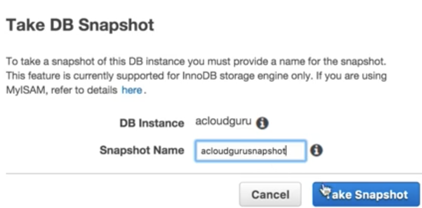
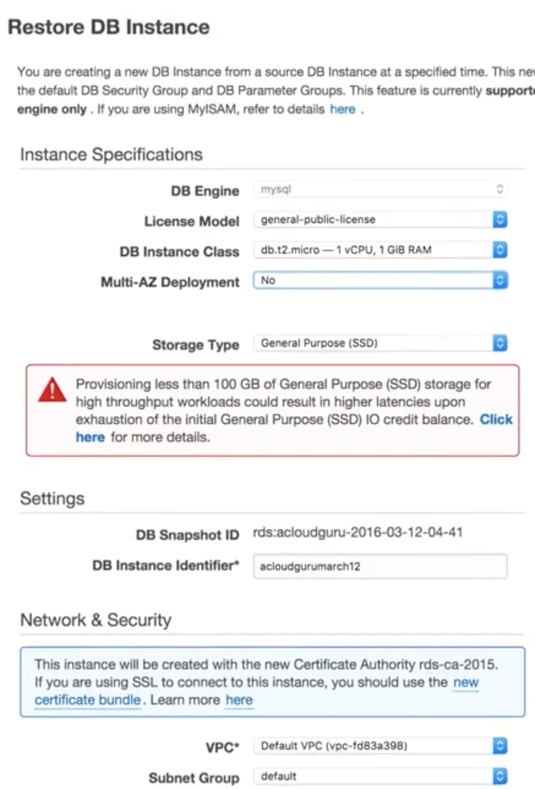
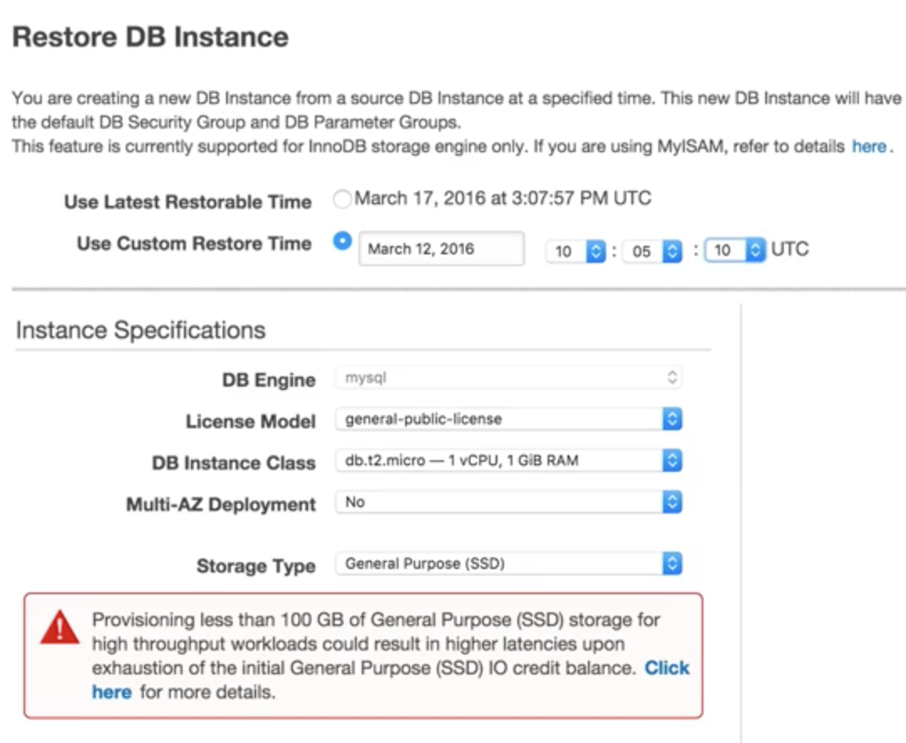
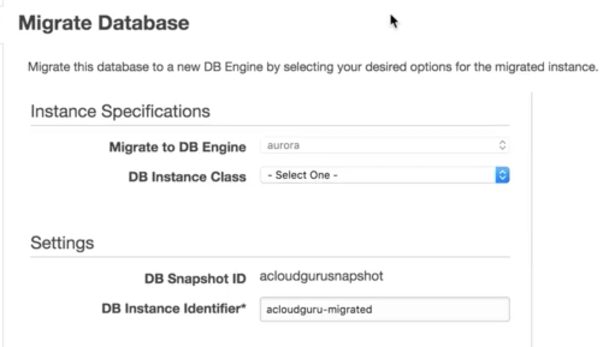
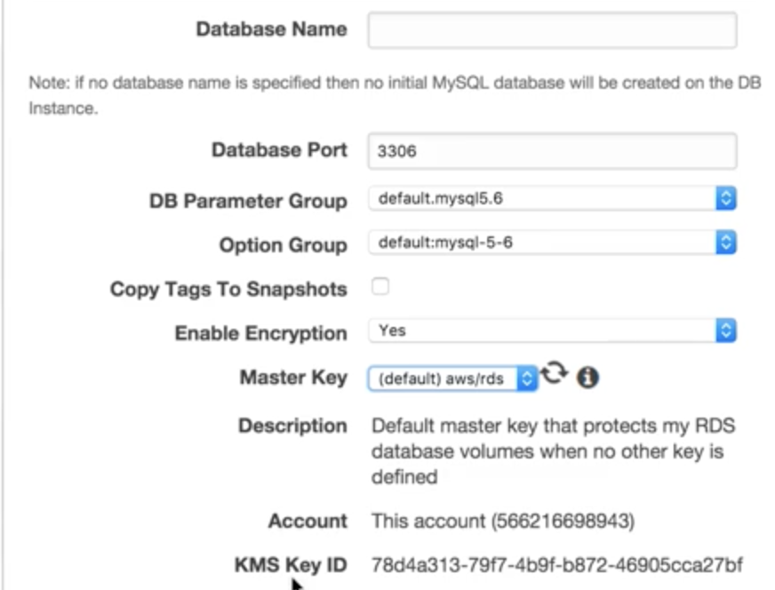
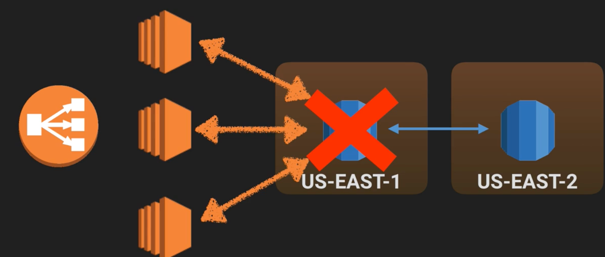
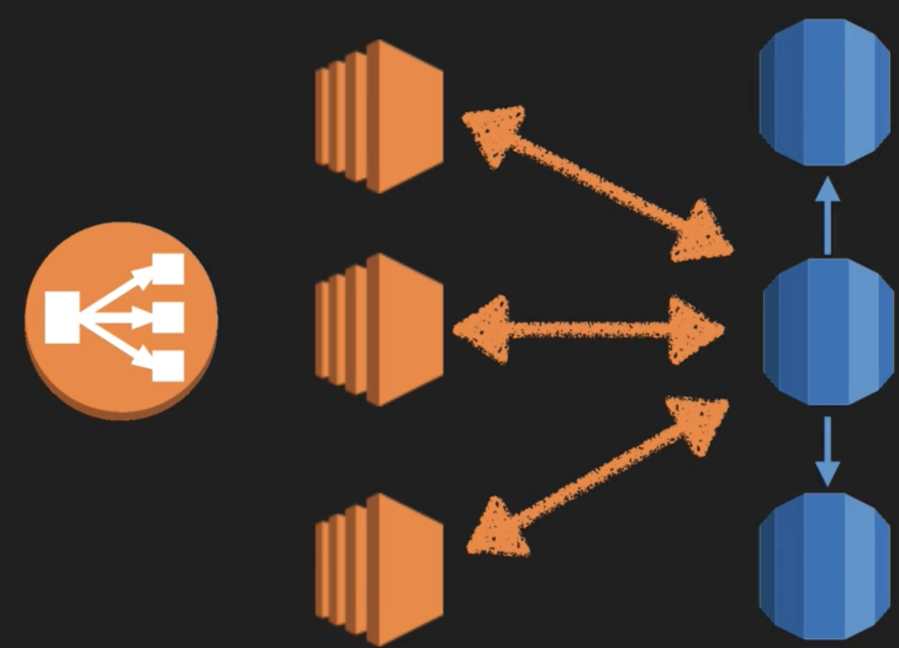
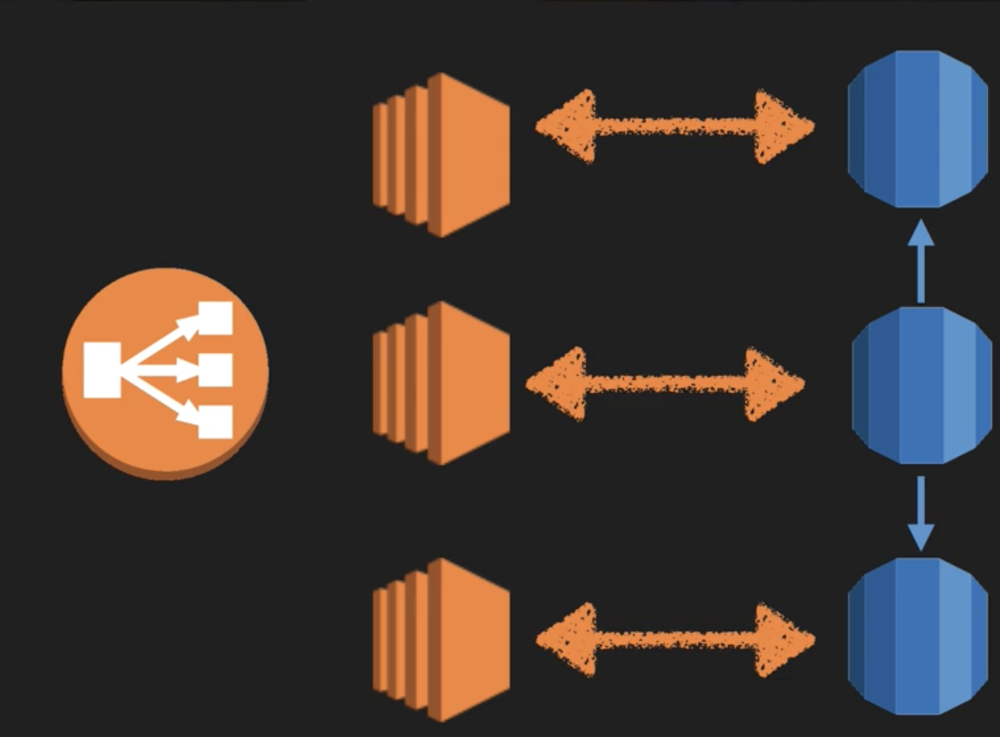
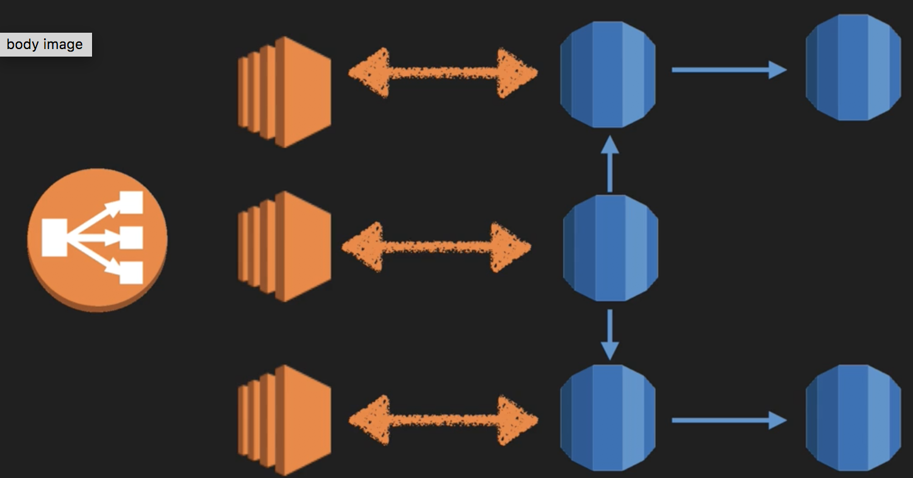

# RDS - Back Ups, Multi-AZ & Read Replicas 

## Automated Backups 

There are two different types of Backups for AWS. 

#### Automated Backups and Database Snapshots.

**Automated Backups** allow you to recover your database to any `point in time` within a "retention period". 

**Retention period** can be between `one and 35 days`. 

Automated Backups will take a full daily snapshot and will also store `transaction logs` throughout the day. When you do a recovery, AWS will first choose the most recent daily back up, and then apply transaction logs relevant to that day. This allows you to do a point in time recovery down to a second, within the retention period. 

**Automated Backups are enabled by default.** The `backup data is stored in S3` and **you get free storage space equal to the size of your database**. So if you have an RDS instance of 10Gb you will get 10Gb worth of storage. 

Backups are taken within a defined window. 

#### During the backup window, storage I/O may be suspended while your data is being backed up and you may experience `elevated latency`.

## Snapshots  

**DB Snapshots** are done manually (ie **they are user initiated**). **They are stored even after you delete the original RDS instance**, unlike automated backups. 

## Restoring Backups

When ever you restore either an **Automatic Backup** or a **manual Snapshot**, 

### The restored version of the database will be a `new RDS instance` with a `new end point`

### Take snapshot and restore it normally with new `DB Instance Identifier`

### Restore it from `point in time`

### Migrate DB to new `DB Instance Identifier` 

## Encryption 

**Encryption at rest is supported for MySQL, Oracle, SQL Server, PostgreSQL & MariaDB.** Encryption is done using the `AWS Key Management Service (KMS) service`. Once your RDS instance is encrypted the data stored at rest in **the underlying storage is encrypted, as are its automated backups, read replicas, and snapshots**. 

**At the present time, encrypting an existing DB Instance is not supported**. To use Amazon RDS encryption for an existing database, create a new DB Instance with encryption enabled and migrate your data into it

### Encryption with KMS

## What is a Multi-AZ

### Multi-AZ is for `Disaster Recovery`

`Multi-AZ` allows you to have an **exact copy of your production database** in `another Availability Zone`. 

AWS handles the replication for you, so when yo production database is written to, **this write will automatically be synchronized to the stand by database.** 

**In the event of planned database maintenance, DB Instance failure, or an Availability Zone failure**, 

#### Amazon RDS will automatically failover to the standby so that database operations can resume quickly without administrative intervention. 

### Multi-AZ is for `Disaster Recovery` only. It is `not primarily used for improving performance.` For performance improvement you need `Read Replicas`. 

## Multi-AZ Databases 

* SQL Server 
* Oracle 
* MySQL Server 
* PostgreSQL 
* MariaDB 

## What is Read Replica

#### 1.`Read replica` allow you to have a `read only` copy of your production database.

#### 2.This is achieved by using `Asynchronous replication` from the `primary RDS instance` to the `read replica`. 
#### 3.You use read replica's primarily for `very read-heavy database workloads`.

 

### you can have up to 5 copies of any databases

 

## Read Replica Databases 

* MySQL Server 
* PostgreSQL 
* MariaDB 
* Amazon Aurora

## Read Replica Databases

**1.Used for `Scaling`!!! `Not for DR`(Disaster Recovery)!** 

**2.Must have `automatic backups turned on` in order to deploy a read replicas**

**3.You can have up to `5 read replicas copies` of any databases**

**4.You can have `read replicas` of `read replicas` (but watch out for latency)**

**5.Each read replica will have its own DNS end point.**

**6.You `cannot have Read Replicas that have Multi-AZ`** 

**7.You `can create Read Replica's of Multi-AZ` source databases however.** 

**8.Read Replicas can be promoted to be their own databases. This breaks the replication.**

**9.Read Replica in a second region for MySQL and MariaDB. Not for PostgreSQL**

**10.Read Replica is for read only, cannot write in**

**11.Read Replica is exact copy of db, using boost performance**

**12.Read Replica doesn't support `Sqlserver`, `Oracle`**

## DynamoDB vs RDS 

#### 1.`DynamoDB` offers `"push button" scaling`, meaning that you can scale your database on the fly, `without any down time`.

#### 2.`RDS` is not so easy and you usually have to `use a bigger instance size` or to `add a read replica`.  

