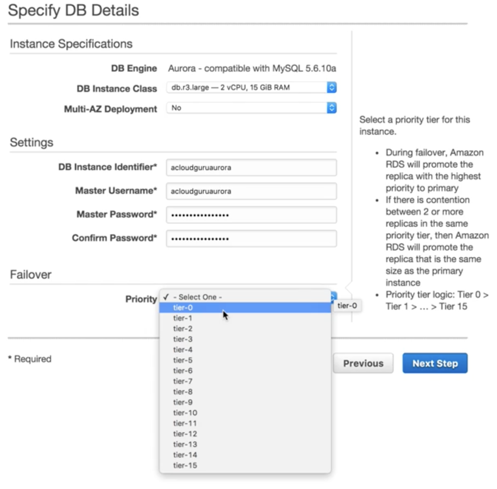
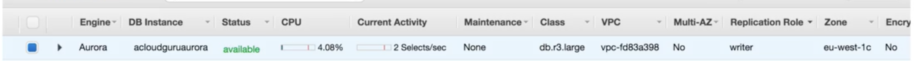
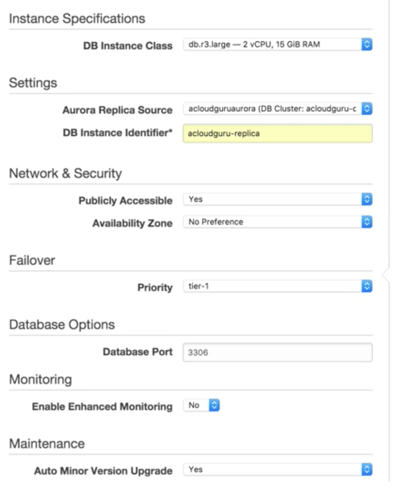
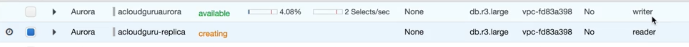
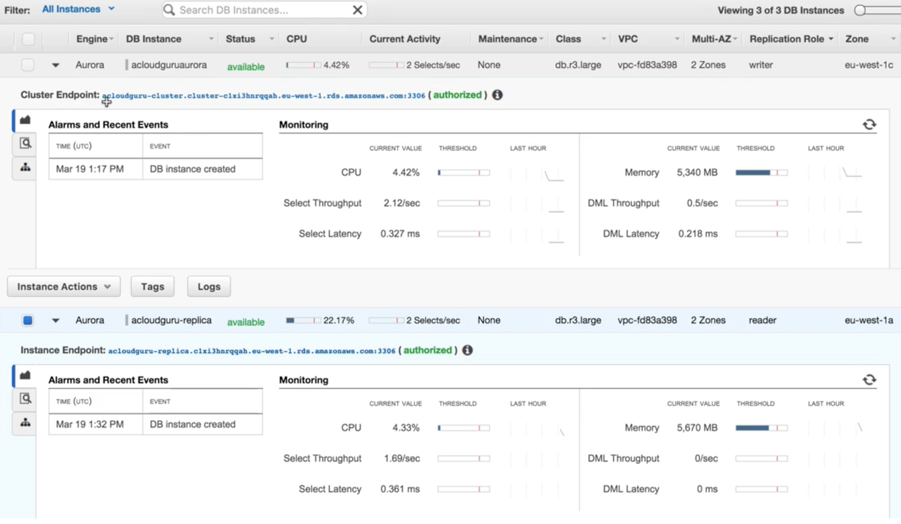

# Aurora

## What is Aurora 

Amazon Aurora is a **MySQL-compatible, relational database engine** that combines the speed and availability of high-end commercial databases with the simplicity and cost-effectiveness of open source databases. **Amazon Aurora provides up to five times better performance than MySQL** at a price point one tenth that of a commercial database while delivering similar performance and availability. 

## Aurora Scaling 

### • Start with 10Gb, Scales in 10Gb increments to 64Tb (Storage Autoscaling) 
### • Compute resources can scale up to 32vCPUs and 244Gb of Memory. 

*  `2 copies of your data is contained in each availability zone`, with `minimum of 3 availability zones`. **6 copies of your data**. 
*  Aurora is designed to transparently handle the loss of up to two copies of data without affecting database write availability and up to three copies without affecting read availability. 
*  Aurora storage is also **self-healing**. **Data blocks** and **disks** are continuously scanned for errors and repaired automatically. 

## Aurora Replicas

###  2 Types of Replicas are available.

*  Aurora Replicas (currently 15) 
*  MySQL Read Replicas (currently 5) 

## Create an AWS Aurora

### Select a priority tier for this instance. 

* During failover, Amazon RDS will promote the replica with the highest priority to primary
* If there is contention between 2 or more replicas in the same priority tier, then Amazon RDS will promote the replica that is the same size as the primary instance
* Priority tier logic: Tier 0 > Tier 1 > ... > Tier 15 

### Replication role: write

## create Replica for Aurora

### Replication role: reader

#### Once Aurora primary instance fail. The `cluster endpoint` while the cluster dns address automatically fail over to the `instance endpoint` 

