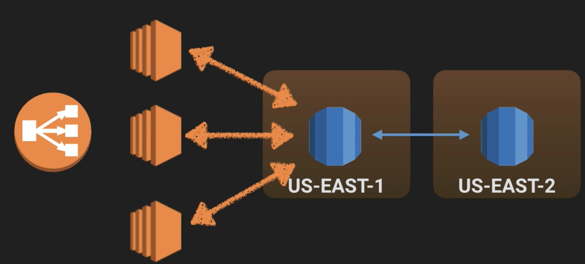

# AWS Databases

## Courses List

1. [AWS Database Introduction](1DB_Intro.md)
2. [RDS Instance - LAB](2DB_RDS_Lab.md)
3. [RDS - Back Ups, Multi-AZ & Read Replicas](3RDS_MuAZ_RR.md)
4. [DynamoDB](4DB_DynamoDB.md)
5. [RedShift](5DB_Redshift.md)
6. [Elasticache](6DB_Elasticache.md)
7. [Aurora](7DB_Aurora.md)

## Database Types

### Relational database

* Database
* Tables
* Row
* Fields (Columns)

### Non Relational Database
#### Database

* Collection => Table
* Document => Row
* Key Value Pairs => Fields

#### JSON/NoSQL/Yaml

## AWS Database Types

### RDS - OLTP

* SQL 
* MySQL 
* PostgreSQL 
* Oracle 
* Aurora
* MariaDB 

### DynamoDB - No SQL 
### RedShift - OLAP
### Elasticache - In Memory Caching

* Memcached 
* Redis 

### DMS SCT

* DMS stands for Database Migration Service. 
* AWS schema conversion tool (SCT) 

### Data Warehousing

* Used for **business intelligence.** 
* Used to **pull in very large and complex data sets.** 

### OLTP vs OLAP

1. Online **Transaction** Processing (OLTP): **database and delivery status**
2. Online **Analytics** Processing (OLAP): **records and calculation **

## RDS Instance - LAB

1. $ hostname = `RDS endpoint`
2. Enable our web sever security group to talk to our rds instance using rds **SG**
3. Inbound: Mysql / Aurora  TCP 3306

## RDS - Back Ups, Multi-AZ & Read Replicas

### Automated Backups: 

* Recover your database to any `point in time` within a "retention period".
* When you do a recovery, AWS will first choose the **most recent daily back up**, and then **apply transaction logs** relevant to that day.
* Automated Backups are enabled by default.
* The **backup data is stored in S3** and you get free storage space equal to the size of your database.
* During the backup window, **storage I/O may be suspended while your data is being backed up** and you may experience **elevated latency**.

### Database Snapshots: 

**DB Snapshots** are done manually (ie **they are user initiated**). **They are stored even after you delete the original RDS instance**, unlike automated backups.

### Restoring Backups

* The **restored version of the database** will be a **new RDS instance with a new end point**
* Take snapshot and restore it normally with **new DB Instance Identifier**

## What is a Multi-AZ

`Multi-AZ` allows you to have an **exact copy of your production database** in another `Availability Zone`

#### Multi-AZ is for `Disaster Recovery` only. It is `not primarily used for improving performance.` For performance improvement you need `Read Replicas`. 

## What is Read Replica

 

## Read Replica Databases

### 1.Used for `Scaling`!!! `Not for DR`(Disaster Recovery)!** 

**2.Must have `automatic backups turned on` in order to deploy a read replicas**

**3.You can have up to `5 read replicas copies` of any databases**

**4.You can have `read replicas` of `read replicas` (but watch out for latency)**

**5.Each read replica will have its own DNS end point.**

**6.You `cannot have Read Replicas that have Multi-AZ`** 

**7.You `can create Read Replica's of Multi-AZ` source databases however.** 

**8.Read Replicas can be promoted to be their own databases. This breaks the replication.**

**9.Read Replica in a second region for MySQL and MariaDB. Not for PostgreSQL**

**10.Read Replica is for read only, cannot write in**

**11.Read Replica is exact copy of db, using boost performance**

**12.Read Replica doesn't support `Sqlserver`, `Oracle`**

## DynamoDB 

* supports both **document** and **key-value data models**.
* Stored on SSD storage 
* Spread Across 3 geographically distinct data centers 
* **Eventual Consistent ReadS** (Default) 
* **Strongly Consistent Reads** 

### Eventual Consistent Reads

**Consistency across all copies of data is usually reached within a second**. Repeating a read after a short time should return the updated data. (Best Read Performance) 

### Strongly Consistent Reads

**strongly consistent read returns a result that reflects all writes that received a successful response prior to the read**. 

* Immediately read result after write db, you can use SCR
* If you can wait for couple seconds, you can use ECR

### DynamoDB Pricing

* Write Throughput `$0.0065` per hour for every **10 units**
* Read Throughput `$0.0065` per hour for every **50 units**
* **Write** is more expensive than **read**
* Storage costs of `$0.25` Gb per month.

## DynamoDB vs RDS 

#### 1.`DynamoDB` offers `"push button" scaling`, meaning that you can scale your database on the fly, `without any down time`.

#### 2.`RDS` is not so easy and you usually have to `use a bigger instance size` or to `add a read replica`.  

#### 3.RDS before scale capacity you need **create snapshot or read replicas**.

#### 4. RDS scaling gonna `move to a difference size RDS instance`, which means there is an `obvious down time for RDS scaling `.

#### 5.DynamoDB scaling `don't have down time`

## Redshift => OLAP

**1.Amazon Redshift** is a powerful, fully managed cloud **data warehouse service**.

**2.Redshift Spectrum** extends the power of Redshift to **query unstructured data in S3** – **without loading your data into Redshift**.

### • Single Node (160Gb)
### • Multi-Node
     * Leader Node (manages client connection and receives queries).
     * Compute Node (store data and perform queries and computations). Up to 128 Compute Nodes 

## Elasticache Exam Tips 

* Typically you will be given a scenario where a particular database is **under a lot of stress/load**. You may be asked which service you should use to alleviate this. 

* Elasticache is a good choice if your database is particularly read heavy and not prone to frequent changing. 

* Redshift is a good answer if the reason your database is feeling stress is because management keep running OLAP transactions on it etc. 
  * Leader Node (manages client connection and receives queries).
  * Compute Node (store data and perform queries and computations). Up to 128 Compute Nodes 

### Advantage:

* Columnar Data Storage
* Advanced Compression
* Massively Parallel (Processing MPP)

### Redshift Security

* Encrypted in transit using SSL
* Encrypted at rest using AES-256 encryption
* RedShift takes care of key management.

## Aurora Replicas

**Amazon Aurora is a MySQL-compatible, relational database engine** that **combines the speed** and **availability of high-end commercial databases** with the simplicity and cost-effectiveness of open source databases.

###  2 Types of Replicas are available.

*  Aurora Replicas (currently 15) 
*  MySQL Read Replicas (currently 5) 

## Aurora Scaling 

*  `2 copies of your data is contained in each availability zone`, with `minimum of 3 availability zones`. **6 copies of your data**. 
*  Aurora is designed to transparently handle the loss of up to two copies of data without affecting database write availability and up to three copies without affecting read availability. 
*  Aurora storage is also **self-healing**. **Data blocks** and **disks** are continuously scanned for errors and repaired automatically. 

