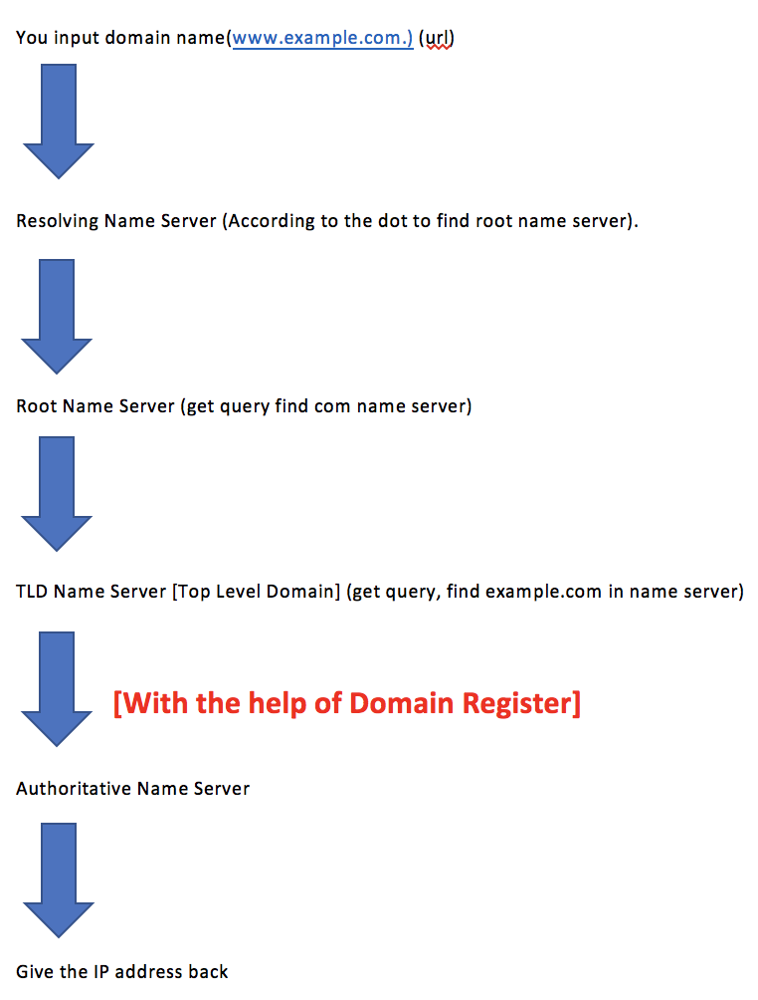

# DNS

## What is DNS? 

If you've used the Internet, you've used DNS. 

### DNS is used to convert `human friendly domain names` (such as http://google.guru) into an `Internet Protocol (IP) address` (such as http://82.124.53.1). 

**IP addresses are used by computers to identify each other on the network.** IP addresses commonly come in 2 different forms, **IPv4 and IPv6**. 


## IPv4 vs IPv6 

* The IPv4 space is a **32 bit** field and has over 4 billion different addresses (4,294,967,296 to be precise). 
* IPv6 was created to solve this depletion issue and has an address space of **128bits** which in theory is 340,282,366,920,938,463,463,374,607,431,768,211,456 addresses or 340 undecillion addresses. 

## Top Level Domains

If we look at common domain names such as `google.com`, `bbc.co.uk.` you will notice a string of characters separated by dots (periods). 

#### `The last word` in a domain name represents the `"top level domain"`. 
#### `The second word` in a domain name is known as a `second level domain name` (this is optional though and depends on the domain name). 

* .com 
* .edu 
* .gov 
* .co.uk 
* .gov.uk 
* .com.au 

These top level domain names are controlled by the **`Internet Assigned Numbers Authority (IANA)` in a root zone database which is essentially a database of all available top level domains.** You can view this database by visiting 

```
http://www.iana.org/domains/root/db 
```

## Domain Registrars 

**Because all of the names in a given domain name have to be unique there needs to be a way to organize this all so that domain names aren't duplicated.** 

This is where domain registrars come in. **A registrar is an authority that can assign domain names directly under one or more top-level domains.** These domains are registered with `InterNIC`, a service of `ICANN`, which enforces uniqueness of domain names across the Internet.** Each domain name becomes registered in a central database known as the `WholS` database.** 

Popular domain registrars include `GoDaddy.com`, `123-reg.co.uk` etc.

## SOA (A start of authority) Records  

### The SOA record stores information about; 

* The name of the server that supplied the data for the zone. 
* The administrator of the zone. 
* The current version of the data file. 
* The number of seconds a secondary name server should wait before checking for updates. 
* The number of seconds a secondary name server should wait before retrying a failed zone transfer. 
* The maximum number of seconds that a secondary name server can use data before it must either be refreshed or expire. 
* The default number of seconds for the time-to-live file on resource records. 


## TTL 

**The length that a DNS record is cached on either the `Resolving Server` or the `users own local PC` is equal to the value of the `"Time To Live" (TTL) in seconds.`** 

The lower the time to live, the faster changes to DNS records take to propagate throughout the 
Internet. 


## NS Records 

NS stands for **Name Server records** and are used by **Top Level Domain servers** to direct **traffic to the Content DNS server** which contains the **authoritative DNS records**. 



## CNAMES 

### `A Canonical Name (CName)` can be used to resolve one domain name to another. 

For example, you may have a mobile website with the domain name http://m.acloud.guru that is used for when users browse to your domain name on their mobile devices. You may also want the name http://mobile.acloud.guru to resolve to this same address. 


## Alias Records

#### `Alias records` are used to map resource `record sets` in your `hosted zone` to `Elastic Load Balancers`, `CloudFront distributions`, or `S3 buckets` that are configured as websites. 

Alias records work like a CNAME record in that you can map one DNS name (www.example.com) to another 'target' DNS name (elbl 234.elb.amazonaws.com). 

### Key difference

**A CNAME can't be used for naked domain names (zone apex)**. You can't have a CNAME for `http://acloud.guru`, **it must be either an A record or an Alias**.

**Alias resource record sets** can save you time because Amazon Route 53 automatically recognizes changes in the record sets that the alias resource record set refers to. 

For example, suppose an alias resource record set for `example.com` points to an ELB load balancer at `Ib1-1234.us-east-1.elb.amazonaws.com`. If the IP address of the load balancer changes, **Amazon Route 53 will automatically reflect those changes in DNS answers** for `example.com` without any changes to the hosted zone that contains resource record sets for `example.com`. 

## It looks like `Alias Records` always better than `CNAME`


| CNAME Records | Alias Records   |
|:------------- |:---------------:|
| You can't create a CNAME record at the zone apex. For example, if you register the DNS name example.com, the zone apex is example.com.     | You can create an alias record at the zone apex. |        
| Route 53 charges for CNAME queries.      | Route 53 doesn't charge for alias queries to AWS resources.         |    
| A CNAME record redirects queries for a domain name regardless of record type | Route 53 responds to a DNS query only when the name and type of the alias record matches the name and type in the query.        |
| A CNAME record can point to any DNS record that is hosted anywhere.      | An alias record can only point to selected AWS resources or to another record in the hosted zone that you're creating the alias record in.        |    
| A CNAME record appears as a CNAME record in response to dig or nslookup queries. | An alias record appears as the record type that you specified when you created the record, such as A or AAAA. The alias property is visible only in the Route 53 console or in the response to a programmatic request, such as an AWS CLI `list-resource-record-sets` command.        |

## Exam Tips 

* ELB's do not have pre-defined IPv4 addresses, you resolve to them using a DNS name. 
* Understand the difference between an Alias Record and a CNAME. 
* Given the choice, always choose an Alias Record over a CNAME. 


 