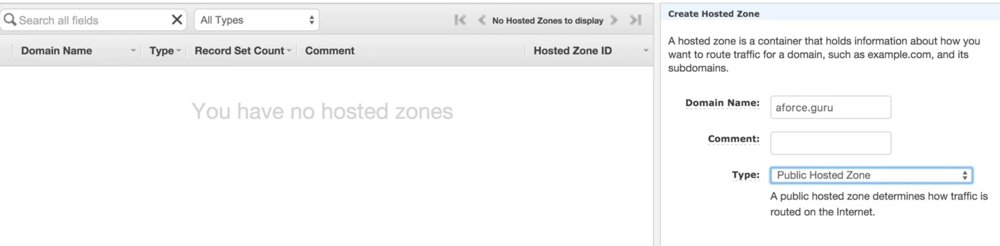
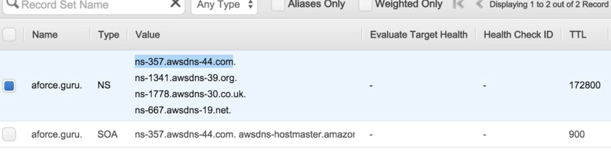
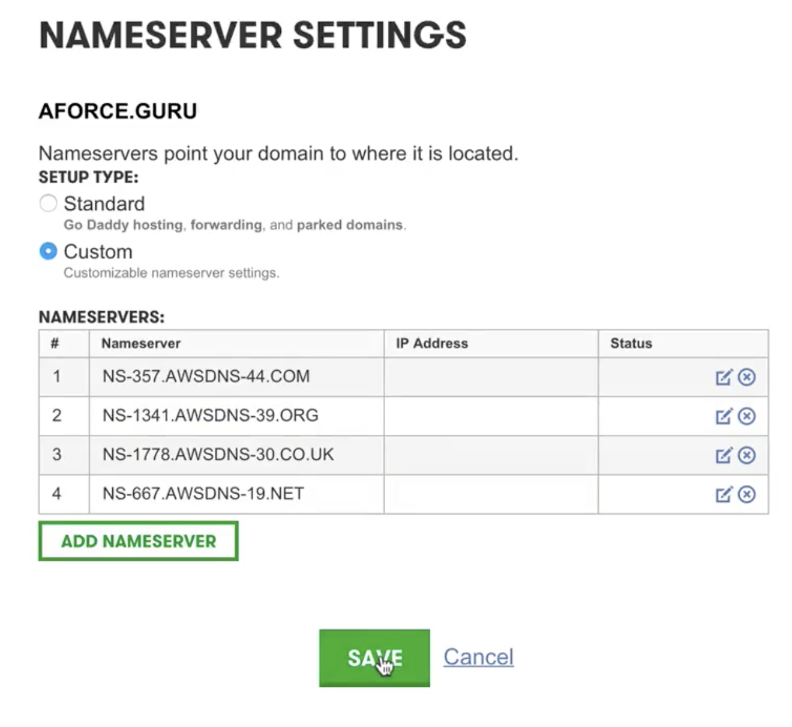
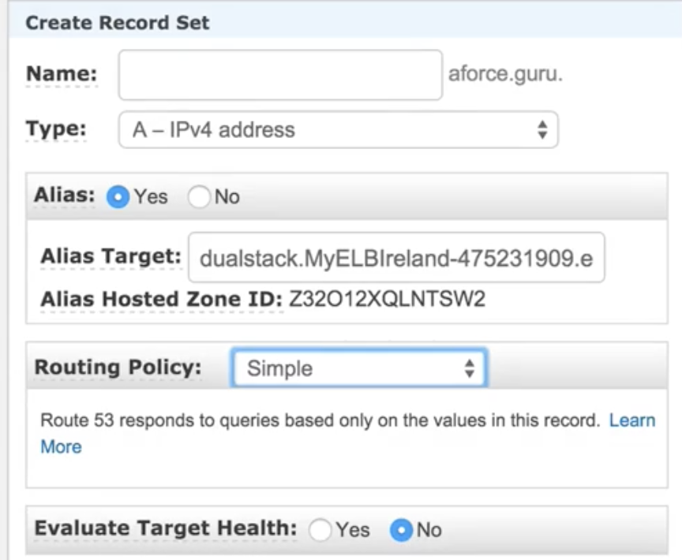
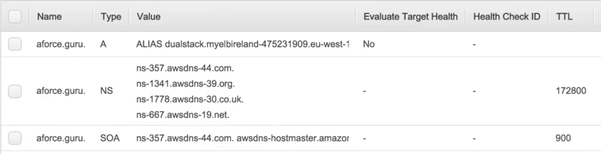

# Route53 The Basics - Lab

## create `public hosted zone` and set on `Domain Registrars`

### copy 4 `name severs(NS)` value 

### paste `Name Severs` in `Domain Registrars`

## Create Record Set and point Alias to created ELB

