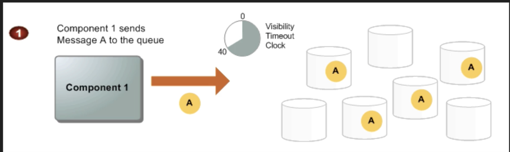
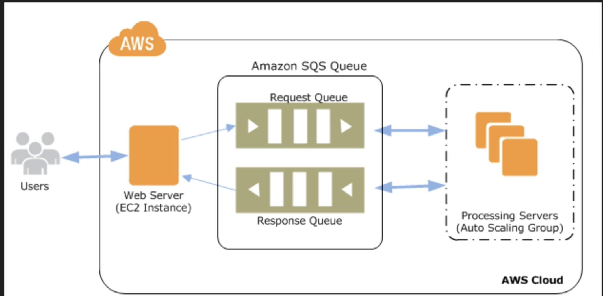

# SQS (Amazon Simple Queue Service)

## What is SQS?

#### `Amazon SQS` is a `web service` that gives you access to a `message queue` that can be used to store messages while waiting for a computer to process them. 

Amazon SQS is a **distributed queue system** that enables web service applications to quickly and reliably queue messages that one component in the application generates to be consumed by another component. 

### A queue is a `temporary repository` for messages that are awaiting processing. 

##### Using Amazon SQS, you can decouple the components of an application so they run independently, with Amazon SQS easing message management between components. 

Any component of a distributed application can store messages in a fail-safe queue. Messages can contain up to **256 KB** of text in any format. Any component can later retrieve the messages programmatically using the **Amazon SQS API**.

##### The queue acts as a `buffer` between the component `producing and saving data`, and `the component receiving the data for processing`. 

This means the queue resolves issues that arise if the producer is producing work faster than the consumer can process it, or if the producer or consumer are only intermittently connected to the network. 

**Amazon SQS ensures delivery of each message at least once,** and supports multiple readers and writers interacting with the same queue. 

### A single queue can be used simultaneously by many distributed application components, with no need for those components to coordinate with each other to share the queue.

**Amazon SQS is engineered to always be available and deliver messages.** 

### One of the resulting tradeoffs is that SQS does not guarantee first in, first out delivery of messages. 

For many distributed applications, each message can stand on its own, and as long as all messages are delivered, the order is not important. If your system requires that order be preserved, you can place sequencing information in each message, so that you can reorder the messages when the queue returns them.  

## SQS Example 

### To illustrate, suppose you have a number of image files to encode. 

**In an Amazon SQS worker queue,** you create an Amazon SQS message for each file specifying the command (jpeg-encode) and the location of the file in Amazon S3. 

**A pool of Amazon EC2 instances** running the needed image processing software does the following:

1. Asynchronously pulls the task messages from the queue 
2. Retrieves the named file 
3. Processes the conversion
4. Writes the image back to Amazon S3 
5. Writes a "task complete" message to another queue 
6. Deletes the original task message 
7. Checks for more messages in the worker queue 

## SQS Diagram

## SQS Autoscaling

## SQS Exam Tips

* Does not offer FIFO (first in, first out)
* 12 hours visibility time out 
* Amazon SQS is engineered to provide "at least once" delivery of all messages in its queues. Although most of the time each message will be delivered to your application exactly once, you should design your system so that processing a message more than once does not create any errors or inconsistencies. 
* **First 1 million Amazon SQS Requests per month are free**
* `$0.50` per 1 million Amazon SQS Requests per month thereafter (`$0.00000050` per SQS Request) 
* A single request can have from **1 to 10 messages**, **up to a maximum total payload of 256KB**. 
* **Each 64KB 'chunk' of payload is billed as 1 request**. For example, a single API call with a **256KB payload will be billed as `four` requests.** 

