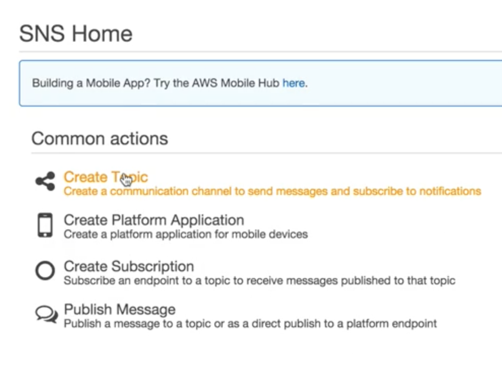
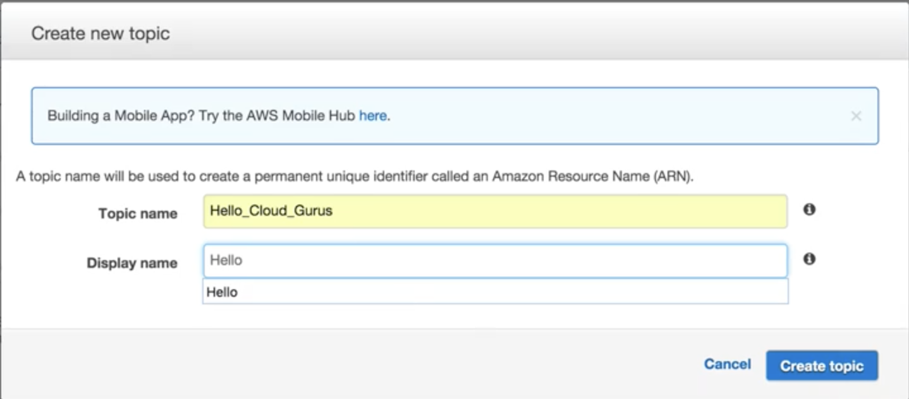
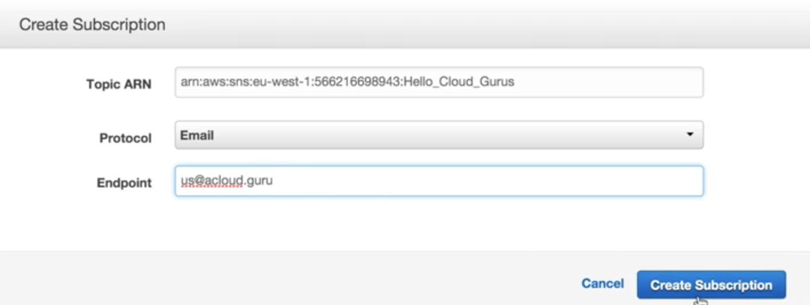
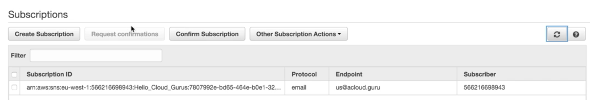
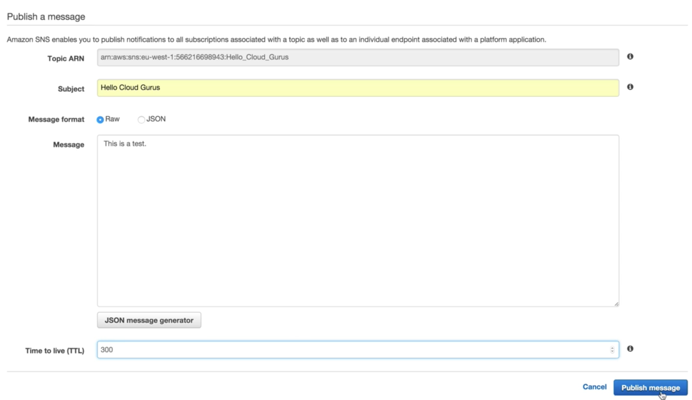

# Simple Notification Service

## What is SNS? 

#### `Amazon Simple Notification Service (Amazon SNS)` is a web service that makes it easy to set up, operate, and send notifications from the cloud. 

It provides developers with a highly scalable, flexible, and cost-effective capability to **publish messages** from an application and immediately deliver them to subscribers or other applications. 

**Push notifications** to Apple, Google, Fire OS, and Windows devices, as well as Android devices in China with Baidu Cloud Push. 

**Besides `pushing cloud notifications` directly to `mobile devices`, Amazon SNS can also deliver notifications by `SMS text message or email`, to `Amazon Simple Queue Service (SQS)` queues, or to `any HTTP endpoint`.** 

**SNS notifications can also trigger Lambda functions.**

When a message is published to an SNS topic that has a Lambda function subscribed to it, the Lambda function is invoked with the payload of the published message. The Lambda function receives the message payload as an input parameter and can manipulate the information in the message, 

**publish the message to other SNS topics, or send the message to other AWS services**. 

#### SNS allows you to group multiple recipients using topics.

**A topic is an "access point" for allowing recipients to dynamically subscribe for identical copies of the same notification.** **One topic can support deliveries to multiple endpoint types** -- for example, you can group together iOS, Android and SMS recipients. When you publish once to a topic, SNS delivers appropriately formatted copies of your message to each subscriber. 

To prevent messages from being lost, all messages published to Amazon SNS are stored redundantly across multiple availability zones. 

## Create SNS topic 

## Create Subscription for the topic

## Public a message

## SNS Benefits 

* **Instantaneous, push-based delivery (no polling, pulling)**
* Simple APIs and easy integration with applications
* Flexible message delivery over multiple transport protocols
* Inexpensive, pay-as-you-go model with no up-front costs 
* Web-based AWS Management Console offers the simplicity of a point-and-click interface 

## SNS VS SQS

#### Both Messaging Services in AWS 
#### SNS - Push
#### SQS - Polls (Pulls) [SQS download message and do the task]

## SNS Pricing  

* Users pay `$0.50` per 1 million Amazon SNS Requests 
* `$0.06` per 100,000 Notification deliveries over HTTP 
* `$0.75` per 100 Notification deliveries over SMS 
* `$2.00` per 100,000 Notification deliveries over Email 