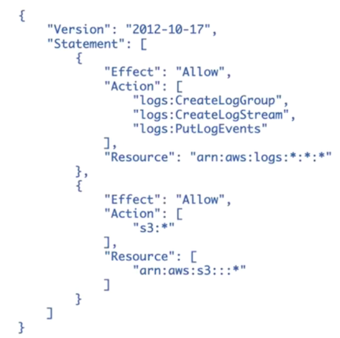
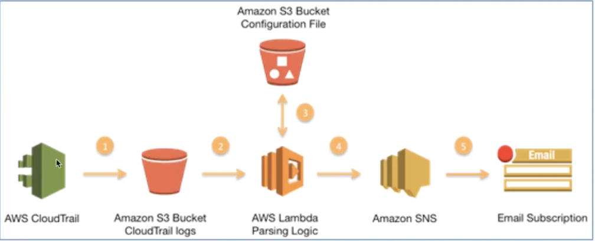
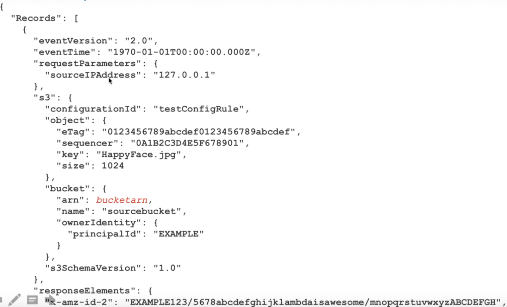
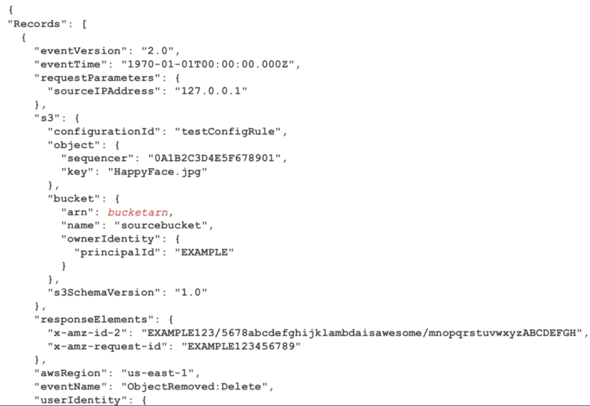
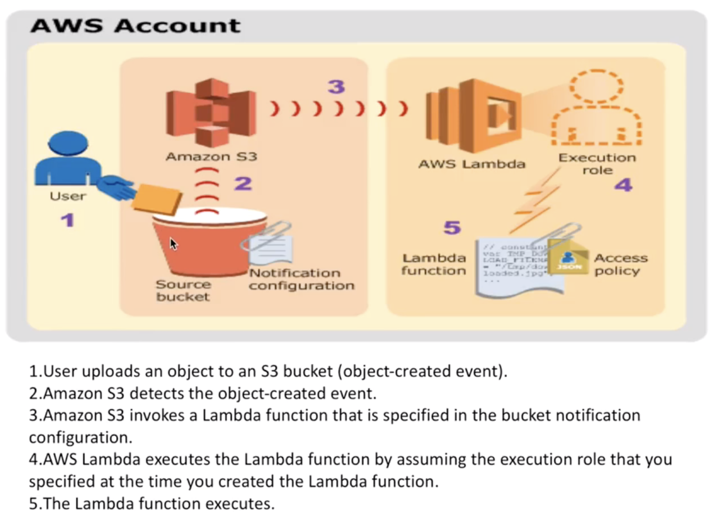
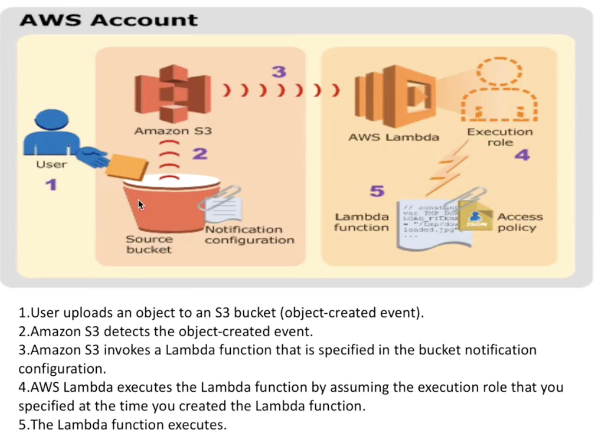
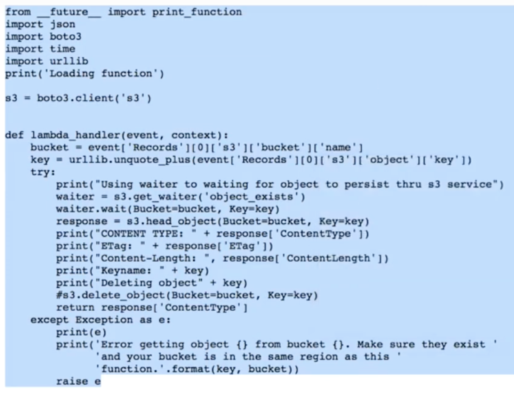
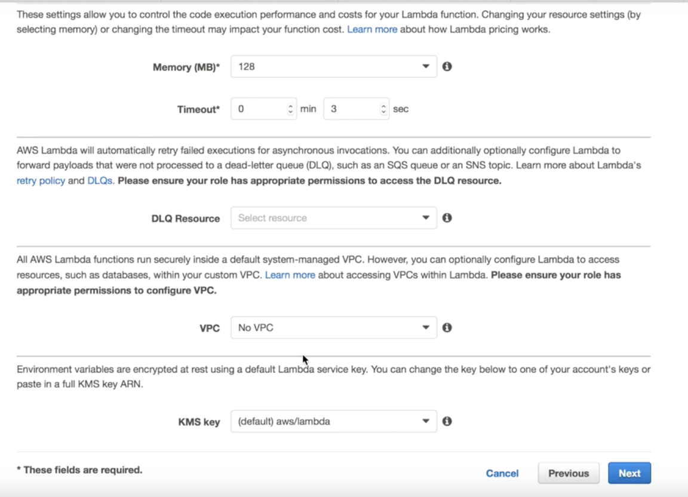
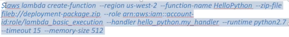
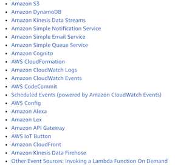

# AWS Lambda 

## What is AWS Lambda

#### AWS Lambda is a serverless compute. 

**runs your code in response to events and automatically manages the underlying compute resources for you.** 

#### Automatically run code in response to multiple events

* such as modifications to objects in Amazon S3 buckets 
* table updates in Amazon DynamoDB. 

#### Lambda runs your code on high-availability compute infrastructure 

#### Don't worry about administration of the compute resources 

* including server and operating system maintenance 
* capacity provisioning and automatic scaling, 
* code and security patch deployment 
* code monitoring 
* logging.

#### All you need to do is supply the code

* The code you run on AWS Lambda is called a "Lambda function." 
* After you create your Lambda function it is always ready to run as soon as it is triggered, similar to a formula in a spreadsheet. 
* Each function includes your code as well as some associated configuration information, including the function name and resource requirements. 
* After you upload your code to AWS Lambda, you can associate your function with specific AWS resources (e.g. a **particular Amazon S3 bucket, Amazon DynamoDB table, Amazon Kinesis stream, or Amazon SNS notification**). 

#### What languages does AWS Lambda support? 

* AWS Lambda supports code written in Node.js (JavaScript), Python, Java (Java 8 compatible), and C# (using the .NET Core runtime). 
* Your code can include existing libraries, even native ones. Please read our documentation on using Node.js, Python, Java, and C#. 

#### How does AWS Lambda secure my code? 

* **AWS Lambda stores code in Amazon S3 and encrypts it at rest**. 
* **AWS Lambda performs additional integrity checks while your code is in use.** 


#### How long can an AWS Lambda function execute? 

* **All calls made to AWS Lambda must complete execution within 300 seconds.**
* The default timeout is 3 seconds, but you can set the timeout to any value between 1 and 300 seconds. 

## Programming Model 

* Handler
* Context
* Event
* Logging
* Exception

```
def handler_name(vent, context):
  ...
  return some_value
```

#### Components of Lambda

1. Source Service where events captured(S3, Dynamo, Kinesis, etc)
2. Lambda Service with your code
3. CloudWatch log group and log stream to capture logs
4. IAM Role and the following policy



### Handler ..... Is a function 

* **Handler is the function AWS Lambda calls to start execution of your Lambda function.**
* When a Lambda function is invoked, AWS Lamtbda starts executing your code by calling the handler function.
* AWS Lambda passes any **event data** to this **handler as the first parameter**. 
* **Your handler should process the incoming event data and may invoke any other functions/methods in your code.** 

```
def handler name(event, context): 
...
    return some_value
```

### Event 

#### AWS Lambda uses this parameters to pass in event data to the handler



#### Amazon S3 put sample event



#### Amazon S3 Delete sample event



### Context

* AWS Lambda **uses this parameter to provide runtime information to your handler**. This 
parameter is of the `LambdaContext` type. 
* AWS Lambda also passes a context object to the handler function, as the second parameter. 
* **Via this context object your code can interact with AWS Lambda.**
* For example, your code can find the execution time remaining before AWS Lambda terminates your Lambda function. 

**When Lambda runs your function, it passes a context object to the handler. This object provides methods and properties that provide information about the invocation, function, and execution environment.**

```
import time
def get_my_log_stream(event, context):       
    print("Log stream name:", context.log_stream_name)
    print("Log group name:",  context.log_group_name)
    print("Request ID:",context.aws_request_id)
    print("Mem. limits(MB):", context.memory_limit_in_mb)
    # Code will execute quickly, so we add a 1 second intentional delay so you can see that in time remaining value.
    time.sleep(1) 
    print("Time remaining (MS):", context.get_remaining_time_in_millis())
```

### Logging（python）

* Your Lambda function can contain logging statements. 
* AWS Lambda writes these logs to CloudWatch.
* If you use the Lambda console to invoke your Lambda function, the console displays the same logs.

#### The following Python statements generate log entries:

* print statements.
* Logger functions in the logging module (for example, logging.Logger.info and logging.Logger.error).

```
import logging
logger = logging.getLogger()
logger.setLevel(logging.INFO)
def my_logging_handler(event, context):
    logger.info('got event{}'.format(event))
    logger.error('something went wrong')
    return 'Hello from Lambda!'  
```

### Exceptions (python)

If your Lambda function raises an exception, AWS Lambda recognizes the failure and serializes the exception information into JSON and returns it. Consider the following example:

```
def always_failed_handler(event, context):
    raise Exception('I failed!')
```

When you invoke this Lambda function, it will raise an exception and AWS Lambda returns the following error message:

```
{
  "errorMessage": "I failed!",
  "stackTrace": [
    [
      "/var/task/lambda_function.py",
      3,
      "my_always_fails_handler",
      "raise Exception('I failed!')"
    ]
  ],
  "errorType": "Exception"
}
```

## Examples





### Lambda function



### Lambda Adv. Setting



#### 1.Memory: change performance and cost
#### 2.DLQ Resource: sql, sns 
#### 3.VPC
#### 4.KMS Key

### AWS CLI to create Lambda Function




## Exam Tips:

* Lambda function with specific AWS resources: particular Amazon S3 bucket, Amazon DynamoDB table, Amazon Kinesis stream, or Amazon SNS notification
* AWS Lambda secure my code:
  * AWS Lambda stores code in Amazon S3 and encrypts it at rest
  * AWS Lambda performs additional integrity checks while your code is in use.
* Components of Lambda
  * Source Servers where events captured(S3, Dynamo, Kinesis, etc)
  * Lambda Service with your code
  * CloudWatch log group and log stream to capture logs
  * IAM Role and the following policy
* Event: AWS Lambda uses this parameters to pass in event data to the handler



* AWS ADV. Setting

1. Memory: change performance and cost
2. DLQ Resource: sql, sns 
3. VPC
4. KMS Key