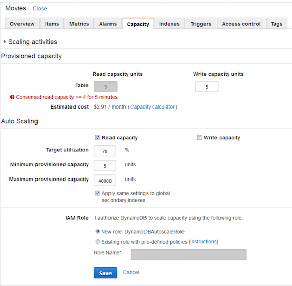

# DynamoDB Auto Scaling 

## DynamoDB Attributes

### Scalability

* Millions of reads/sec from single DAX Cluster
* Unlimited items and storage
* **Auto scale through based on consumption**

### Performance

* Consistent, single digit millisecond latency
* Optimized for analytics workloads with **native indexing**
* Microsecond response times with **DynamoDB Accelerator(DAX)**

### Security

* Control user access at items and attributes level
* SOC, PCI, ISO, FedRAMP
* **Monitor with Cloudwatch metrics & logging with CloudTrail**
* Client-side encryption library
* **Secure, private, VPC endpoints**

### Availability & Data Protection

* 99.9% high availability
* **Built-in replication across 3 zones**

### Manageability & TCO

* Full-managed
* Perpetual free tier
* pay-as-you-grow for capacity and storage independently
* **Track table level spending with tagging**
* **purge data automatically (Time to. live)**
* **DMS connector for DynamoDB**

### Dev Platform $ tools

* Event-driven programming with trigger & Lambda
* Advanced analytics with EMR & Amazon Redshift
* Full-text query amazon  elasticserach service
* **Real-time stream processing with Amazon Kinesis**

## Auto Scaling 

### Features

* **Fully-managed, automatic scaling of throughput capacity for read and write of tables and global secondary indexes** 
* **Set only target utilization %** (consumed capacity/provisioned capacity), **minimum and maximum limits** 
* Configurable from management console, CLI, and SDK 
* Works with existing tables and GSI; Enabled by default for new tables 
* Full visibility into scaling activities from console 
* **Powered by Application Auto Scaling which also supports EC2, ECS, EMR, AppStream**

### Key Benefits

* Removes the guesswork out of provisioning adequate capacity for new workloads 
* Reduces operational burden of monitoring and adjusting capacity as application demands change 
* **Scales up capacity as application request rates accelerate ensuring optimal performance**
* **Scales down capacity as application request rates slow down reducing costs** 
* **No additional costs for Auto Scaling** 

### Practice

1. User creates Application **Auto Scaling policy** for a table 
2. DynamoDB publishes **consumed capacity metrics to Amazon CloudWatch**. 
3. If consumed capacity **exceeds target utilization** (or **falls below target**), Amazon CloudWatch triggers an alarm 
4. **The CloudWatch alarm invokes Application Auto Scaling to evaluate your scaling policy** 
5. **Application Auto Scaling sends UpdateTable API request to DynamoDB to adjust table's provisioned throughput** 
6. **DynamoDB processes the UpdateTable request** increasing (or decreasing) table's provisioned throughput capacity so that it approaches your target utilization. 

### Best Practice

* Auto Scaling is best suited for predictable, gradually changing traffic patterns 
* Start with default settings for new tables/GSI, and make adjustments over time 
* Optimize for the daily scale down limits, currently, nine per day 
* For known time window of traffic spikes, disable Auto Scaling and update manual provisioning programmatically 
* Apply same settings to GSI as tables, for optimal query performance 

### Using Auto Scaling

Here’s how you enter your own parameters:

### Things to Know

DynamoDB Auto Scaling is designed to accommodate request rates that vary in a **somewhat predictable**, **generally periodic fashion**. 

**If you need to accommodate unpredictable bursts of read activity, you should use Auto Scaling in combination with DAX** (read Amazon DynamoDB Accelerator (DAX) – In-Memory Caching for Read-Intensive Workloads to learn more). 

**Also, the AWS SDKs will detect throttled read and write requests and retry them after a suitable delay.**

## Time to Live

1. Time To Live (TTL) for DynamoDB allows you to define when items in a table expire so that they can be automatically deleted from the database.
2. **TTL Attribute** – **The TTL attribute can be indexed or projected, but it cannot be an element of a JSON document.** 
3. **Amazon DynamoDB point-in-time recovery (PITR)** provides **automatic backups** of your DynamoDB table data. 
4. **Audit Log**: TTL activity recorded in DynamoDB streams

## DynamoDB DAX (Accelerataor)

DAX is a fully managed caching service that sits (logically) in front of your DynamoDB tables. 

**It operates in write-through mode,** and is API-compatible with DynamoDB. Responses are returned from the cache in microseconds, **making DAX a great fit for eventually-consistent read-intensive workloads**. DAX is seamless and easy to use. As a managed service, you simply create your DAX cluster and use it as the target for your existing reads and writes.

**Each DAX cluster can contain 1 to 10 nodes;** you can add nodes in order to increase overall read throughput. The cache size (also known as the working set) is based on the node size **(dax.r3.large to dax.r3.8xlarge)** that you choose when you create the cluster. **Clusters run within a VPC, with nodes spread across Availability Zones**

### Creating a DAX Cluster

* node type: dax.r3.large
* cluster size: 3 nodes
* IAM role: write/read policy

* subnet and security group

The next step is to update my application to use the DAX SDK for Java and to configure it to use the endpoint of my cluster (`dax1.seutl3.clustercfg.dax.use1.cache.amazonaws.com:8111 in this case`).

**Consistency** – DAX offers the best opportunity for performance gains when you are using eventually consistent reads that can be served from the in-memory cache (DAX always refers back to the DynamoDB table when processing consistent reads).

**Write-Throughs** – DAX is a write-through cache. However, if there is a weak correlation between what you read and what you write, you may want to direct your writes to DynamoDB. This will allow DAX to be of greater assistance for your reads.

### Features

* **Fully managed**: handle all of the upgrades, patching, and software management 
* **Flexible**: Configure DAX for one table or many 
* **Highly available:** fault tolerant, replication across multi-AZs within a region 
* **Scalable**: scales-out to any workload with up to 10 read replicas 
* **Manageability**: fully integrated AWS service: Amazon CloudVVatch, Tagging for DynamoDB, AWS Console 
* **Security**: Amazon VPC, AWS IAM, AWS CloudTrail, AWS Organizations 

## VPC EndPoint for DynamoDB (VPC-E)

### Features

* VPC: **Access DynamoDB via secure Amazon VPC endpoint**
* Access Control: **restrict table access for each VPC endpoint** with a unique IAM role and permissions 

### Key Benefits

* Turn off access from public Internet gateways enhancing privacy and security 
* Fast, secure data transfer between Amazon VPC and DynamoDB 

## Tagging 

### Features 

* **Track costs**: AWS bills broken down by tags in detailed monthly bills and Cost Explorer 
* **Flexible**: Add customizable tags to both table and indexes 

### Key Benefits 

* **Transparency**: know exactly how much your DynamoDB tables and indexes cost 
* **Consistent**: report of spend across AWS services 

## AWS Data Migration Service (DMS)

## Lambda

