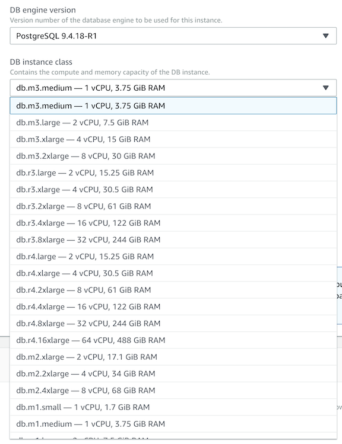
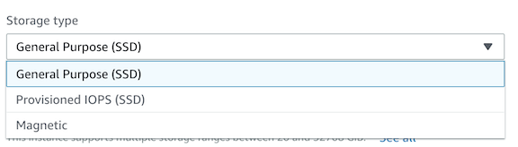
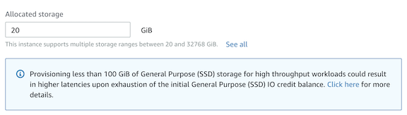
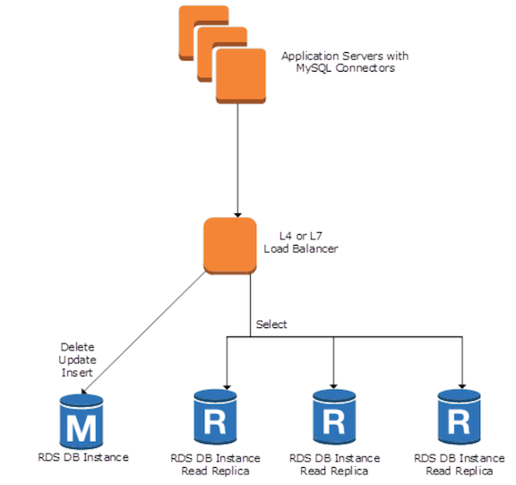
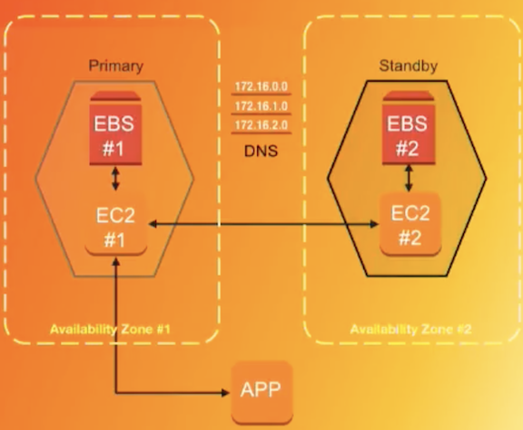
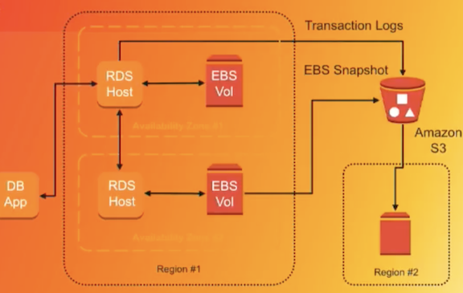

# RDS Performance

## Scaling Your Amazon RDS Instance Vertically and Horizontally

### Vertical Scaling

To handle a higher load in your database, you can vertically scale up your master database with a simple push of a button

#### Storage and instance type are decoupled:

**When you scale your database instance up or down, your storage size remains the same and is not affected by the change.**

You can separately modify your DB instance to increase the allocated storage space or improve the performance by changing the storage type (such as to General Purpose SSD to Provisioned IOPS SSD).

#### change instance type 

**Scale compute/memory vertically up or down**

* Handle higher load to grow over time 
* Lower usage to control costs 
* New host is attached to existing storage with **minimal downtime** 

#### change storage type

#### change storage size

**Scale up Amazon EBS storage (now up to 16 TB!)**

* Amazon EBS engines now support Elastic Volumes for fast scaling (now including SQL Server) 
* **No downtime for storage scaling** 
* Initial scaling operation may take longer, because storage is reconfigured on older 
* **instances Can re-provision 10PS on the fly** 

### Horizontal Scaling

In addition to scaling your master database vertically, you can also improve the performance of a read-heavy database by using read replicas to horizontally scale your database. RDS MySQL, PostgreSQL, and MariaDB can have up to 5 read replicas

**Amazon Aurora can have up to 15 read replicas.**

Read replicas allow you to create read-only copies that are synchronized with your master database. You can also place your **read replica in a different AWS Region** closer to your users for better performance. Also, you can use read replicas to increase the availability of your database by promoting a read replica to a master for faster recovery in the event of a disaster. 

You can use a transport or a layer 4 load balancer together with the MySQL Connector. Currently, **the Elastic Load Balancing (ELB) load balancer does not support the routing of traffic to RDS instances**. Therefore, you might want to consider other options such as HAProxy, which is an open-source software-based load balancer that many people use. 

## RDS HA (high availability)

### What happens during a Multi-AZ failover

* Each host manages set of Amazon EBS volumes with a full copy of the data 
* Instances are monitored by an external observer to maintain consensus over quorum 
* Failover initiated by automation or through the Amazon RDS API Redirection to the new primary instance is provided through DNS 

## Multi-AZ compare with Read Replica

### Multi-AZ

* Synchronous replication—highly durable 
* Only primary instance is active at any point in time
* Backups can be taken from secondary 
* Always in two Availability Zones within a Region 
* Database engine version upgrades happen on primary
* Automatic failover when a problem is detected 

### Read Replicas

* Asynchronous replication—highly scalable 
* **All replicas are active and can be used for read scaling** 
* No backups configured by default 
* Can be within an Availability Zone, cross-AZ, or **cross-region** 
* Database engine version upgrades independently from source instance 
* Can be manually promoted to a standalone database 

## RDS Manage backups

* Two options — **automated backups and manual snapshots** 
* Amazon RDS backups leverage 
* **Amazon EBS snapshots stored in Amazon S3** 
* **Transaction logs are stored every 5 minutes in Amazon S3** to support point-in-time recovery (PITR) 
* No performance penalty for backups 
* **Snapshots can be copied across regions or shared with other accounts** 

## RDS security

* Amazon RDS is designed to be secure by default 
* Network isolation with Amazon Virtual Private Cloud (Amazon VPC) 
* AWS Identity and Access Management (IAM)- based resource-level permission controls 
* Encryption at rest using AWS KMS (all engines) or Oracle/Microsoft TDE 
* Use SSL protection for data in transit 

### how do I encrypt my database

* Use AWS KMS-based encryption in the AWS console 
* No performance penalty for encrypting data 
* Centralized access and audit of key activity

#### Best practices 

* **Encryption cannot be removed from DB instances**
* **If source is encrypted, Read Replicas must be encrypted**
* **Add encryption to an unencrypted DB instance by encrypting a snapshot copy**

## RDS Monitoring

#### Amazon CloudWatch metrics 

* CPU/Storage/Memory 
* Swap usage 
* I/O (read and write) 
* Latency (read and write) 
* Throughput (read and write) 
* Replica lag 

## RDS Charge

* Database instance
* Database storage
* Back storage
* Data transfer

### save money on RDS

1. **Amazon RDS Reserved Instance**
2. **Stop instance only pay for storage charge**

## Groups

### DB Parameter Groups

A DB parameter group contains engine configuration values that can be applied to one or more DB instances of the same instance type

### DB Option Groups

* Some DB engines offer tools that simplify managing the databases and making the best use of data.

* Amazon RDS makes such tools available through option groups for e.g. Oracle Application Express (APEX), SQL Server Transparent Data Encryption, and MySQL memcached support.

