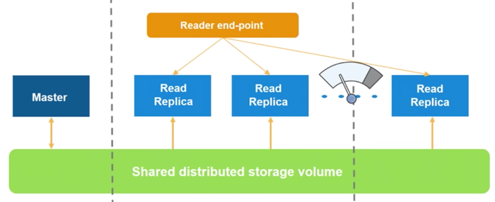
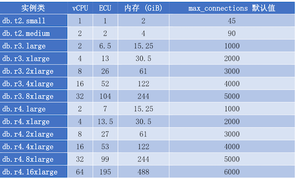
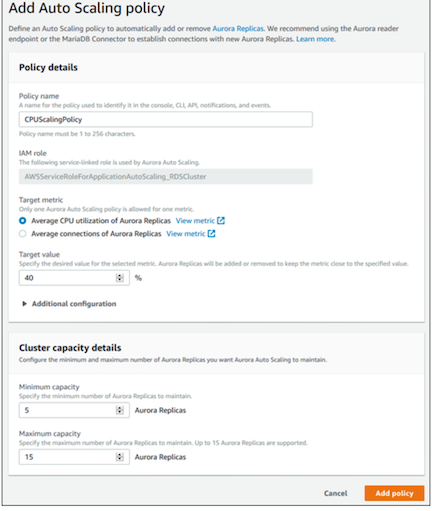
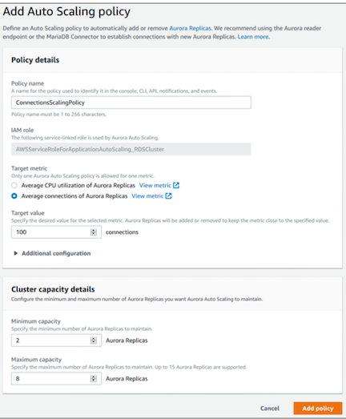

# Aurora Performance

## Aurora up to 15 promotable read replicas

* Up to **15 promotable read replicas** across **multiple availability zones** 
* Re-do log based replication leads to low replica lag — typically < 10ms
* **Reader end-point** with **load balancing** and **auto-scaling**

## Amazon Aurora Connection Management

**Amazon Aurora typically involves a cluster of DB instances instead of a single instance.**

For certain Aurora tasks, different instances or groups of instances perform different roles. 

For example, **the primary instance handles all data definition language (DDL) and data manipulation language (DML) statements.** 

**Up to 15 Aurora Replicas handle read-only query traffic.**

Using endpoints, you can map each connection to the appropriate instance or group of instances based on your use case.

1. To perform **DDL statements** you can connect to whichever instance is the `primary instance`. 
2.  **To perform queries, you can connect to the `reader endpoint`, with Aurora automatically performing load-balancing among all the Aurora Replicas.**
3. For clusters with DB instances of **different capacities or configurations**, you can connect to `custom endpoints` associated with `different subsets of DB instances`.
4. For **diagnosis or tuning**, you can connect to a `specific instance endpoint` to examine details about a specific DB instance.

### Types of Aurora Endpoints

#### 1.Cluster endpoint

A `cluster endpoint` for an Aurora DB cluster that connects to the current primary DB instance for that DB cluster. **This endpoint is the only one that can perform write operations such as DDL statements**. 

**Each Aurora DB cluster has one cluster endpoint and one primary DB instance.**

You use the cluster endpoint for all write operations on the DB cluster, including inserts, updates, deletes, and DDL changes. You can also use the cluster endpoint for read operations, such as queries.

#### 2.Reader endpoint

A `reader endpoint` for an Aurora DB cluster **connects to one of the available Aurora Replicas for that DB cluster**. **Each Aurora DB cluster has one reader endpoint**. If there is more than one Aurora Replica, the **reader endpoint directs each connection request to one of the Aurora Replicas**.

**The reader endpoint provides `load-balancing support` for read-only connections to the DB cluster.** Use the reader endpoint for **read operations**, such as **queries**. **You can't use the reader endpoint for write operations**.

#### 3.Custom endpoint

**A `custom endpoint` for an Aurora cluster represents a set of DB instances that you choose.**
When you connect to the endpoint, **Aurora performs load balancing and chooses one of the instances in the group to handle the connection**. 

An Aurora DB cluster has no custom endpoints until you create one. You can **create up to five custom endpoints** for each provisioned Aurora cluster. **You can't use custom endpoints for Aurora Serverless clusters.**

#### 4.Instance endpoint

An `instance endpoint` **connects to a specific DB instance within an Aurora cluster.**

**Each DB instance in a DB cluster, regardless of instance type, has its own unique instance endpoint.**

So there is one instance endpoint for the current primary DB instance of the DB cluster, and there is one instance endpoint for each of the Aurora Replicas in the DB cluster.

### Using the Cluster Endpoint

You use the cluster endpoint when you administer your cluster, perform extract, transform, load (ETL) operations, or develop and test applications. The cluster endpoint connects to the primary instance of the cluster. The primary instance is the only DB instance where you can create tables and indexes, run INSERT statements, and perform other DDL and DML operations.

### Using the Reader Endpoint

**You use the reader endpoint for read-only connections for your Aurora cluster**. **This endpoint uses a load-balancing mechanism to help your cluster handle a query-intensive workload**. The reader endpoint is the endpoint that you supply to applications that do reporting or other read-only operations on the cluster.

### Using Custom Endpoints

You use custom endpoints to simplify connection management when your cluster contains DB instances with different capacities and configuration settings.

## How Aurora Endpoints Work with High Availability

1. If the primary DB instance of a DB cluster fails, Aurora automatically fails over to a new primary DB instance. It does so by either **promoting an existing Aurora Replica to a new primary DB instance or creating a new primary DB instance**.
2. Use use the reader endpoint to reconnect to one of the Aurora Replicas in the DB cluster
3. During a failover, the reader endpoint might direct connections to the new primary DB instance of a DB cluster for a short time after an Aurora Replica is promoted to the new primary DB instance.

## Aurora 扩展

### 垂直扩展

您可通过增加内存将实例向上扩展为数据库实例类，或通过将 max_connections 参数设置为更大的值 (最大为 16,000) 来增加至您的 Aurora MySQL 数据库实例的最大连接数。

**根据需要修改实例类型，可以在线修改，但重启才能生效，会引起业务中断;**

### 水平扩展

可通过在数据库群集中创建最多 15 个 Aurora 副本来实现针对 Aurora 数据库群 集的读取扩展。每个 Aurora 副本均返回群集卷中的相同数据，且副本滞后时间最短 - 通常大大少于主实例写入更新后的 100 毫秒。当读取流量增大时，可创建额外 Aurora 副本并直接连接到这些副本以为您的数据库群集分配读取负载。

**Aurora 副本 不必具有与主实例相同的数据库实例类。**

### 故障转移

### 创建克隆

使用数据库克隆，可以快速而经济高效地创建您的所有数据库的克隆

* 不能跨 AWS 区域创建克隆数据库。克隆数据库必须在与源数据库相同的区域中创建。
* 当前，最多只能基于一个副本创建 15 个克隆，包括基于其他克隆的克隆。在超出 15 个之后，只能创建副本。但是，每个副本的克隆数也有最多 15 个的限制。
* 目前不支持跨账户数据库克隆。

### 回溯数据库集群

使用 `Amazon Aurora` 与 `MySQL` 的兼容性，**您可以将数据库群集回溯到特定时间， 而无需从备份还原数据**。

* 您可以轻松撤消错误
* 您可以快速回溯数据库群集
* 您可以浏览以前的数据更改

## 监控及管理集群

1. Amazon CloudWatch Metrics
2. Enhanced Monitoring
3. Performance Insights

**Amazon RDS Performance Insights 用于监控您的 Amazon RDS 数据库实例负载， 使您可以分析数据库性能和排查数据库性能问题。Amazon RDS Performance Insights 当前可用于与 Amazon Aurora MySQL**

## Using Amazon Aurora Auto Scaling with Aurora Replicas

**To meet your connectivity and workload requirements, Aurora Auto Scaling dynamically adjusts the number of Aurora Replicas provisioned for an Aurora DB cluster.**

**Aurora Auto Scaling is available for both Aurora MySQL and Aurora PostgreSQL.** Aurora Auto Scaling enables your Aurora DB cluster to handle sudden increases in connectivity or workload.

#### When the connectivity or workload decreases, Aurora Auto Scaling removes unnecessary Aurora Replicas so that you don't pay for unused provisioned DB instances.

### Aurora Auto Scaling Policies components

* A service-linked role
* A target metric
* Minimum and maximum capacity
* A cooldown period

Before you can use Aurora Auto Scaling with an Aurora DB cluster, you must first create an Aurora DB cluster with a primary instance and **at least one Aurora Replica**. 

**Although Aurora Auto Scaling manages Aurora Replicas, the Aurora DB cluster must start with at least one Aurora Replica**

### CPU utilization ASG

### Connections ASG

