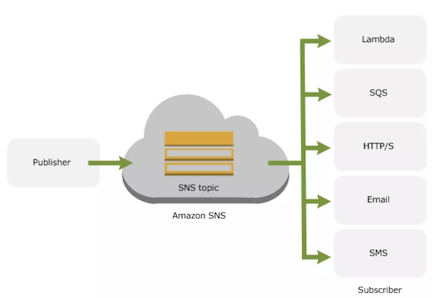

# Simple Queue Service – SQS

**Amazon SQS is a highly available distributed queue system**

**supports the HTTP over SSL (HTTPS) and Transport Layer Security (TLS) protocols for security**

## SQS provides two types of Queues – Standard & FIFO

### SQS Standard Queue Features & Key Points

* Redundant infrastructure
* At-Least-Once delivery
  * **ensures delivery of each message at least once**
* Message Attributes
* Order

#### makes a best effort to preserve order in messages `does not guarantee first in, first out` delivery of messages

* Multiple writers and readers
* Variable message size 
  * supports message in any format up to 256KB of text.
 
* Access Control
* Delay Queues
* Dead Letter Queues

### SQS Use Cases

* Work Queues
* Buffer and Batch Operations
* Request Offloading
* **Fan-out**
  * Combine SQS with SNS to send identical copies of a message to multiple queues in parallel for simultaneous processing.

* Auto Scaling
 * **SQS queues can be used to determine the load on an application**, and combined with Auto Scaling, the EC2 instances can be scaled in or out, depending on the volume of traffic

### How SQS Queues Works

* SQS queue retains messages for **four days, by default**.
* **Queues can configured to retain messages for 1 minute to 14 days** after the message has been sent.

### Visibility timeout

SQS blocks the visibility of the message for the Visibility timeout period, which is the time during which **SQS prevents other consuming components from receiving and processing that message**

**Consumer should delete the message within the Visibility timeout. If the consumer fails to delete the message before the visibility timeout expires, the message is visible again for other consumers.**

### Message Lifecycle (POLL message)

1. Component 1 sends Message A to a queue, and the message is redundantly distributed across the SQS servers.
2. When Component 2 is ready to process a message, it retrieves messages from the queue, and Message A is returned. While Message A is being processed, it remains in the queue but is not returned to subsequent receive requests for the duration of the visibility timeout.
3. **Component 2 deletes Message A from the queue** to **avoid the message being received and processed again once the visibility timeout expires**.

### SQS Design Patterns

## Amazon SQS Introduces FIFO Queues with Exactly-Once Processing and Lower Prices for Standard Queues

## Questions

1.**SQS helps to facilitate horizontal scaling of encoding tasks**

2.Which statement best describes an Amazon SQS use case?

**Create a video transcoding website where multiple components need to communicate with each other, but can’t all process the same amount of work simultaneously (SQS provides loose coupling)**

3.Your application provides data transformation services. Files containing data to be transformed are first uploaded to Amazon S3 and then transformed by a fleet of spot EC2 instances. Files submitted by your premium customers must be transformed with the highest priority. How should you implement such a system?

**Use two SQS queues, one for high priority messages, and the other for default priority. Transformation instances first poll the high priority queue; if there is no message, they poll the default priority queue**

4.Your company plans to host a large donation website on Amazon Web Services (AWS). You anticipate a large and undetermined amount of traffic that will create many database writes. To be certain that you do not drop any writes to a database hosted on AWS. Which service should you use?

**Amazon Simple Queue Service (SQS) for capturing the writes and draining the queue to write to the database**

5.A user is using the AWS SQS to decouple the services. Which of the below mentioned operations is **not supported** by SQS?

**DeleteMessageQueue**

6.**SQS by default stores message for 4 days**

7.**http://sqs.us-east-1.amazonaws.com/123456789012/queue2**

8.How does Amazon SQS allow multiple readers to access the same message queue **without losing messages or processing them many times**

**Amazon SQS queue has a configurable visibility timeout**

9.How long can you keep your Amazon SQS messages in Amazon SQS queues?

**From 60 secs up to 2 weeks**

10.When a Simple Queue Service message triggers a task that takes 5 minutes to complete, which process below will result in successful processing of the message and remove it from the queue while minimizing the chances of duplicate processing?

**Retrieve the message with an increased visibility timeout, process the message, delete the message from the queue**

# Simple Notification Service – SNS

Simple Notification Service – SNS is a web service that coordinates and manages the delivery or **sending of messages to subscribing endpoints or clients**

**Producers push messages to the topic, they created or have access to, and SNS matches the topic to a list of subscribers who have subscribed to that topic, and delivers the message to each of those subscribers**

Subscribers receive all messages published to the topics to which they subscribe, and all subscribers to a topic receive the same messages.

### SNS Supported Transport Protocols

* HTTP, HTTPS 
* Email, Email-JSON
* SQS
  * Users can specify an SQS queue as the endpoint; SNS will enqueue a notification message to the specified queue
* SMS

### SNS Supported Endpoints

* Email Notification
* Mobile Push Notifications
* SQS Queues.   SNS  => SQS
* SMS Notifications
* HTTP/HTTPS Endpoints
* Lambda

## Questions

1.Which of the following notification endpoints or clients does **Amazon Simple Notification Service support**? Choose 2 answers

**Email / Short Message Service**

2.What happens when you create a topic on Amazon SNS?

**An ARN (Amazon Resource Name) is created**

3.A user wants to make so that whenever the CPU utilization of the AWS EC2 instance is above 90%, the redlight of his bedroom turns on. Which of the below mentioned AWS services is helpful for this purpose?

**AWS CloudWatch + AWS SNS**

4.What is the format of structured notification messages sent by Amazon SNS?

**An JSON object containing MessageId, unsubscribeURL, Subject, Message and other values**

5.Which of the following are valid arguments for an SNS Publish request? Choose 3 answers.

* TopicAm
* Subject
* Message

## Operations 

### create topic

### create subscription

* Topic ARN
* Protocol
* Endpoint

### Create message

* Topic ARN
* Subject
* message format
* message
* TTL
* Message Attributes

### Create platform application

