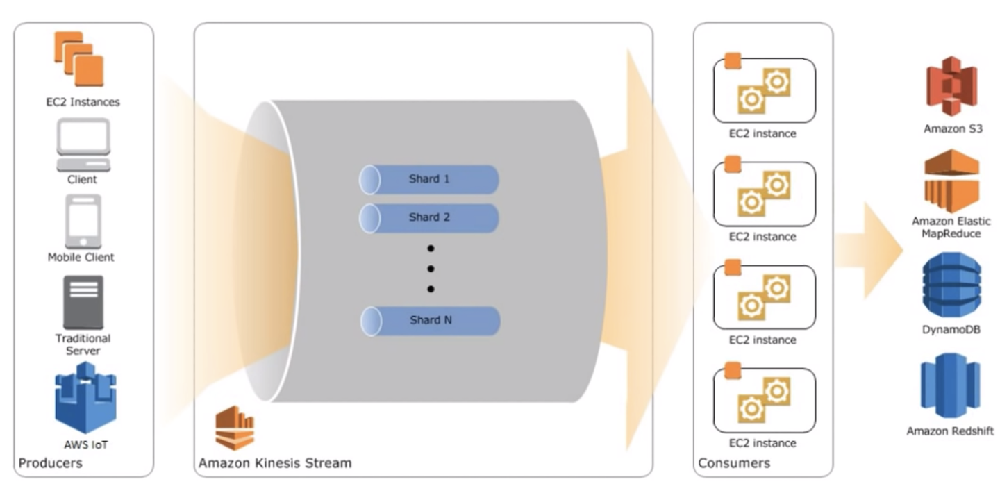
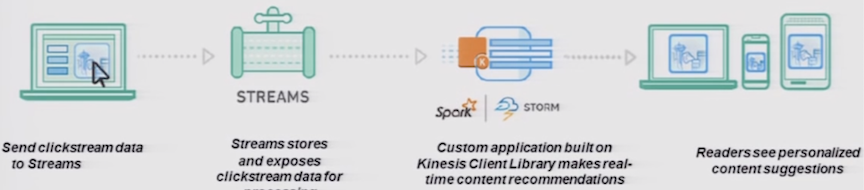
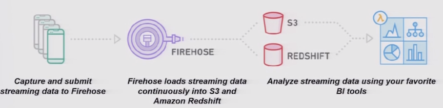

# Kinesis

**Collect and process large streams of data records in real time Support rapid and continuous data intake and aggregation Kinesis applications are data-processing applications or consumers**

**Use cases:**

* Faster log and data feed intake and processing 
* **Real-time metrics and reporting**
* **Real-time data analytics**
* Complex **stream processing**

## Kinesis Stream- Benefits 

**Real-time aggregation of data**

Load aggregated data into a data warehouse or map-reduce cluster 

Provides durability and elasticity 

* Put-to-get delay is typically less than 1 second 
* Enables scale the stream up or down 

**Multiple applications can consume data from a stream** 

## Exam Tips:  Kinesis vs SQS

* **Kinesis stream** supports ordering of records, reading or replaying records **in the same order** 
* **Records counting, aggregation, and filtering is easier in Kinesis using Partition Key** 
* **Able to Read or process records in the same order after few hours or days from a stream** 

* SQS supports messaging semantics like **message-level** acknowledgement of failure or success of a delivery 
* **SQS supports individual message delay**, **sudden increase of concurrency or throughput at read time**

### Benefits of Kinesis

* Real-Time
* “Big Data”

### SQS Benefits

* Ease of Use
* Read Throughput

### SQS Use Cases

* Application integration
* Decoupling microservices
* Allocate tasks to multiple worker nodes
* Decouple live user requests from intensive background work
* Batch messages for future processing

## Questions

1.Having different **logs or stream of data** collected from various producers like servers or IOT devices. You or your customer wants to analyze this data in **real time** based on heuristics. To validate the results, need to analyze the same data **multiple times within 12 hours**. Which solution is the best? 

SQS with EC2, S3 with EC2, EMR with S3 and **EC2 with Kinesis** 

### kinesis features

1. stream of data
2. real time* analysis
3. multiple times process (sqs At-Least-Once delivery)

2.Ability for **real-time analytics** of the **inbound data**. Ensure processing of the data is **highly durable, elastic and parallel**. The results of the analytic processing should be persisted for data mining. Which architecture to use? 

**Amazon Kinesis to collect the inbound data, analyze the data with Kinesis clients and save the results to a Redshift cluster using EMR**

### If you want persistent data storage for mining, you should use redshift with EMR

## Kinesis streaming data analysis

### Kinesis Stream

**Build your own custom applications that process or analyze streaming data**

### Kinesis Firehose

**Easily load massive volumes of streaming data into Amazon S3 and Amazon Redshift**

### Kinesis Analytics

**Easily analyze data streams using standard SQL queries.**

