# S3 Protecting Data

## Server-Side Encryption with AWS KMS–Managed Keys (SSE-KMS)

### Encryption

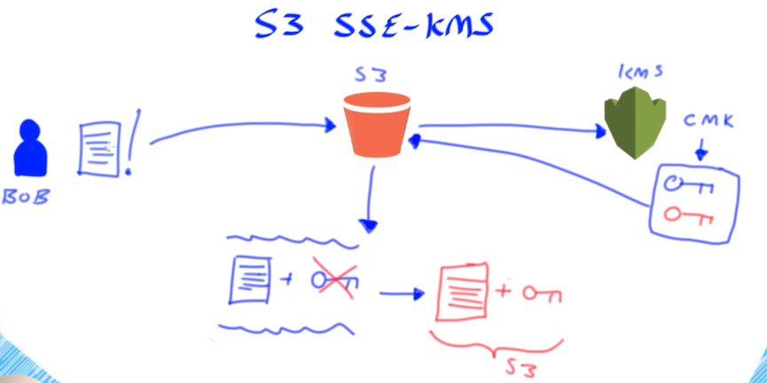

1. At this point KMS uses the **customer master key (CMK) to generate two keys** 
2. First key is just a **plain text data key(blue)** 
3. Second key that's generated is the same key but an **encrypted version(Red)**
4. Both of these key send back to S3 and S3 receives both the **plaintext key and encrypted key** now
5. So the **plaintext data key** will combine **uploaded object** to perform an **encryption algorithm** 
6. **Then generate an encrypted version of document**
7. So **S3 will store** and associate the **encrypted data key** alongside this **encrypted object**
8. At last, **the plaintext data key will deleted from memory**

#### S3 encrypt the uploaded object using plaintext data key to generate an encrypted version of your object, the s3 will associate the encrypted data key alongside your encrypted object 

### Decryption

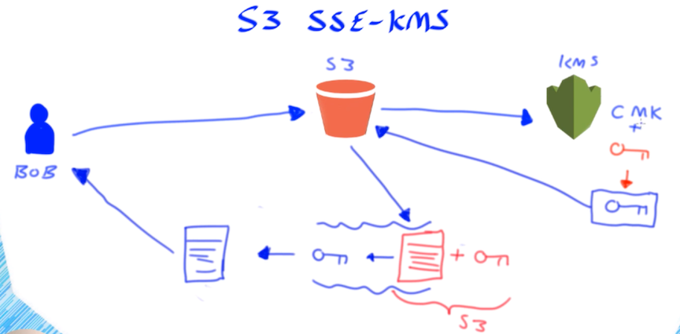

1. S3 knows the **object is encrypted associated with encrypted version of data key**
2. So send the **encrypted data key** to KMS to **generate plaintext data key**
3. KMS use the same **CMK and encrypted data key** and will generate the plain text version of data key. **(red -> blue)**
4. Now just **single plaintext data**, and return to S3
5. At this point, S3 can access the encrypted object, and use **plaintext data key(blue)** to perform an **encryption algorithm** again to decrypt the object
6. **Generate a plain version of object** which return to user

## S3 Master Encrypted Key

### Encryption

**Amazon S3 Server Side Encryption handles all encryption, decryption, and key management in a totally transparent fashion.**

1. When you PUT an object and request encryption,
2. we generate a unique key, **encrypt your data with the key,** 
3. **Then encrypt the key with a master key**. 
4. For added protection, **keys are stored in hosts that are separate and distinct from those used to store your data**. 

Here’s a diagram of the PUT process for a request that specifies SSE:

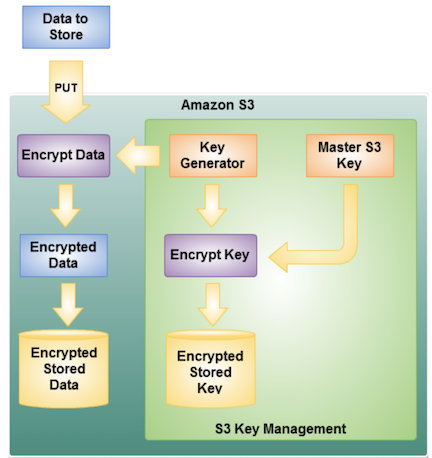

### Decryption

1. When you GET an encrypted object, 
2. **we fetch and decrypt the key, and then use it to decrypt your data.** 
3. **We also include an extra header in the response to the GET to let you know that the data was stored in encrypted form in Amazon S3.**

## Customer master key with SSE

### Encryption

1. You simply supply your encryption key as part of a PUT and S3 will take care of the rest. 
2. It will use your key to apply AES-256 encryption to your data, compute a one-way hash (checksum) of the key, 
3. Then **expeditiously remove the key from memory**. 
4. **It will return the checksum as part of the response, and will also store the checksum with the object.**

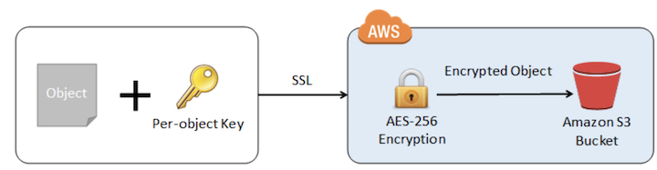

### Decryption

1. when you need the object, **you simply supply the same key as part of a GET**. 
2. **S3 will decrypt the object** (after verifying that the stored checksum matches that of the supplied key) and return the decrypted object, 
3. **once again taking care to expeditiously remove the key from memory.**

# S3 new lifecycle

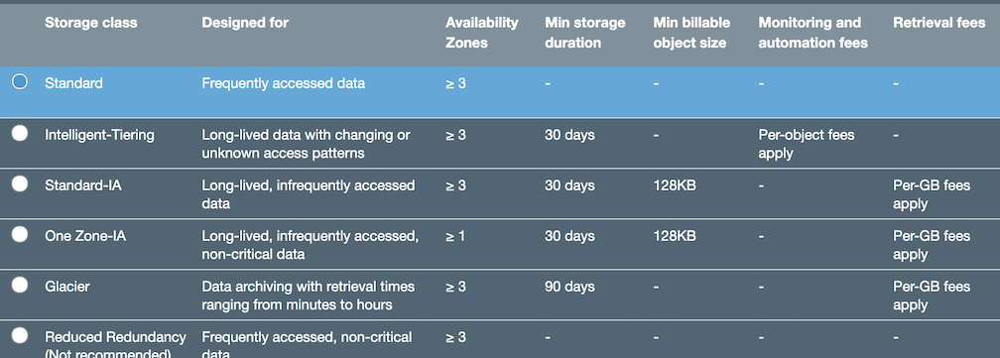

* Standard => **FA**
* Intelligent-Tiering => **Long-lived with changing or unknown access patterns**
* Standard-IA => **Long-lived, IFA**
* One zone-IA => **Long-lived, IFA, non-critical data**
* Glacier => **Data archiving with retrieval times (3-5 hours)** 
* Reduced Redundancy => **FA, non-critical, not recommended**

# Cloudfront

1. Web
2. RTMP

### Web

* Speed up distribution of static and dynamic content, for example, .html, .css, .php, and graphics files.
* Distribute media files using HTTP or HTTPS.
* Add, update, or delete objects, and submit data from web forms.
* Use live streaming to stream an event in real time.

### RTMP

* Create an RTMP distribution to speed up distribution of your streaming media files using Adobe Flash Media Server's RTMP protocol. 
* An RTMP distribution allows an end user to begin playing a media file before the file has finished downloading from a CloudFront edge location.
* To create an RTMP distribution, you must store the media files in an Amazon S3 bucket.

## CloudFront OAI (origin access identity)

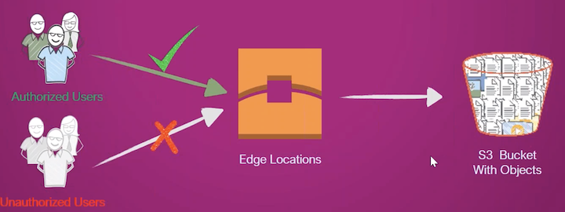

## OAI features

1. **Prevent direct access to your Amazon S3 Bucket**
2. **Only Cludfront can access Amazon S3 bucket**
3. **S3 URLs not being used anywhere**
4. Ensure content is not leaking

### Created OAI

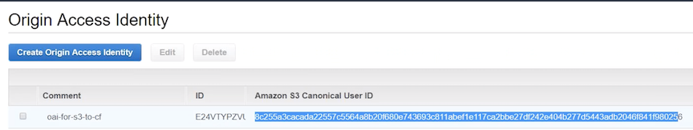

### Edit Cludfront Origin with existing OAI

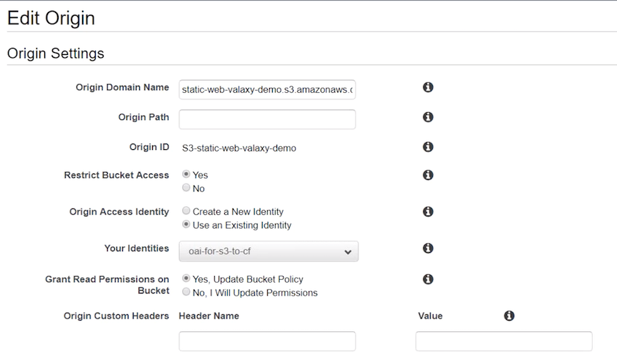

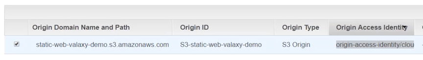

### new policy attached to S3

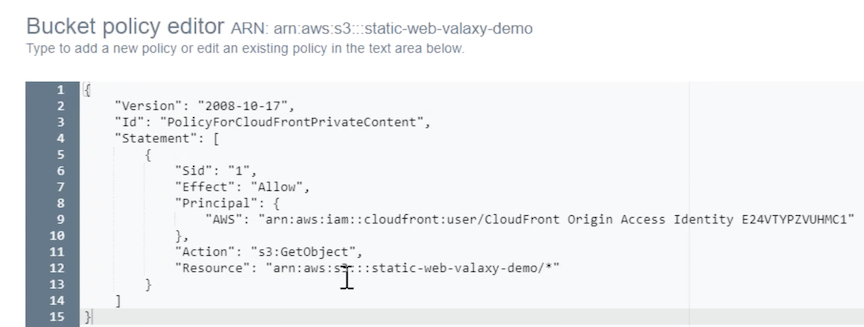

## WAF(Web Application Firewall) Control Access to Your Content

**AWS WAF is a web application firewall that lets you monitor the HTTP and HTTPS requests that are forwarded to CloudFront, and lets you control access to your content.**

**Based on conditions that you specify, such as the IP addresses that requests originate from or the values of query strings, CloudFront responds to requests either with the requested content or with an HTTP 403 status code (Forbidden).**

You can also configure CloudFront to return a custom error page when a request is blocked.

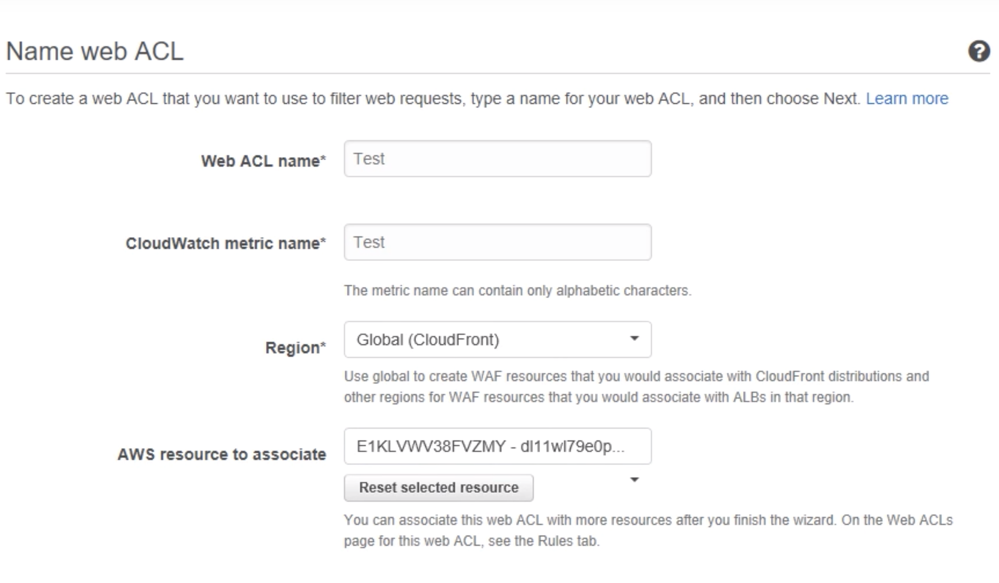

### conditions

* Cross-site Scripting Match Conditions
* IP Match Conditions
* Geographic Match Conditions
* Size Constraint Conditions
* SQL Injection Match Conditions
* String Match Conditions
* Regex Match Conditions

# EFS VS S3

* EFS looks like a local filesystem to the whatever it is mounted to. So that means you can use operating system level commands **like: mv, copy, vi, nano**, etc 
* S3 you will need clients to interact with object in S3.
* If you wanted to **edit a file in EFS you could just use nano or vi and edit it**. 
* With S3 you would **need to download it, edit it, and load it backup**. 

## S3 User Policy

### Examples: 

* Allow an IAM user access to **one of your buckets**
* Allow each IAM user access to **a folder in a bucket**
* Allow a group to have a shared folder in Amazon S3

## S3 bucket policy

* Granting Permissions to **Multiple Accounts with Added Conditions**
* Granting **Read-Only Permission to an Anonymous User**
* Restricting Access to **Specific IP Addresses**
* Restricting Access to a **Specific HTTP Referrer**
* Granting Permission to an **Amazon CloudFront Origin Identity**
* Adding a Bucket Policy to **Require MFA**
* **Granting Cross-Account Permissions** to Upload Objects While Ensuring the Bucket Owner Has Full Control
* Granting Permissions for **Amazon S3 Inventory and Amazon S3 Analytics**
* Example Bucket Policies for **VPC Endpoints for Amazon S3**

**[Effect, Principal, Action, Resource]**

## object permission

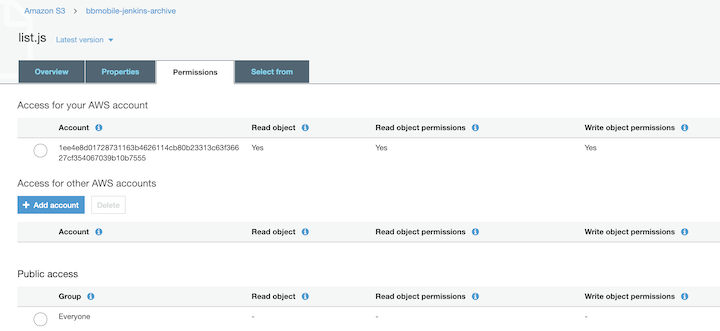

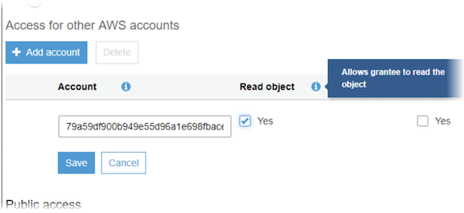

**To grant permissions to an AWS user from a different AWS account, under Access for other AWS accounts, choose Add account**