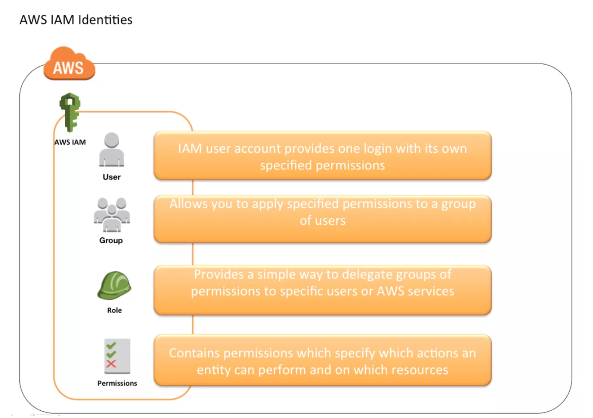

# AWS Identity Access Management

## AWS IAM Overview

* AWS Identity and Access Management (IAM) is a web service that helps you securely **control access to AWS resources for your users**.

* IAM is used to control 
  * **Identity** – **who** can use your AWS resources (**authentication**)
  * **Access** – **what resources** they can use and in what ways (**authorization**)


* IAM can also keep your **account credentials private.**
* With IAM, **multiple IAM users can be created under the umbrella of the AWS account or temporary access** can be enabled through identity federation with corporate directory or third party providers
* IAM also enables access to resources across AWS accounts.


## IAM Features

* **Shared access to your AWS account**
 * Grant other people permission to administer and use resources in your AWS account without having to share your password or access key. 
* **Granular permissions**
 * Each user can be granted with different set granular permissions as required to perform their job
* **Secure access to AWS resources for applications that run on EC2**
 * IAM can help provide applications running on EC2 instance temporary credentials that they need in order to access other AWS resources
* **Identity federation**
 * IAM allows users to access AWS resources, without requiring the user to have accounts with AWS, by providing temporary credentials
* **Identity information for assurance**
  * CloudTrail can be used to receive log records that include information about those who made requests for resources in the account
* **PCI DSS Compliance**
* **Integrated with many AWS services**
* **Eventually Consistent**
  * IAM, like many other AWS services, is **eventually consistent and achieves high availability by replicating data across multiple servers** within Amazon’s data centers around the world.
  * Changes made to IAM would be eventually consistent and hence would take some time to reflect
* **Free to use**
* **AWS Security Token Service**

 
## Identities

IAM identities determine who can access and help to provide authentication for people and processes in your AWS account




### Account Root User

**Do not use or share the Root account once the AWS account is created, instead create a separate user with admin privilege**

### IAM Users

* **IAM Best Practice – Create Individual Users**
* **User credentials:**
  * **Password** to access AWS services through AWS Management Console
  * **Access Key/Secret Access Key** to access AWS services through API, CLI or SDK
* IAM user starts with no permissions and is not authorized to perform any AWS actions on any AWS resources
* **Grant least Privilege**
* Each IAM user is associated with one and only one AWS account.

### IAM Groups

* **Use groups to assign permissions to IAM Users**
* A group can have multiple users, while a user can belong to multiple groups (10 max)

### IAM Roles

* **Trust policy**
 * Trust policy defines – **who can assume the role**
* **Permissions policy**
 * Permissions policy defines – **what they can access**
 * Permissions policy determines authorization, which grants the user of the role the needed permissions to carry out the desired tasks on the resource
* **Federation** is creating a trust relationship between an external Identity Provider (IdP) and AWS

* **Use roles for applications running on EC2 instances**
* **Delegate using roles instead of sharing credentials**

## MultiFactor Authentication (MFA)

**Enable MFA on Root accounts and privilege users**

Multi-Factor Authentication can be configured using

* Security token-based
* SMS text message-based

MFA device can be associated with only one AWS account or IAM user and vice versa

MFA protection can be enabled for service api’s calls using 

```
“Condition”: {“Bool”: {“aws:MultiFactorAuthPresent”: “true”}} 
```

and is available only if the service supports temporary security credentials


## IAM Access Management

* IAM Access Management is all about **Permissions** and **Policies**
* IAM policy basically states 

```
Principal A is allowed or denied (effect)
to perform Action B 
on Resource C 
given Conditions D are satisfied
```

```
{
    “Version”: “2012-10-17”,
    “Statement”: {
       “Principal“: {“AWS”: [“arn:aws:iam::ACCOUNT-ID-WITHOUT-HYPHENS:root”]},
       “Action“: “s3:ListBucket”,
       “Effect“: “Allow”,
       “Resource“: “arn:aws:s3:::example_bucket”,
       “Condition“: {“StringLike”: {
           “s3:prefix”: [ “home/${aws:username}/” ]
              }
          }
    }
}
```

### Identity-Based vs Resource-Based Permissions

### Managed Policies and Inline Policies


  


