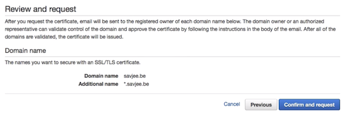
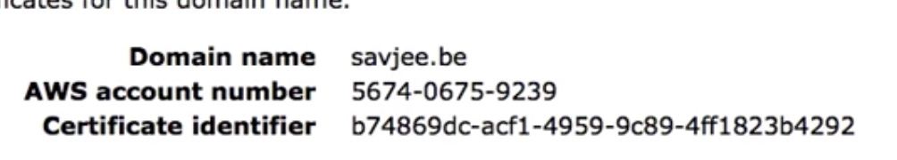
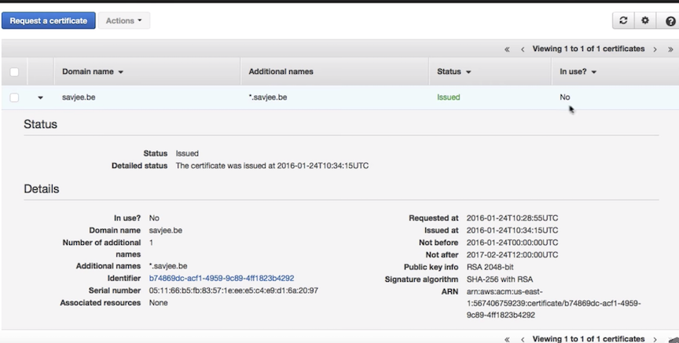
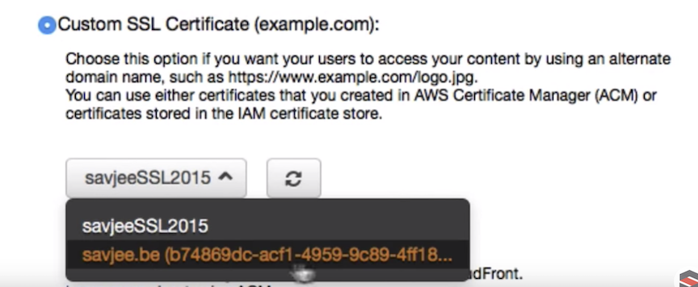
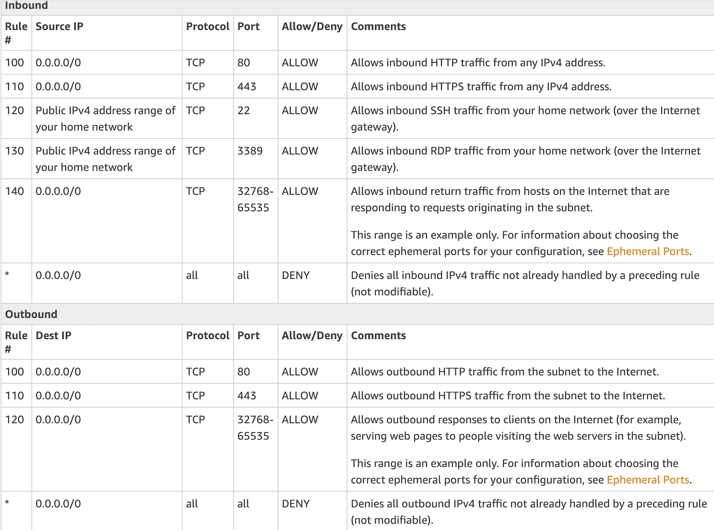
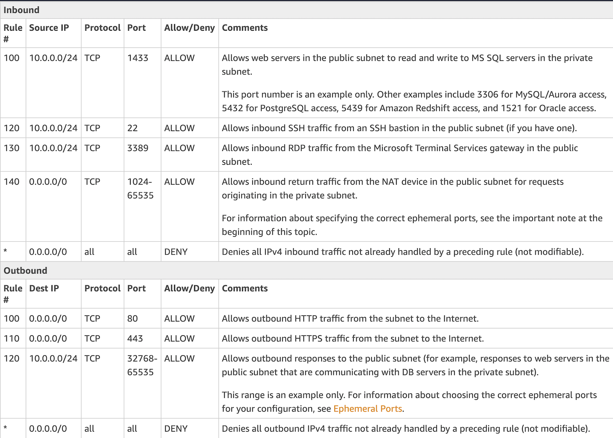
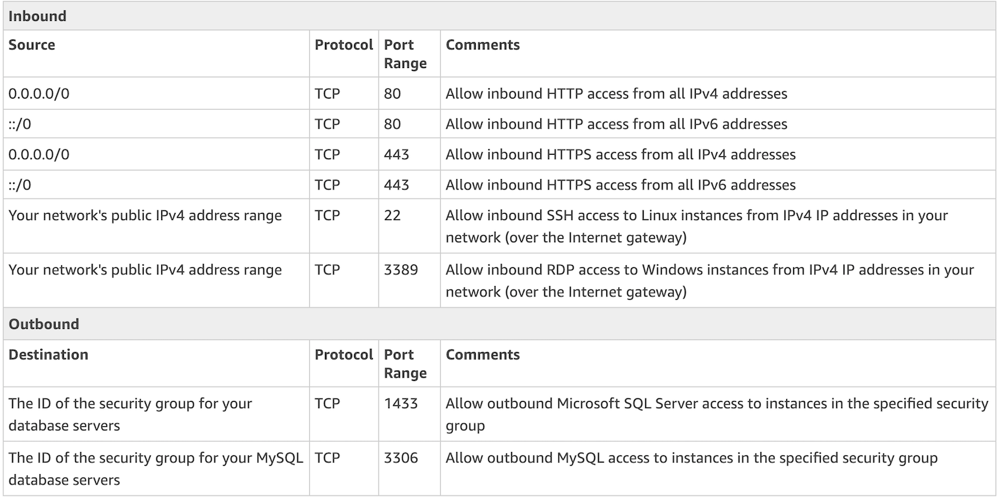
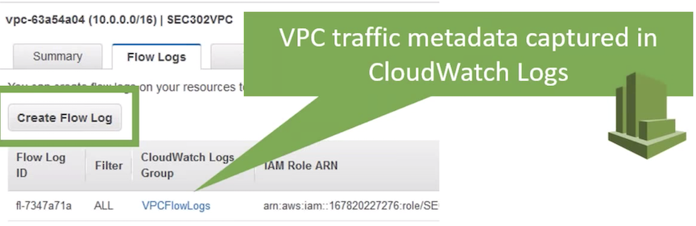

# How do I use an SSL/TLS certificate with a load balancer that is configured to support HTTPS?

### Why use SSL/TLS Certificates

* Identify a website or application over
* TLS/SSL Secure network communications 
* Browser users see a lock icon 

## Use cases 

### When to consider using ACM Private CA 

#### Server certificates 

* **Private certificates to identify internal servers**
* **EC2, ECS, or on-premises servers: e.g. Apache, Tomcat, NGINX**
* **With AWS ELB, CloudFront, API Gateway**

###Client certificates 

* Second factor for API access
* TLS mutual authentication for server-server communication 

### Replacement for self-signed certificates 

### IoT device certificates

## AWS Certificate Manager

ACM make to easy to **provision, manage, deploy, and renew** SSL/TLS certificated on the AWS Cloud

### Example: ACM applied to Cloudfront

### create ssl certificate

### custom SSL certificate with cloudfront

## ACM ON Load balancer

1. you can Request a Public Certificate using AWS Certificate Manager (ACM). 
2. To use a **third-party certificate with a load balancer**, you can **either Import the certificate to ACM** or **Import the certificate to AWS Identity and Access Management (IAM)**.

#### Configure an HTTPS Listener Classical Load Balancer

#### Create a Listener for Your Application Load Balancer

When you use HTTPS for your load balancer listener, **you must deploy an SSL certificate on your load balancer**. **The load balancer uses this certificate to terminate the connection and decrypt requests from clients before sending them to the targets**. 

**You cannot directly install certificates on Amazon Elastic Compute Cloud (Amazon EC2) websites or applications, but you can use the certificate with a load balancer and register the EC2 instance behind the load balancer.**

## ACL recommend RULES

#### 1.VPC with a Single Public Subnet.

**The following table shows the rules we recommended. They block all traffic except that which is explicitly required.**

####  2.public subnet with instances that can receive and send Internet traffic, and a private subnet that can't receive traffic directly from the Internet.

* ACL Rules for the Public Subnet

* ACL Rules for the Private Subnet

## SG recommend RULES

## VPC Flowlog

* Agentless 
* **Enable per ENI, per subnet, or per VPC**
* **Logged to AWS CloudWatch Logs** 
  * Create CloudWatch metrics from log data 
  * Alarm on those metrics 
* Visibility into effects of Security Group rules 
* Analyze & Troubleshooting network connectivity 

