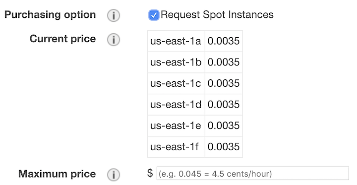
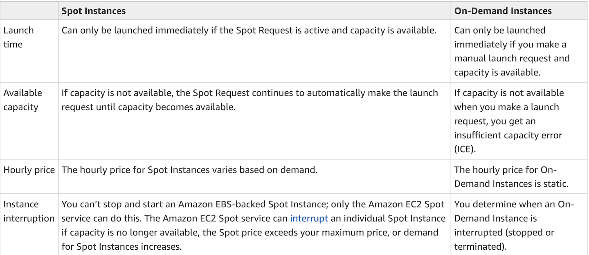
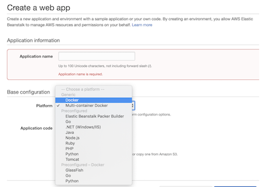
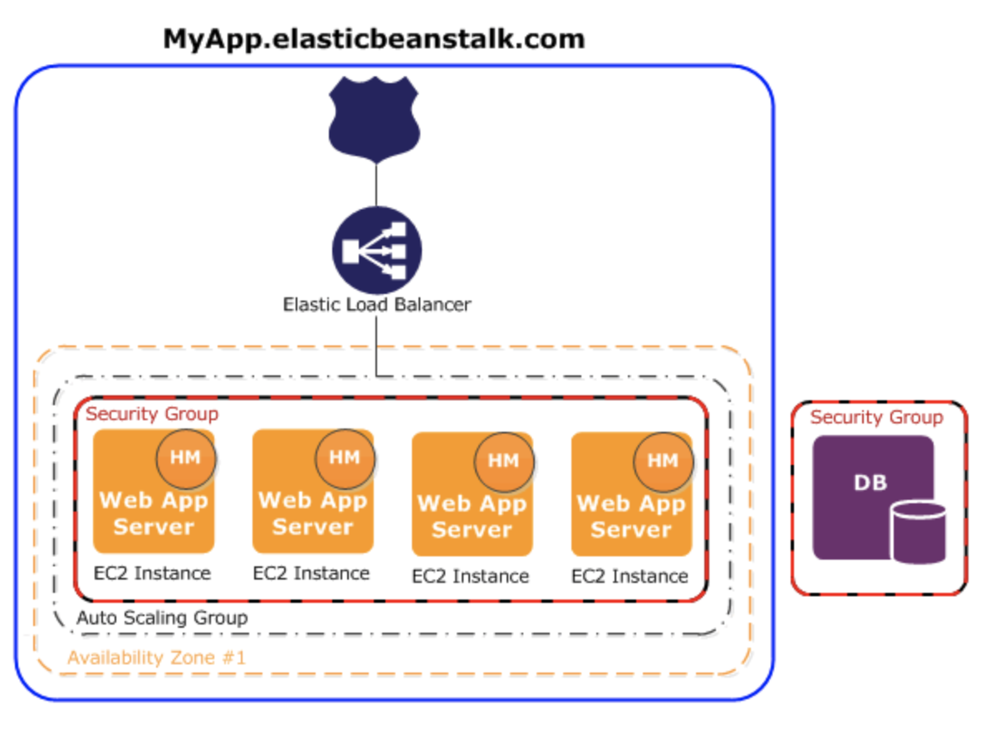
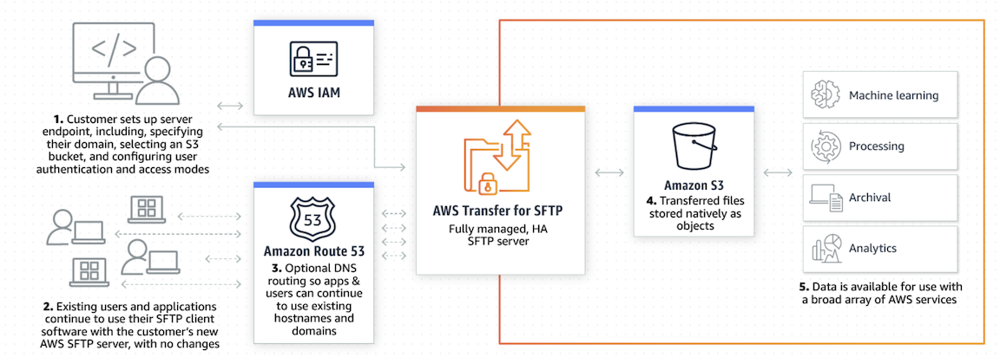
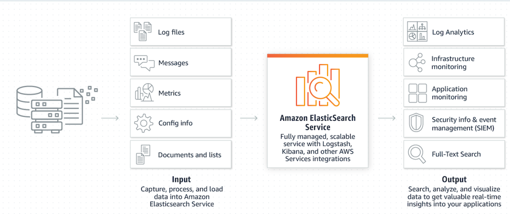

## 1.Authenticating Users with Redis AUTH

Using **Redis AUTH** command can **improve data security by requiring the user to enter a password before they are granted permission to execute Redis commands on a password-protected Redis server.**

### Redis Security & Encryption

* **In-Transit:** Encrypt all communications between clients, server, nodes 
* **At-Rest**: Encrypt backups on disk and in Amazon S3 
* **Support for Redis AUTH**
* **Fully managed**: Setup via API, CLI or console, automatic certificate issuance, renewal 

### Redis HA

* Read replicas for read availability 
* Multi-AZ with auto failover 
  * Automatic failure detection and replica promotion 
  * Repair failed nodes 
* Redis cluster sharding 
  * Faster failover 
  * Availability due to partitioning 

### Redis Cluster Auto Scaling

* **Scale memory and compute** 
* **Scale up to a cluster of 6.1 TiB of in-memory data** 
* **A cluster consists of 1 to 15 shards**
* **Each shard has a primary node and up to 5 replica nodes across multiple AZs for read scaling** 
* **Increase writes by adding shards** 

### Cluster Resizing - Zero Downtime

* **Add or remove shards to scale out/in**
* **Zero downtime—cluster continues to serve read/write requests** 
* No client side changes or app rewrites 
* **Scale up to 6.1TB of in-memory capacity**

##2.Launching Spot Instances in Your Auto Scaling Group

### Launching configuration

### Maintaining your Spot Instances. 

When your Spot Instance is terminated, the Auto Scaling group attempts to launch a replacement instance to maintain the desired capacity for the group. If your maximum price is higher than the Spot market price, then it launches a Spot Instance.

###Spot Instance termination.

Amazon EC2 Auto Scaling can terminate or replace Spot Instances just as it can terminate or replace On-Demand Instances.

### Spot instance vs On-demand instance

##3.API Beanstalk with External RDS

### Create web app with application name: Docker & Multi-container docker

### You can configure additional RDS DB resource

##4.aws SFTP (SSH File Transfer Protocol)

AWS Transfer for SFTP is a fully managed service that enables the transfer of files directly into and out of Amazon S3 using the Secure File Transfer Protocol (SFTP)—also known as Secure Shell (SSH) File Transfer Protocol. 

AWS helps you seamlessly migrate your file transfer workflows to AWS Transfer for SFTP—by **integrating with existing authentication systems**, and **providing DNS routing with Amazon Route 53—so nothing changes for your customers and partners, or their applications. With your data in S3**, you can use it with AWS services for processing, analytics, machine learning, and archiving. 

### Benefits

1. No SFTP servers to manage
2. Seamless SFTP migrations
3. Natively integrated with S3 for API-driven processes

### How it works

##5.AWS ElasticSearch

##6.Amazon Cognito

Amazon Cognito lets you add user sign-up, sign-in, and access control to your web and mobile apps quickly and easily. Amazon Cognito scales to millions of users and supports sign-in with social identity providers, such as Facebook, Google, and Amazon, and enterprise identity providers via SAML 2.0.

* Secure and scalable user directory
* Social and enterprise identity federation
* Standards-based authentication
* Security for your apps and users