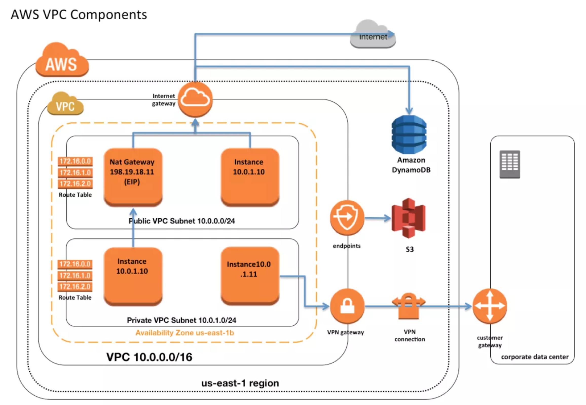
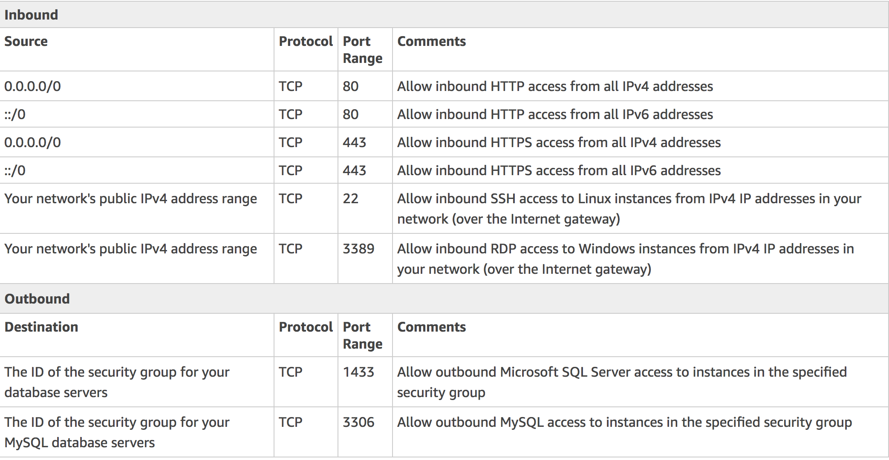
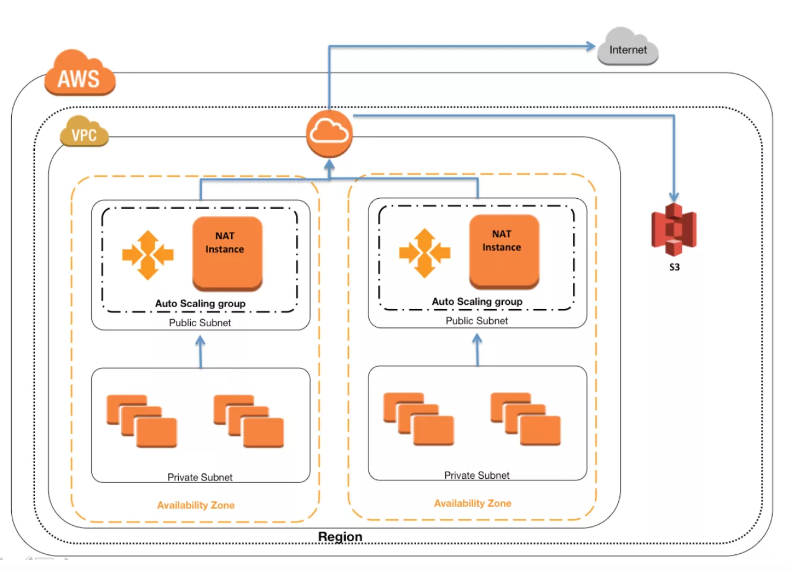

# VPC

## VPC VPN Connections

* VPC VPN connections are used to **extend on-premise** data centers to AWS
* VPC VPN connections provide **secure IPSec connections from on-premise computers/services to AWS**

### AWS hardware VPN

* Connectivity can be established by creating **an IPSec**, **hardware VPN connection between the VPC and the remote network**.
* On the AWS side of the **VPN connection**, a **Virtual Private Gateway (VGW)** provides two **VPN endpoints for automatic failover**.
* **On customer side a customer gateway (CGW)** needs to be configured, which is the **physical device or software application on the remote side of the VPN connection**

### AWS Direct Connect

**AWS Direct Connect** provides a dedicated **private connection from a remote network to your VPC.**

* AWS VPN CloudHub
* Software VPN: **OpenVPN appliance on an EC2 instance in the VPC**

### VPN Components

#### Virtual Private Gateway – VGW

A virtual private gateway is the VPN concentrator on the AWS side of the VPN connection

#### Customer Gateway – CGW

### Questions

1.You have in total 5 offices, and the entire employee related information is stored under AWS VPC instances. Now all the offices want to connect the instances in VPC using VPN. Which of the below help you to implement this?

* you can have redundant **customer gateways between your data center and your VPC**
* you can have **multiple locations connected to the AWS VPN CloudHub**

2.You have been asked to virtually extend two existing data centers into AWS to support a highly available application that depends on existing, on-premises resources located in multiple data centers and static content that is served from an Amazon Simple Storage Service (S3) bucket. **Your design currently includes a dual-tunnel VPN connection between your CGW and VGW. Which component of your architecture represents a potential single point of failure** that you should consider changing to make the solution more highly available?

**Add another CGW in a different data center and create another dual-tunnel VPN connection**

## VPC Endpoints Overview

* VPC endpoint enables creation of a private connection between your VPC and another AWS service **using its private IP address**
* VPC Endpoint **does not require** a **public IP address**, **access over the Internet**, **NAT device**, a **VPN connection or AWS Direct Connect**
* Endpoints are virtual devices. They are horizontally scaled, redundant, and highly available VPC components that allow communication between instances in your VPC and AWS services without imposing availability risks or bandwidth constraints on your network traffic.
* **Endpoints currently do not support cross-region requests**
* SUPPORT S3 and DynamoDB

### Limitations

* Endpoint **cannot be created between a VPC and an AWS service in a different region**.
* Endpoint **cannot be tagged**
* Endpoint **cannot be transferred from one VPC to another, or from one service to another**
* Endpoint **connections cannot be extended out of a VPC** i.e. **resources across the VPN connection, VPC peering connection, AWS Direct Connect connection cannot use the endpoint**

## VPC Overview & Components

VPC allows the user to **select IP address range**, **create subnets**, and c**onfigure route tables**, **network gateways**, and **security settings**. 

### VPC Sizing

* **Connection between your VPC and corporate or home network can be established**, however **the CIDR blocks should be not be overlapping** for e.g. VPC with CIDR 10.0.0.0/16 can communicate with 10.1.0.0/16 corporate network but the connections would be dropped if it tries to connect to 10.0.37.0/16 corporate network cause of overlapping ip addresses.

* **Deletion of the VPC** is possible only after terminating all instances within the VPC, and deleting all the components with the VPC for e.g. subnets, security groups, network ACLs, route tables, Internet gateways, VPC peering connections, and DHCP options

### IP Addresses ( Private, Public and Elastic IP address are properties of ENI)

#### Private IP Addresses

**Primary IP address is associated with the network interface for its lifetime, even when the instance is stopped and restarted** and is **released only when the instance is terminated**

#### Public IP address

**Public IP address is is released when the instance is stopped and restarted or terminated.**

#### Elastic IP address

* Elastic IP addresses are static, persistent public IP addresses which can be associated and disassociated with the instance, as required
* Elastic IP addresses can be moved from one instance to another, which can be within the same or different VPC within the same account

### Elastic Network Interface (ENI)

### Route Tables

* **Each VPC has a Main Route table, and can have multiple custom route tables created**
* **Each Subnet within a VPC must be associated with a single route table at a time, while a route table can have multiple subnets associated with it**
* Subnet, if not explicitly associated to a route table, is implicitly associated with the main route table
* **Route tables** needs to be **updated to defined routes** for **Internet gateways**, **Virtual Private gateways**, **VPC Peering**, **VPC Endpoints**, **NAT Device** etc.

### Internet Gateways – IGW

An Internet gateway is a horizontally scaled, redundant, and highly **available VPC component** that **allows communication between instances in the VPC and the Internet**.

#### Enabling Internet access to an Instance requires

* Attaching Internet gateway to the VPC
* Subnet should have route tables associated with the route pointing to the Internet gateway
* Instances should have a Public IP or Elastic IP address assigned
* Security groups and NACLs associated with the Instance should allow relevant traffic

### NAT

### VPC Security

1. **Security groups** – **Act as a firewall for associated EC2 instances**, controlling both inbound and outbound traffic at the **instance level**
2. **Network access control lists (ACLs)** – **Act as a firewall for associated subnets**, controlling both inbound and outbound traffic at the subnet level
3. Flow logs – **Capture information about the IP traffic going** to and from network interfaces in your VPC

### Flow logs

* **Flow log data is stored using Amazon CloudWatch Logs**
* Flow log can be created for the entire VPC, subnets or each network interface. If enabled, for entire VPC or subnet all the network interfaces are monitored

### Subnets

Each Subnet is associated with a route table which controls the traffic.

### VPC Endpoints

### VPC Peering

### VPC VPN Connections & CloudHub

1.You have a business-to-business web application running in a VPC consisting of an Elastic Load Balancer (ELB), web servers, application servers and a database. Your web application should only accept traffic from predefined customer IP addresses. Which two options meet this security requirement? Choose 2 answers

* Configure web server VPC security groups to allow traffic from your customers’ IPs (Web server is behind the ELB and customer IPs will never reach web servers)

* **Configure your web servers to filter traffic based on the ELB’s “X-forwarded-for” header (get the customer IPs and create a custom filter to restrict access.）**

* **Configure ELB security groups to allow traffic from your customers’ IPs and deny all outbound traffic (ELB will see the customer IPs so can restrict access, deny all is basically have no rules in outbound traffic, implicit, and its stateful so would work)**

* Configure a VPC NACL to allow web traffic from your customers’ IPs and deny all outbound traffic (**NACL is stateless, deny all will not work**)

2.A user has created a VPC with public and private subnets using the VPC Wizard. The VPC has CIDR 20.0.0.0/16. The private subnet uses CIDR 20.0.0.0/24. Which of the below mentioned entries are required in the main route table to allow the instances in VPC to communicate with each other?

2.A user has created a VPC with public and private subnets using the VPC Wizard. The VPC has CIDR 20.0.0.0/16. The private subnet uses CIDR 20.0.0.0/24. Which of the below mentioned entries are required in the main route table to **allow the instances in VPC to communicate with each other**?

**Destination : 20.0.0.0/16 and `Target : Local`**

3.A user has created a VPC with two subnets: one public and one private. The user is planning to run the patch update for the instances in the private subnet. **How can the instances in the private subnet connect to the internet**?

**Use NAT with an elastic IP**

4.A user has launched an EC2 instance and installed a website with the Apache webserver. The webserver is running but the user is not able to access the website from the Internet. What can be the possible reason for this failure?

**The security group of the instance is not configured properly.**

5.A user has created a VPC with public and private subnets using the VPC wizard. Which of the below mentioned statements is true in this scenario?

**VPC bounds the main route table with a private subnet and a custom route table with a public subnet**

* main route table  => private subnet
* custom rouet table => public subnet

6.A user has created a VPC with public and private subnets. The VPC has CIDR 20.0.0.0/16. The private subnet uses CIDR 20.0.1.0/24 and the **public subnet uses CIDR 20.0.0.0/24.** The user is planning to host a web server in the **public subnet (port 80)** and a DB server in the private subnet (port 3306). **The user is configuring a security group of the NAT instance. Which of the below mentioned entries is not required for the NAT security group**?

**For Inbound allow Source: 20.0.0.0/24 on port 80**

7.A user has created a VPC with CIDR 20.0.0.0/24. The user has used all the IPs of CIDR and wants to increase the size of the VPC. The user has two subnets: public (20.0.0.0/25) and private (20.0.0.128/25). How can the user change the size of the VPC?

**Amazon Virtual Private Cloud (VPC) now allows customers to expand their VPCs by adding secondary IPv4 address ranges (CIDRs) to their VPCs**

**Customers can add the secondary CIDR blocks to the VPC directly from the console or by using the CLI after they have created the VPC with the primary CIDR block.**

8.A user has created a VPC with the public and private subnets using the VPC wizard. The VPC has CIDR 20.0.0.0/16. The public subnet uses CIDR 20.0.1.0/24. The user is planning to host a web server in the public subnet (port 80) and a DB server in the private subnet (port 3306). The user is configuring a security group for the public subnet (WebSecGrp) and the private subnet (DBSecGrp). Which of the below mentioned entries is required in the web server security group (WebSecGrp)?

**Configure Destination as DB Security group ID (DbSecGrp) for port 3306 Outbound**

DB's data need outbound 

9.A user has created a VPC with CIDR 20.0.0.0/16. The user has created one subnet with CIDR 20.0.0.0/16 by mistake. The user is trying to create another subnet of CIDR 20.0.0.1/24. How can the user create the second subnet?

**It is not possible to create a second subnet as one subnet with the same CIDR as the VPC has been created**

10.A user has setup a VPC with CIDR 20.0.0.0/16. The VPC has a private subnet (20.0.1.0/24) and a public subnet (20.0.0.0/24). The user’s data centre has CIDR of 20.0.54.0/24 and 20.1.0.0/24. If the private subnet wants to communicate with the data centre, what will happen?

**It will allow traffic with data centre on CIDR 20.1.0.0/24 but does not allow on 20.0.54.0/24 (as the CIDR block would be overlapping)**

11.A user has created a VPC with public and private subnets using the VPC wizard. The VPC has CIDR 20.0.0.0/16. The private subnet uses CIDR 20.0.0.0/24 . The NAT instance ID is i-a12345. Which of the below mentioned entries are required in the main route table attached with the private subnet to allow instances to connect with the internet?

**Destination: 0.0.0.0/0 and Target: i-a12345**

12.A user has created a VPC with CIDR 20.0.0.0/16 using the wizard. The user has created a public subnet CIDR (20.0.0.0/24) and **VPN only subnets CIDR (20.0.1.0/24) along with the VPN gateway (vgw-12345) to connect to the user’s data centre**. The user’s data centre has CIDR 172.28.0.0/12. The user has also setup a **NAT instance (i-123456) to allow traffic to the internet from the VPN subnet**. Which of the below mentioned options is not a valid entry for the main route table in this scenario?

**NAT instance already inside VPN subnet subnets CIDR (20.0.1.0/24)**

**Destination: 20.0.1.0/24 and Target: i-12345**

13.A user has created a VPC with CIDR 20.0.0.0/16. **The user has created one subnet with CIDR 20.0.0.0/16 in this VPC. The user is trying to create another subnet with the same VPC for CIDR 20.0.0.1/24. What will happen in this scenario**?

**It will throw a CIDR overlaps error**

14.A user has created a VPC with CIDR 20.0.0.0/16 using the wizard. The user has created both Public and VPN-Only subnets along with hardware VPN access to connect to the user’s data centre. The user has not yet launched any instance as well as modified or deleted any setup. He wants to **delete this VPC** from the console. Will the console allow the user to delete the VPC?

**Yes, the console will delete all the setups and detach the virtual private gateway**

**(doesn't concern NAT instance)**

**Deletion of the VPC is possible only after terminating all instances within the VPC, and deleting all the components with the VPC for e.g. subnets, security groups, network ACLs, route tables, Internet gateways, VPC peering connections, and DHCP options**

15.A user has created a VPC with the public and private subnets using the VPC wizard. The VPC has CIDR 20.0.0.0/16. The public subnet uses CIDR 20.0.1.0/24. The user is planning to host a web server in the public subnet (port 80) and a DB server in the private subnet (port 3306). The user is configuring a security group for the public subnet (WebSecGrp) and the private subnet (DBSecGrp). **Which of the below mentioned entries is required in the private subnet database security group (DBSecGrp)**?

**Allow Inbound on port 3306 for Source Web Server Security Group (WebSecGrp)**

16.A user has created a VPC with a subnet and a security group. The user has launched an instance in that subnet and attached a public IP. The user is still unable to connect to the instance. **The internet gateway has also been created**. What can be the reason for the error?

**The internet gateway is not configured with the route table**

17.A user has created a subnet in VPC and launched an EC2 instance within it. The user has not selected the option to assign the IP address while launching the instance. Which of the below mentioned statements is true with respect to the Instance requiring access to the Internet?

**The user would need to create an internet gateway and then attach an elastic IP to the instance to connect from internet**

18.**A user has created a VPC with public and private** subnets using the VPC wizard. Which of the below mentioned statements is **not true** in this scenario?

**VPC will create a routing instance and attach it with a public subnet**

19.A user has created a VPC with the public subnet. The user has created a security group for that VPC. Which of the below mentioned statements is **true** when a **security group** is created?

**It will have all the outbound traffic by default**

#### SG bound to instance, allow visit outside by default

20.A user has created a VPC with CIDR 20.0.0.0/16 using VPC Wizard. The user has created a public CIDR (20.0.0.0/24) and a VPN only subnet CIDR (20.0.1.0/24) along with the hardware VPN access to connect to the user’s data centre. Which of the below mentioned components is not present when the VPC is setup with the wizard?

**A NAT instance configured to allow the VPN subnet instances to connect with the internet**

21 A user has created a VPC with CIDR 20.0.0.0/24. The user has created a public subnet with CIDR 20.0.0.0/25 and a private subnet with CIDR 20.0.0.128/25. The user has launched one instance each in the private and public subnets. Which of the below mentioned options **cannot be the correct IP address** (private IP) assigned to an instance in the public or private subnet?

**20.0.0.255**  => 20.0.0.254

22A user has created a public subnet with VPC and launched an EC2 instance within it. **The user is trying to delete the subnet**. What will happen in this scenario?

**It will not allow the user to delete the subnet until the instances are terminated**

23 A user has created a VPC with CIDR 20.0.0.0/16 using the wizard. The user has created a public subnet CIDR (20.0.0.0/24) and VPN only subnets CIDR (20.0.1.0/24) along with the VPN gateway (vgw-12345) to connect to the user’s data centre. Which of the below mentioned options is a valid entry for the main route table in this scenario?

**Destination: 0.0.0.0/0 and Target: vgw-12345**

24.Which two components provide connectivity with external networks? When attached to an Amazon VPC which two components provide connectivity with external networks? Choose 2 answers

* Elastic IPs (EIP) (**Does not provide connectivity, public IP address will do as well)**
* NAT Gateway (NAT) (**Not Attached to VPC and still needs IGW**)
* **Internet Gateway (IGW)**
* **Virtual Private Gateway (VGW)**

25.You are attempting to connect to an instance in Amazon VPC without success You have already verified that the VPC has an Internet Gateway (IGW) the instance has an associated Elastic IP (EIP) and correct security group rules are in place. Which VPC component should you evaluate next?

**The configuration of the Routing Table**

26.If you want to launch Amazon Elastic Compute Cloud (EC2) Instances and assign each Instance a predetermined private IP address you should:

**Launch the instances in the Amazon virtual Private Cloud (VPC)**

27.A user has recently started using EC2. The user launched one EC2 instance in the default subnet in EC2-VPC Which of the below mentioned options is not attached or available with the EC2 instance when it is launched?

**Elastic IP**

28.A user has created a VPC with CIDR 20.0.0.0/24. The user has created a public subnet with CIDR 20.0.0.0/25. The user is trying to create the private subnet with CIDR 20.0.0.128/25. Which of the below mentioned statements is true in this scenario?

**It will allow the user to create a private subnet with CIDR as 20.0.0.128/25**

29.A user has created a VPC with CIDR 20.0.0.0/16 with only a private subnet and VPN connection using the VPC wizard. The user wants to connect to the instance in a private subnet over SSH. How should the user define the security rule for SSH?

**Allow Inbound traffic on port 22 from the user’s network**

30.A company wants to implement their website in a virtual private cloud (VPC). The web tier will use an Auto Scaling group across multiple Availability Zones (AZs). The database will use Multi-AZ RDS MySQL and should not be publicly accessible. What is the minimum number of subnets that need to be configured in the VPC?

**4 (2 public subnets for web instances in multiple AZs and 2 private subnets for RDS Multi-AZ)**

31.Which of the following are characteristics of Amazon VPC subnets? Choose 2 answers

* Each subnet maps to a single Availability Zone

* By default, all subnets can route between each other, whether they are private or public

32.You need to design a VPC for a web-application consisting of an Elastic Load Balancer (ELB). a fleet of web/application servers, and an RDS database The entire Infrastructure must be distributed over 2 availability zones. Which VPC configuration works while assuring the database is not available from the Internet?

**Two public subnets for ELB two private subnets for the web-servers and two private subnets for RDS**

33.A user wants to access RDS from an EC2 instance using IP addresses. Both RDS and EC2 are in the same region, but different AZs. Which of the below mentioned options help configure that the instance is accessed faster?

**Configure the Private IP of the Instance in RDS security group**

34.In regards to VPC, select the correct statement:

**You can associate multiple subnets with the same Route Table.**

35.You need to design a VPC for a web-application consisting of an ELB a fleet of web application servers, and an RDS DB. The entire infrastructure must be distributed over 2 AZ. Which VPC configuration works while assuring the DB is not available from the Internet?

**Two Public Subnets for ELB, two private Subnet for the web-servers, and two private subnet for the RDS**

36.You have an Amazon VPC with one private subnet and one public subnet with a Network Address Translator (NAT) server. You are creating a group of Amazon Elastic Cloud Compute (EC2) instances that configure themselves at startup via downloading a bootstrapping script from Amazon Simple Storage Service (S3) that deploys an application via GIT. Which setup provides the highest level of security?

**Amazon EC2 instances in private subnet, no EIPs, route outgoing traffic via the NAT**

37.You have launched an Amazon Elastic Compute Cloud (EC2) instance into a public subnet with a primary private IP address assigned, an internet gateway is attached to the VPC, and the public route table is configured to send all Internet-based traffic to the Internet gateway. The instance security group is set to allow all outbound traffic but cannot access the Internet. Why is the Internet unreachable from this instance?

38.You have an environment that consists of a public subnet using Amazon VPC and 3 instances that are running in this subnet. These three instances can successfully communicate with other hosts on the Internet. You launch a fourth instance in the same subnet, using the same AMI and security group configuration you used for the others, but find that this instance cannot be accessed from the internet. What should you do to enable Internet access?

**Assign an Elastic IP address to the fourth instance**

## AWS VPC NAT – NAT Gateway – Nat Instance 

### NAT Overview

* Network Address Translation (NAT) devices, **launched in the public subnet, enables instances in a private subnet to connect to the Internet**, but **prevents the Internet from initiating connections with the instances.**

### NAT device Configuration Key Points

* needs to be launched in the Public Subnet
* needs to be **associated with an Elastic IP address (or public IP address)**
* **Source/Destination flag disabled**
* should have a Security group associated that
  * allows **Outbound Internet traffic** from instances in the private subnet
  * disallows Inbound Internet traffic from everywhere
* Instances in the private subnet should have the Route table configured to direct all Internet traffic to the NAT device

### NAT Gateway

* A NAT gateway supports bursts of up to **10 Gbps of bandwidth.**
* **NAT gateway is associated with One Elastic IP address** which **cannot be disassociated after it’s creation.**
* **NAT gateway cannot be associated a security group. Security can be configured for the instances in the private subnets to control the traffic**
* **NAT gateway cannot send traffic over VPC endpoints, VPN connections, AWS Direct Connect, or VPC peering connections.** Private subnet’s route table should be modified to route the traffic directly to these devices.

### NAT Instance

* NAT instance can be created by using Amazon Linux AMIs configured to route traffic to Internet.
* NAT instances must have security groups associated with **Inbound traffic enabled from private subnets and Outbound traffic enabled to the Internet**
* NAT instances should have the Source Destination Check attribute disabled,

* Create One **NAT instance per Availability Zone**
* Configure all **Private subnet route tables to the same zone NAT instance**
* Configure all Private subnet route tables to the same zone NAT instance
* **Bootstrap scripts with the NAT instance to update the Route tables programmatically**

### Use Auto Scaling group per NAT instance with min and max size set of 1. So if NAT instances fail, Auto Scaling will automatically launch an replacement instance

### Disabling Source/Destination checks

* Each EC2 instance performs source/destination checks, by default, and the instance must be the source or destination of any traffic it sends or receives (To ec2 itself)
* However, as the NAT instance acts as a router between the Internet and the instances in the private subnet it must be able to send and receive traffic when the source or destination is **not itself**
* **Therefore, the source/destination checks on the NAT instance should be disabled**

### Questions

1.After launching an instance that you intend to serve as a NAT (Network Address Translation) device in a public subnet you modify your route tables to have the NAT device be the target of internet bound traffic of your private subnet. When you try and make an outbound connection to the Internet from **an instance in the private subnet**, you are not successful. Which of the following steps could resolve the issue?

**Disabling the Source/Destination Check attribute on the NAT instance**

2.You manually launch a NAT AMI in a public subnet. The network is properly configured. Security groups and network access control lists are property configured. Instances in a private subnet can access the NAT. The NAT can access the Internet. However, private instances cannot access the Internet. What additional step is required to allow access from the private instances

**Disable Source/Destination Check on the NAT instance**

3.A user has created a VPC with public and private subnets. The VPC has CIDR 20.0.0.0/16. The private subnet uses CIDR 20.0.1.0/24 and the public subnet uses CIDR 20.0.0.0/24. The user is planning to host a web server in the public subnet (port 80. and a DB server in the private subnet (port 3306.. The user is configuring a security group of the NAT instance. Which of the below mentioned entries is **not required** for the NAT security group?

**For Inbound allow Source: 20.0.0.0/24 on port 80 **

**NAT instance SG need connect to private subnet inbound not public subnet**

4.A web company is looking to implement an external payment service into their highly available application deployed in a VPC. Their application EC2 instances are behind a public facing ELB. Auto scaling is used to add additional instances as traffic increases. Under normal load the application runs 2 instances in the Auto Scaling group but at peak it can scale 3x in size. The application instances need to communicate with the payment service over the Internet, which requires whitelisting of all public IP addresses used to communicate with it. A maximum of 4 whitelisting IP addresses are allowed at a time and can be added through an API. How should they architect their solution?

**Route payment requests through two NAT instances setup for High Availability and whitelist the Elastic IP addresses attached to the NAT instances**

**ELB does not have a fixed IP address**

## VPC Security Security Group vs NACLs

### Security Groups

* Each instance within a subnet **can be assigned a different set of Security groups**
* An instance can be **assigned 5 security groups** with each **security group having 50 rules**
* Default Security group **allows no external inbound traffic** but **allows inbound traffic from instances with the same security group**
* Default Security group allows all outbound traffic
* New Security groups start with only an outbound rule that **allows all traffic to leave the instances**
* **Security groups can specify only Allow rules, but not deny rules**
* **Security groups are Stateful – responses to allowed inbound traffic are allowed to flow outbound regardless of outbound rules, and vice versa.** Hence an Outbound rule for the response is not needed

### NACLs

* NACLs are **not for granular control** and **are assigned at a Subnet level** and is applicable to all the instances in that Subnet
* **Default ACL allows all inbound and outbound traffic.**
* **Newly created ACL denies all inbound and outbound traffic**
* **A Subnet can be assigned only 1 NACLs** and if not associated explicitly would be associated implicitly with the default NACL
* Network ACL is a numbered list of rules that are evaluated in order
starting with the lowest numbered rule, to determine whether traffic is allowed in or out of any subnet associated with the network ACL
for e.g. if you have a Rule No. 100 with Allow All and 110 with Deny All, the Allow All would take precedence and all the traffic will be allowed
* **Network ACLs are Stateless:** if you enable Inbound SSH on port 22 from the specific IP address, you would need to add a Outbound rule for the response as well

####  Default Security group *allows no external inbound traffic* but allows inbound traffic from instances with the same security group, 
#### Default Security group *allows all outbound traffic*
#### Default ACL *allows* all inbound and outbound traffic.
#### Newly created ACL *denies* all inbound and outbound traffic

1.Instance A and instance B are running in two different subnets A and B of a VPC. Instance A is not able to ping instance B. What are two possible reasons for this? (Pick 2 correct answers)

**The security group attached to instance B does not allow inbound ICMP traffic**

**The NACL on subnet B does not allow outbound ICMP traffic**

2.An instance is launched into a VPC subnet with the network ACL configured to allow all inbound traffic and deny all outbound traffic. The instance’s security group is configured to allow SSH from any IP address and deny all outbound traffic. What changes need to be made to allow SSH access to the instance?

**The outbound network ACL needs to be modified to allow outbound traffic.**

3.From what services I can **block incoming/outgoing IP**s?

**NACL**   ALLOW / Deny

4.You are currently hosting multiple applications in a VPC and have logged numerous port scans coming in from a specific IP address block. Your security team has requested that all access from the offending IP address block be denied for the next 24 hours. **Which of the following is the best method to quickly and temporarily deny access from the specified IP address block**?

**Modify the Network ACLs associated with all public subnets in the VPC to deny access from the IP address block**

5.You have two Elastic Compute Cloud (EC2) instances inside a Virtual Private Cloud (VPC) in the same Availability Zone (AZ) but in different subnets. One instance is running a database and the other instance an application that will interface with the database. You want to confirm that they can talk to each other for your application to work properly. **Which two things do we need to confirm in the VPC settings so that these EC2 instances can communicate inside the VPC? Choose 2 answers**

**A network ACL that allows communication between the two subnets.**

**Security groups are set to allow the application host to talk to the database on the right port/protocol**

6.Which activity would be useful in defending against this attack?

**Create an inbound NACL (Network Access control list) associated with the web tier subnet with deny rules to block the attacking IP addresses**

7.Which of the following statements describes network ACLs? (Choose 2 answers)

* Using network ACLs, you can deny access from a specific IP range
* Keep network ACL rules simple and use a security group to restrict application level access

8.Can you configure the security groups for these instances to only allow the ICMP ping to pass from the monitoring instance to the application instance and nothing else” If so how?

**Yes, The security group for the monitoring instance needs to allow outbound ICMP and the application instance’s security group needs to allow Inbound ICMP (is stateful, so just allow outbound ICMP from monitoring and inbound ICMP on monitored instance)**

9.A user has configured a VPC with a new subnet. The user has created a security group. The user wants to configure that instances of the same subnet communicate with each other. How can the user configure this with the security group?

**Configure the security group itself as the source and allow traffic on all the protocols and ports**

10.You are designing a data leak prevention solution for your VPC environment. You want your VPC Instances to be able to access software depots and distributions on the Internet for product updates. The depots and distributions are accessible via third party CDNs by their URLs. You want to explicitly deny any other outbound connections from your VPC instances to hosts on the Internet. Which of the following options would you consider?

**Configure a web proxy server in your VPC and enforce URL-based rules for outbound access Remove default routes. (Security group and NACL cannot have URLs in the rules nor does the route)**

11.You have an EC2 Security Group with several running EC2 instances. You change the Security Group rules to allow inbound traffic on a new port and protocol, and launch several new instances in the same Security Group. The new rules apply:

**Immediately to all instances in the security group.**

## VPC Peering Overview

* A VPC peering connection is a networking connection between two VPCs that enables routing of traffic between them using **private IP addresses**
* Only one VPC peering connection can be established between the same two VPCs at the same time
* A **placement group** can span peered VPCs that are **in the same region;** 

A company has an AWS account that contains three VPCs (Dev, Test, and Prod) in the same region. Test is peered to both Prod and Dev. All VPCs **have non-overlapping CIDR blocks.** **The company wants to push minor code releases from Dev to Prod to speed up time to market. Which of the following options helps the company accomplish this**?

**Create a new peering connection Between Prod and Dev along with appropriate routes.**

