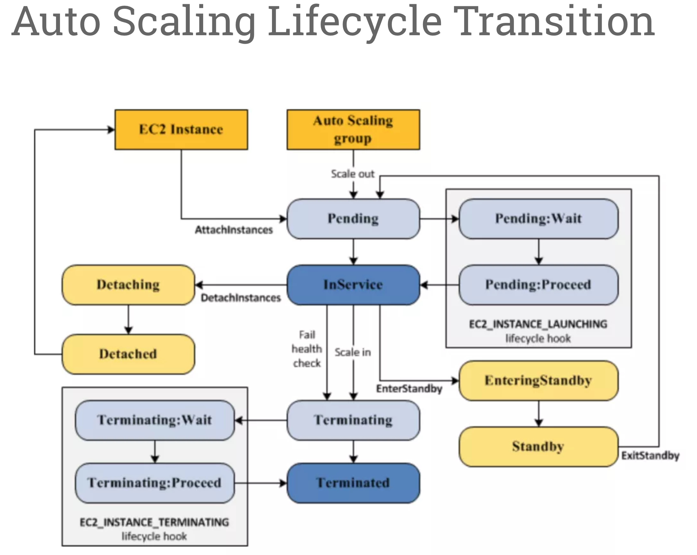
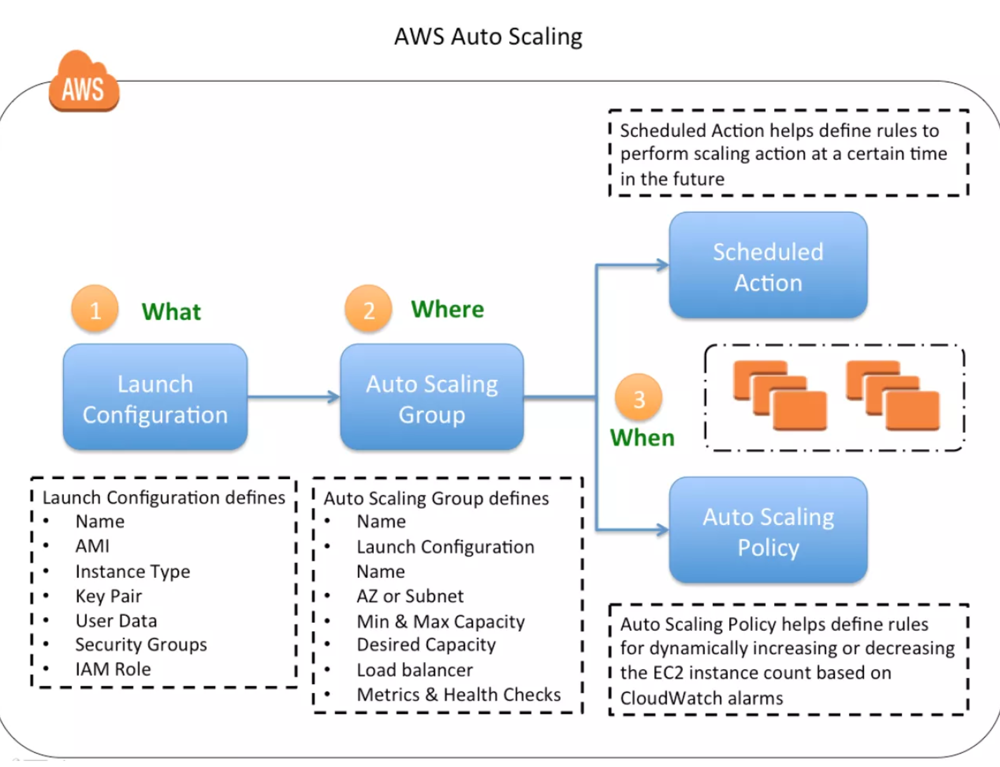

# AWS Auto Scaling Lifecycle

## Auto Scaling Lifecycle

* Auto Scaling lifecycle starts when the Auto Scaling group **launches an instance and puts it into service.**
* Auto Scaling lifecycle ends when the instance is **terminated either by the user** , or the Auto Scaling group **takes it out of service and terminates it**

### Auto Scaling Lifecycle Hooks

* Auto Scaling Lifecycle hooks enable you to perform custom actions by pausing instances as an Auto Scaling group launches or terminates them
* Each Auto Scaling group can have multiple lifecycle hooks. However, there is a limit on the number of hooks per Auto Scaling group

### Scale Out

* Pending
* If an autoscaling:`EC2_INSTANCE_LAUNCHING` lifecycle hook is added, the state is moved to **Pending:Wait**
* Pending:Proceed
* InService

### scale in

* Terminating state
* If an autoscaling:`EC2_INSTANCE_TERMINATING` lifecycle hook is added, the state is moved to **Terminating:Wait**
* Terminating:Proceed
* Terminated state.

**After the wait period the Auto Scaling group continues the launch or terminate process (Pending:Proceed or Terminating:Proceed)**

* CloudWatch Events target to invoke a Lambda function when a lifecycle action occurs.

* Notification target (CloudWatch events, SNS, SQS) for the lifecycle hook which receives the message from EC2 Auto Scaling.

* Create a script that runs on the instance as the instance starts.

### Enter and Exit Standby

* Instance in an InService state can be moved toStandby state.
* Standby state enables you to remove the instance from service, troubleshoot or make changes to it, and then put it back into service.
* Instances in a Standby state continue to be managed by the Auto Scaling group.

### Questions

1.Your application is running on EC2 in an Auto Scaling group. Bootstrapping is taking 20 minutes to complete. You find out that instances are shown as InService although the bootstrapping has not completed. How can you make sure that new instances are not added until the bootstrapping has finished. Choose the correct answer:

**Create a lifecycle hook to keep the instance in pending:wait state until the bootstrapping has finished and then put the instance in pending:proceed state.**

2.When a scale out event occurs, the Auto Scaling group launches the required number of EC2 instances using its assigned launch configuration. What instance state do these instances **start in**? Choose the correct answer:

**Pending**

3.With AWS Auto Scaling, once we apply a hook and the action is complete or the default wait state timeout runs out, the state changes to what, depending on which hook we have applied and what the instance is doing? Select two. Choose the 2 correct answers:

### pending:proceed

### terminating:proceed

4.For AWS Auto Scaling, what is the first transition state an existing instance enters after leaving steady state in Standby mode?

**Pending (You can put any instance that is in an InService state into a Standby state. This enables you to remove the instance from service, troubleshoot or make changes to it, and then put it back into service. Instances in a Standby state continue to be managed by the Auto Scaling group. However, they are not an active part of your application until you put them back into service.)**

5.For AWS Auto Scaling, what is the first transition state an instance enters after leaving steady state when scaling in due to health check failure or decreased load?

**Terminating (When Auto Scaling responds to a scale in event, it terminates one or more instances. These instances are detached from the Auto Scaling group and enter the Terminating state.)**

## AWS Auto Scaling & ELB

**spanning Auto Scaling groups across multiple AZs within a region and then setting up ELB to distribute incoming traffic across those AZs.**

### Health Checks

**ELB health check with the instances should be used to ensure that traffic is routed only to the healthy instances**

## AWS Auto Scalings

* Launch configuration
* Minimum & Maximum capacity 
* Desired capacity
* Availability Zones or Subnets 
* Metrics & Health Checks

**Auto Scaling groups cannot span multiple regions.**

When your instance is terminated, any associated Elastic IP addresses are disassociated and are not automatically associated with the new instance.

**Elastic IP addresses must be associated with the new instance manually.**

**Similarly, when the instance is terminated, its attached EBS volumes are detached and must be attached to the new instance manually**

### Default Termination Policy

### Selection of Availability Zone

* most instances
* oldest launch configuration

### Selection of an Instance in the Availability Zone

* **unprotected instance using the oldest launch configuration,**
* **closest to the next billing hour**
* random: if more than one unprotected instance closest to the next billing hour

1.A user is trying to setup a scheduled scaling activity using Auto Scaling. The user wants to setup the recurring schedule. Which of the below mentioned parameters is not required in this case?

**Maximum size**

2.A user is planning to scale up an application by 8 AM and scale down by 7 PM daily using Auto Scaling. What should the user do in this case?

**Setup scheduled actions to scale up or down at a specific time**

3.An organization has setup Auto Scaling with ELB. Due to some manual error, one of the instances got rebooted. Thus, it failed the Auto Scaling health check. Auto Scaling has marked it for replacement. How can the system admin ensure that the instance does not get terminated?

**Change the health of the instance to healthy using the Auto Scaling commands**

4.A user has configured Auto Scaling with the minimum capacity as 2 and the desired capacity as 2. The user is trying to terminate one of the existing instance with the command: as-terminate-instance-in-auto-scaling-group<Instance ID> –decrement-desired-capacity. What will Auto Scaling do in this scenario?

**Throws an error**

5.An organization has configured Auto Scaling for hosting their application. The system admin wants to understand the Auto Scaling health check process. If the instance is unhealthy, Auto Scaling launches an instance and terminates the unhealthy instance. What is the order execution?

**Auto Scaling terminates the instance first and then launches a new instance**

6.A user has configured ELB with Auto Scaling. The user suspended the Auto Scaling **terminate** process only for a while. What will happen to the availability zone rebalancing process (AZRebalance) during this period?

**Auto Scaling will allow the instances to grow more than the maximum size**

7.An organization has configured Auto Scaling with ELB. There is a memory issue in the application which is causing CPU utilization to go above 90%. The higher CPU usage triggers an event for Auto Scaling as per the scaling policy. If the user wants to find the root cause inside the application without triggering a scaling activity, how can he achieve this?

**Suspend the scaling process until research is completed**

8.A user has configured ELB with Auto Scaling. The user suspended the Auto Scaling Alarm Notification (which notifies Auto Scaling for CloudWatch alarms) process for a while. What will Auto Scaling do during this period?

**AWS will receive the alarms but will not execute the Auto Scaling policy**

9.An organization has configured two single availability zones. The Auto Scaling groups are configured in separate zones. The user wants to merge the groups such that one group spans across multiple zones. How can the user configure this?

**Run the command as-update-auto-scaling-group to configure one group to span across zones and delete the other group**

10.An organization has configured Auto Scaling with ELB. One of the instance health check returns the status as Impaired to Auto Scaling. What will Auto Scaling do in this scenario?

**Terminate the instance and launch a new instance**

11.A user has setup an Auto Scaling group. The group has failed to launch a single instance for more than 24 hours. What will happen to Auto Scaling in this condition

**Auto Scaling will suspend the scaling process**

12.A user is planning to setup infrastructure on AWS for the Christmas sales. The user is planning to use Auto Scaling based on the schedule for proactive scaling. What advise would you give to the user?

**Wait till end of November before scheduling the activity**

13.A user is trying to setup a recurring Auto Scaling process. The user has setup one process to scale up every day at 8 am and scale down at 7 PM. The user is trying to setup another recurring process which scales up on the 1st of every month at 8 AM and scales down the same day at 7 PM. What will Auto Scaling do in this scenario

**Auto Scaling will throw an error since there is a conflict in the schedule of two separate Auto Scaling Processes**

14.A sys admin is trying to understand the Auto Scaling activities. Which of the below mentioned processes is **not performed** by Auto Scaling?

**Reboot Instance**

* Schedule Actions
* Replace Unhealthy                   =>   YES
* Availability Zone Re-Balancing

15.You have started a new job and are reviewing your company’s infrastructure on AWS. You notice one web application where they have an Elastic Load Balancer in front of web instances in an Auto Scaling Group. When you check the metrics for the ELB in CloudWatch you see four healthy instances in Availability Zone (AZ) A and zero in AZ B. There are zero unhealthy instances. What do you need to fix to balance the instances across AZs?

**Make sure Auto Scaling is configured to launch in both AZs**

16.You have decided to change the Instance type for instances running in your application tier that are using Auto Scaling. In which area below would you change the instance type definition?

**Auto Scaling launch configuration**

17.A user is trying to delete an Auto Scaling group from CLI. Which of the below mentioned steps are to be performed by the user?

**Set the minimum size and desired capacity to 0**

18.A user has created a web application with Auto Scaling. The user is regularly monitoring the application and he observed that the traffic is highest on Thursday and Friday between 8 AM to 6 PM. What is the best solution to handle scaling in this case?

**Schedule Auto Scaling to scale up by 8 AM Thursday and scale down after 6 PM on Friday**

19.A user has configured the Auto Scaling group with the minimum capacity as 3 and the maximum capacity as 5. When the user configures the AS group, how many instances will Auto Scaling launch?

**3**

20.A sys admin is maintaining an application on AWS. The application is installed on EC2 and user has configured ELB and Auto Scaling. Considering future load increase, the user is planning to **launch new servers proactively** so that they get registered with ELB. How can the user add these instances with Auto Scaling?

**Increase the desired capacity of the Auto Scaling group**

21.In reviewing the auto scaling events for your application you notice that your application is **scaling up and down multiple times in the same hour**. What design choice could you make to optimize for the cost while preserving elasticity? Choose 2 answers.

* Modify the Amazon CloudWatch alarm period that triggers your auto scaling scale down policy.
* Modify the Auto scaling group cool down timers.

22.A user has created a launch configuration for Auto Scaling where CloudWatch detailed monitoring is disabled. The user wants to now enable detailed monitoring. How can the user achieve this?

**Create a new Launch Config with detail monitoring enabled and update the Auto Scaling group**

23.A user has created an Auto Scaling group with default configurations from CLI. The user wants to setup the CloudWatch alarm on the EC2 instances, which are launched by the Auto Scaling group. The user has setup an alarm to monitor the CPU utilization every minute. Which of the below mentioned statements is true?

**It will fetch the data at every minute as detailed monitoring on EC2 will be enabled by the default launch configuration of Auto Scaling**

24.When Auto Scaling is launching a new instance based on condition, which of the below mentioned policies will it follow?

**Launch an instance in the AZ with the fewest instances**

25.The user has created multiple AutoScaling groups. The user is trying to create a new AS group but it fails. How can the user know that he has reached the AS group limit specified by AutoScaling in that region?

**Run the command: as-describe-account-limits**

26.A user is trying to save some cost on the AWS services. Which of the below mentioned options will not help him save cost?

**Delete the Auto Scaling launch configuration after the instances are terminated (Auto Scaling Launch config does not cost anything)**

* Delete the unutilized EBS volumes once the instance is terminated
* Release the elastic IP if not required once the instance is terminated   =>  SAVE COST
* Delete the AWS ELB after the instances are terminated

27.To scale up the AWS resources using **manual Auto Scaling**, which of the below mentioned parameters should the user change?

**Desired capacity**

28.For AWS Auto Scaling, what is the first transition state an existing instance enters after leaving steady state in Standby mode?

**Pending**

29.For AWS Auto Scaling, what is the first transition state an instance enters after leaving steady state when scaling in due to health check failure or decreased load?

**Terminating**

30.A user has setup Auto Scaling with ELB on the EC2 instances. The user wants to configure that whenever the CPU utilization is below 10%, Auto Scaling should remove one instance. How can the user configure this?

**Configure CloudWatch to send a notification to the Auto Scaling group when the CPU Utilization is less than 10% and configure the Auto Scaling policy to remove the instance**
