# Building A fault Tolerant Wordpress Site: Lab1 - Get SetUp

## Network Diagram

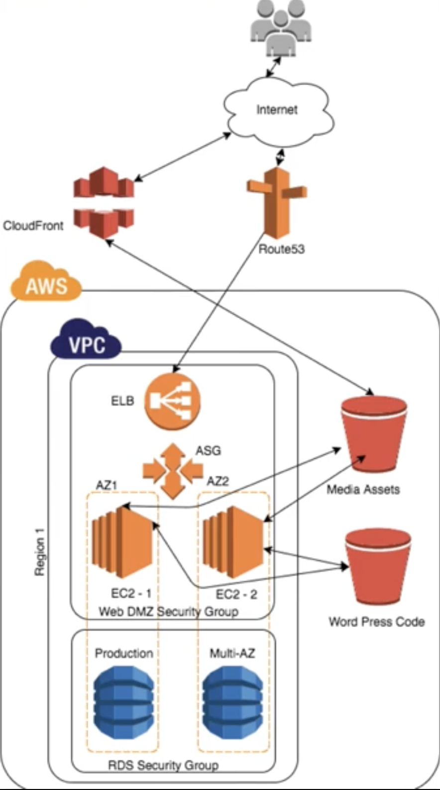

## Create IAM Role with `AmazonS3FullAccess` policy

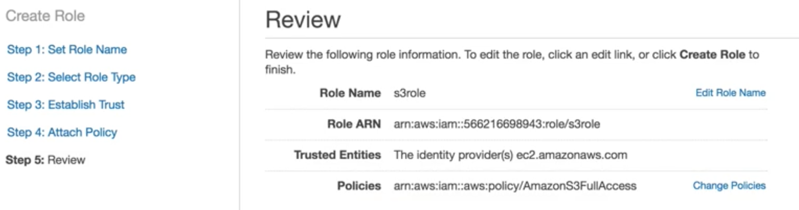

## Create two Security Group


### web instance security group

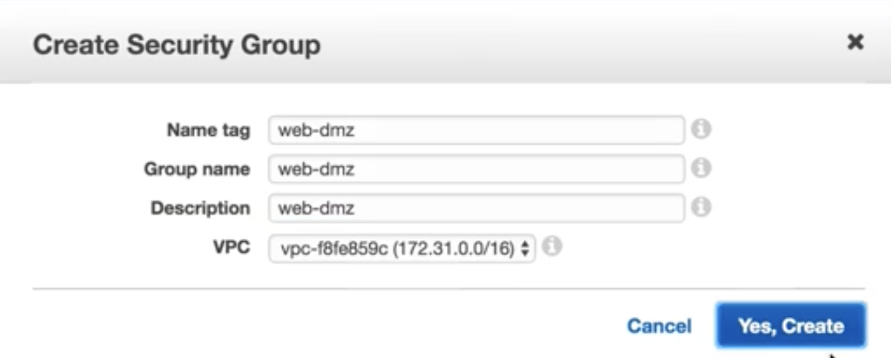

#### Add inbound rules 

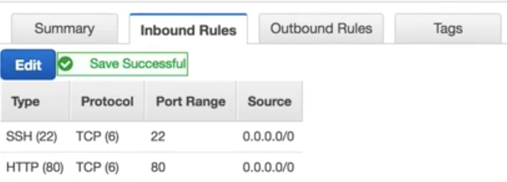

```
Type    Port Range   source
ssh       22         0.0.0.0/0
http      80         0.0.0.0/0
```
### RDS instance security group

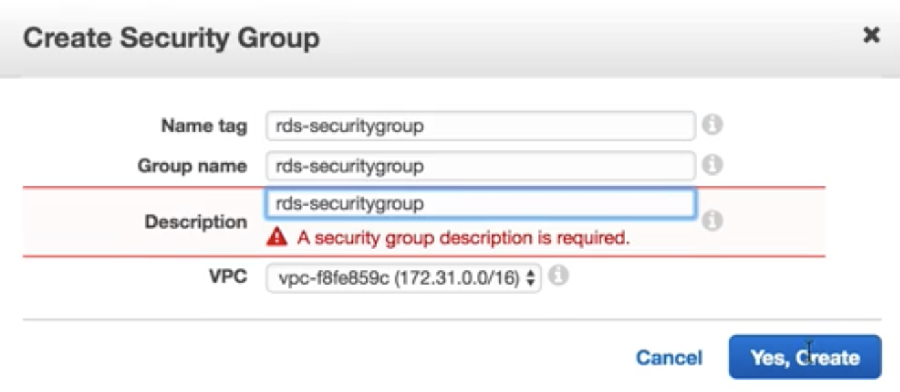

#### Add inbound rules 

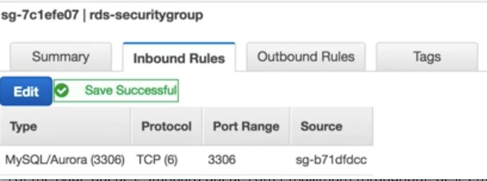

```
Type         Port Range   source
Mysql(3306)   3306        web-sg
```


## Create two S3 Buckets one for code and one for media

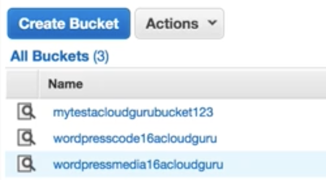

## Create `Web CloudFront` for `media` S3 Bucket

[Introduction to S3 CDN & CloudFront](../5S3/4CDN_Cloudfront.md)

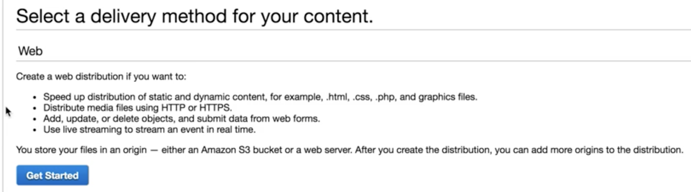

### Point `cloudFront distribution` to `media S3 Bucket`

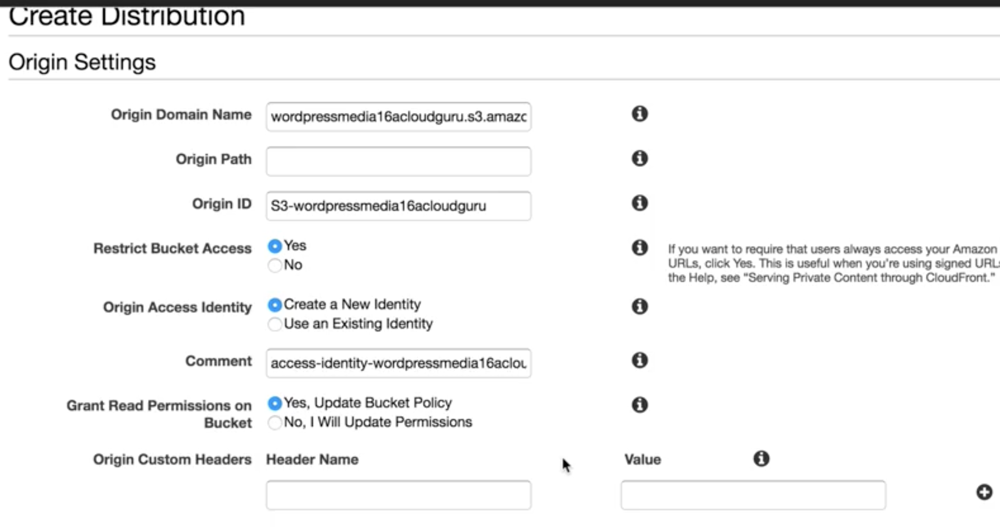

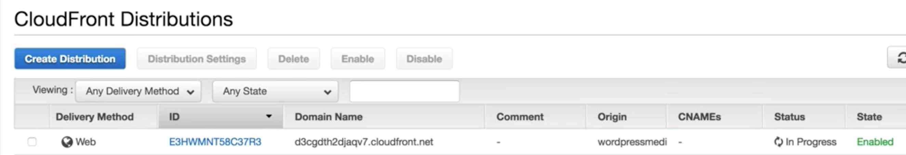

## Create RDS (mysql) instance

### Select MySQL Engine

### Specify DB Details

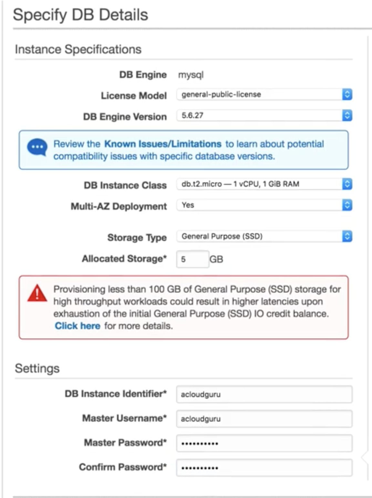

### Configure Advanced Settings

```
Public Accessible: No
VPC SG: rds-sg 
```
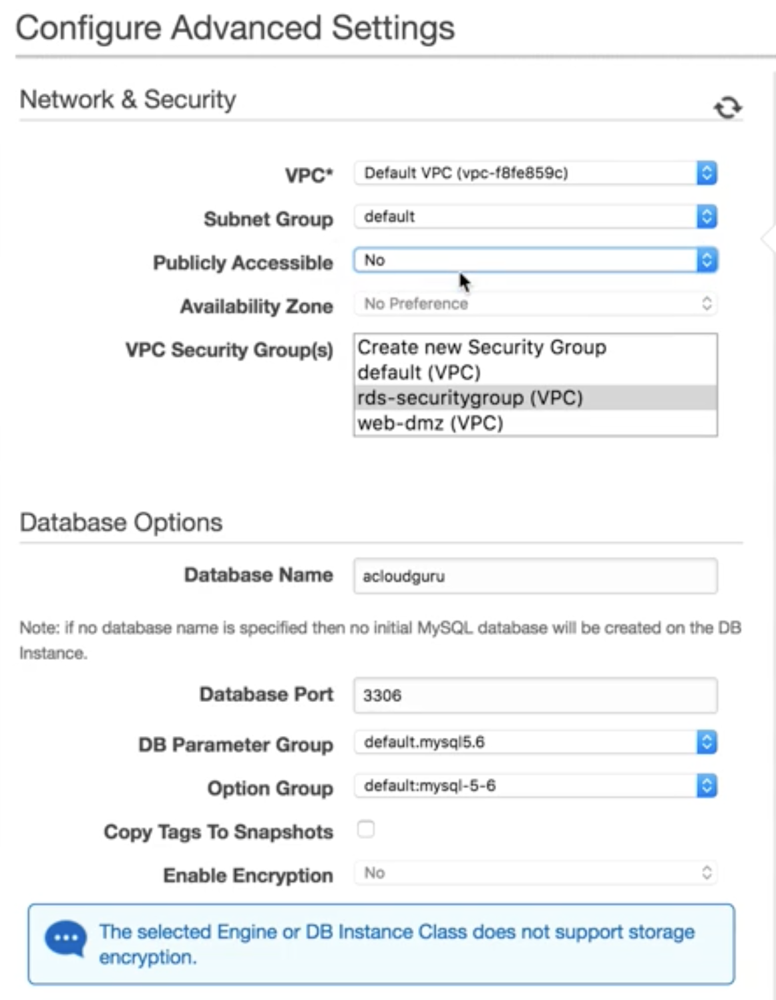


## Create Load Balancer

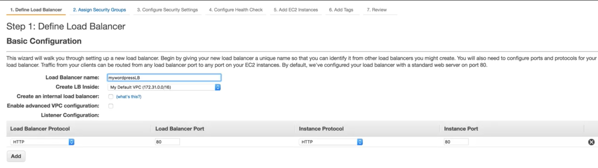

### Put load balancer inside `Web SG`

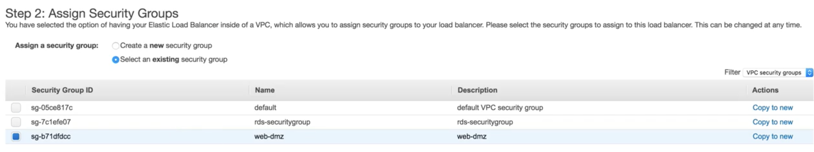

### Configure Health check

```
ping path: /health.html
unhealthy threshold:  2
health threshold:     3
```
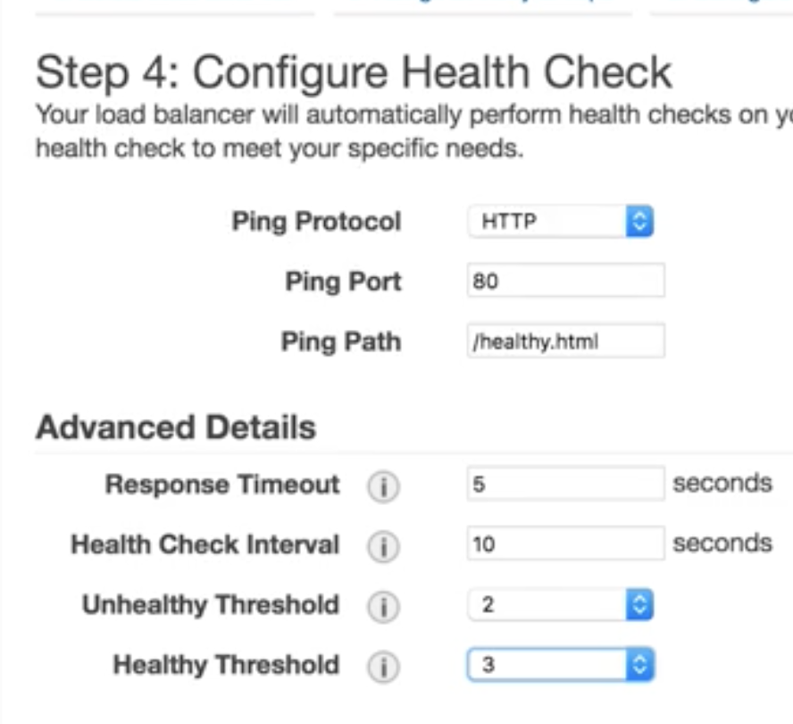


## Create Route53 and set record sets

### Enable Alias and point to ELB

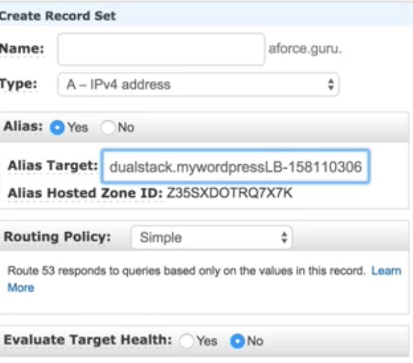


