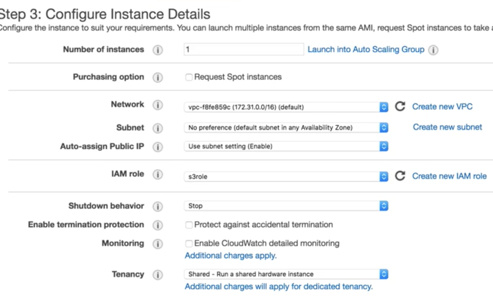
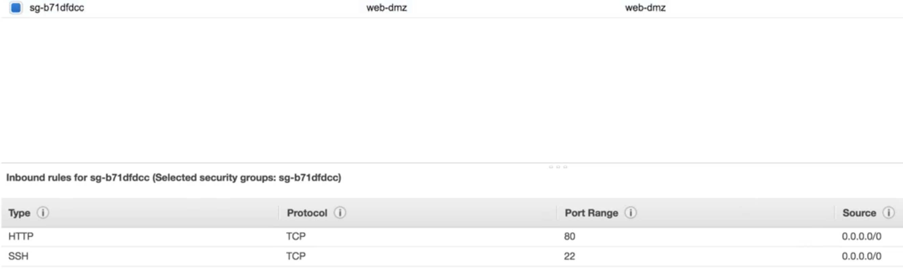
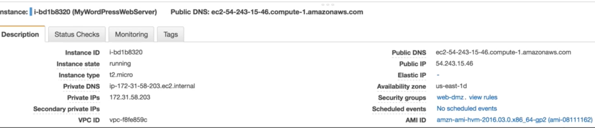
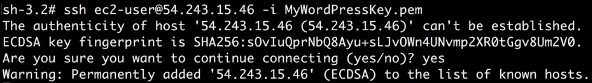
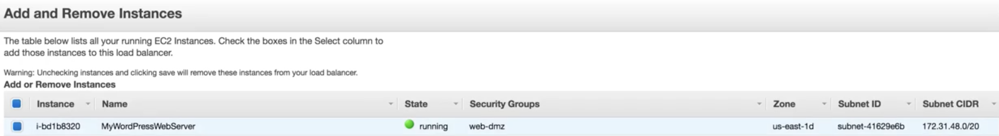
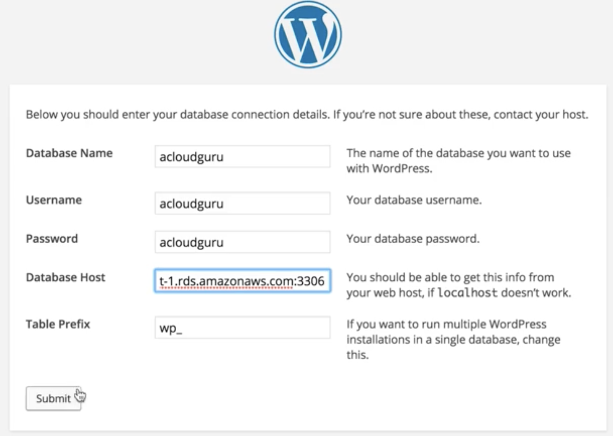
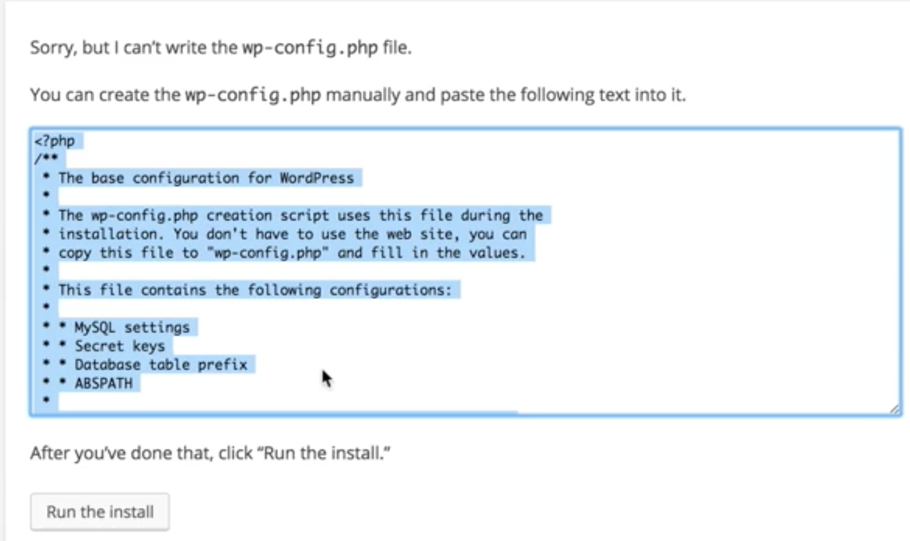
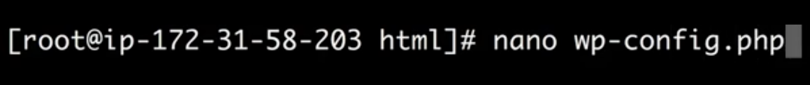
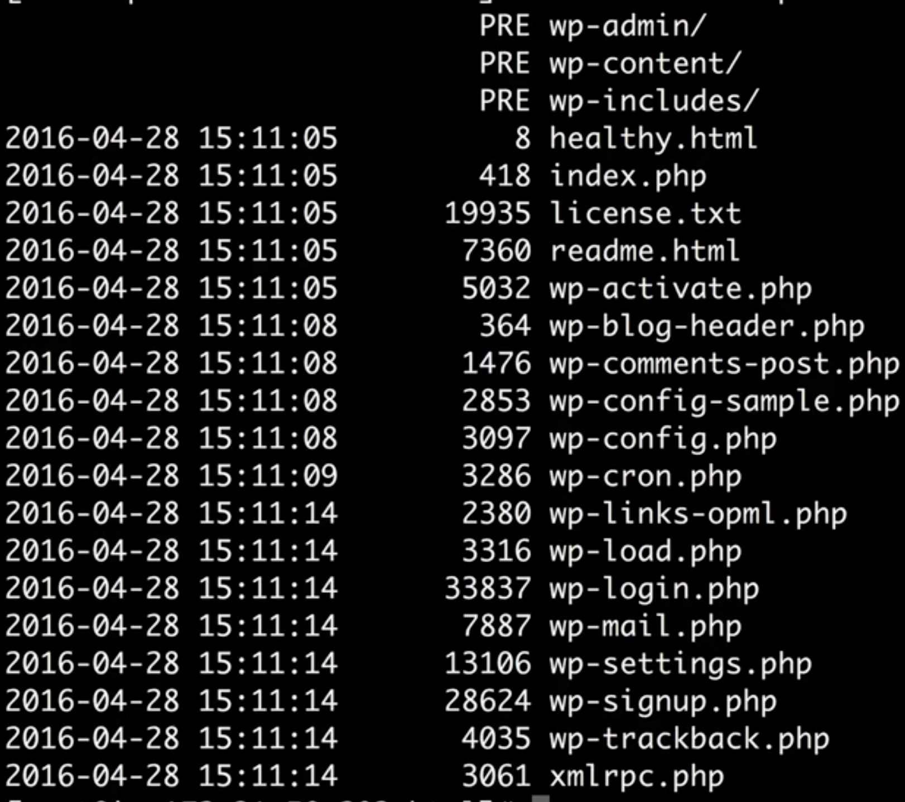

# Building A fault Tolerant Wordpress Site: Lab2 - Setting Up EC2

## Create EC2 instance 

### Configure instance with IAM role `s3role`



### Advanced setting

```
#!/bin/bash 
yum update -y 
yum install httpd php php-mysql stress -y 
cd /etc/httpd/conf 
cp httpd.conf httpdconfbackup.conf 
rm -rf httpd.conf 
wget https://s3-eu-west-1.amazonaws.com/acloudguru/config/httpd.conf 
cd /var/www/html echo "healthy" > healthy.html 
wget https://wordpress.org/latest.tar.gz 
tar -xzf latest.tar.gz 
cp -r wordpress/* /var/www/html/ 
rm -rf wordpress 
rm -rf latest.tar.gz 
chmod -R 755 wp-content                 # rwx-rx-rx
chown -R apache.apache wp-content       # change owner of 
service httpd start 
chkconfig httpd on 
```

### Configure instance inside `Web-SG`




 
### insert ssh key into instance

```
$ ssh ec2-user@54.243.15.46 -i mykey.pem
```



## Add Instance to ELB




## Add `RDS Endpoint` to `Worldpress Database host`




## Configure Worldpress






## Backup instance code to s3 code bucket

```
$ aws s3 ls
$ aws s3 cp --recursive /var/www/html s3://bucketname_S3code
```

```
$ aws s3 ls bucketname
```


## Copy s3 code back to instance for disaster recovery

```
$ aws s3 cp --recursive s3://bucketname_S3code /var/www/html 
chmod -R 755 wp-content                 # rwx-rx-rx
chown -R apache.apache wp-content       # change owner of 
```


