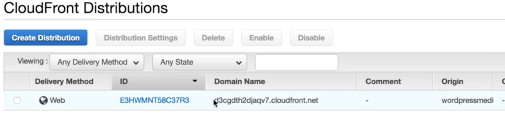
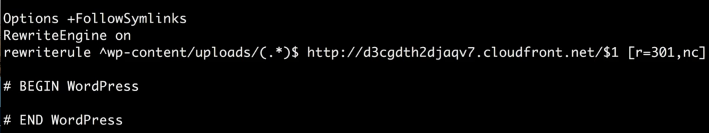
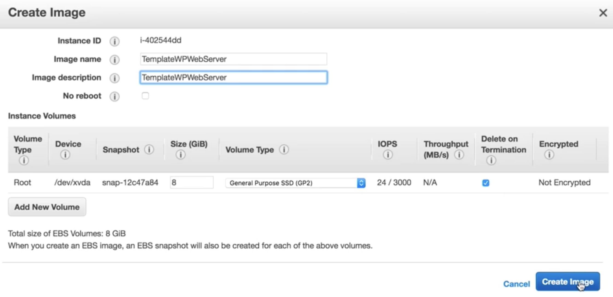
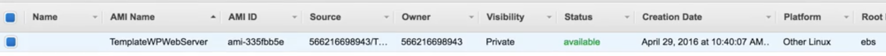

# Building A fault Tolerant Wordpress Site: Lab3 - Automation & Setting up our AMI

## Two ways upload EC2 images to S3 media bucket

### 1. Copy

```
$ aws s3 cp --recursive /var/www/html/wp-content/uploads s3://bucketname_S3Media
```

### 2. Sync

```
$ aws s3 sync  /var/www/html/wp-content/uploads s3://bucketname_S3Media --delete

```

* `-- delete`: **Files that exist in the destination but not in the source are deleted during sync.**


## Redirect Wordpress image read from `CloudFront` rather than EC2 instance


```
$ cd /var/www/html
$ sudo nano .htaccess
```

### check cloudfront distributions `domain name`



#### Rewrite rule



```
$ sudo service httpd restart
```

## Cronjob automatically `upload images and code` to S3 bucket and `download code` to EC2 instance from S3

```
$ cd /etc
$ nano crontab

# every 2 minutes upload code and images to s3 bucket
*/2 * * * * root aws s3 sync --delete /var/www/html/ s3://wordpresscodel6acloudguru/
*/2 * * * * root aws s3 sync --delete /var/www/html/wp-content/uploads/ s3://wordpressmedial6acloudguru/ 

# every 3 minutes download code from s3 bucket
*/3 * * * * root aws s3 sync --delete s3://wordpresscodel6acloudguru/ /var/www/html/ 
```

## Create Image for web instance






